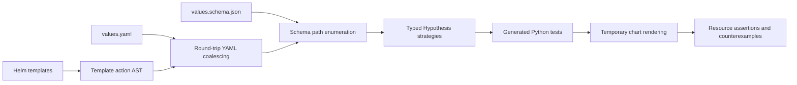

# Hypothesis Helm

Generate Python property tests for Helm chart values. The framework coalesces
undocumented template levers into an in-memory `ruamel.yaml` document, enumerates
schema paths, and selects Hypothesis strategies from their types and constraints.

**Table of contents**

- [Quick start](#quick-start)
- [Architecture](#architecture)
- [Repository map](#repository-map)
- [Development](#development)
- [Documentation](#documentation)
- [License](#license)

## Quick start

Requires Python 3.13+, Poetry, and Helm 3.

```sh
git clone https://github.com/astrivant/hypothesis-helm.git
cd hypothesis-helm
python3.13 -m venv .venv
env -u VIRTUAL_ENV -u PYENV_VERSION -u PYENV_VIRTUAL_ENV poetry install

bash scripts/project-python.sh -m hypothesis_helm.cli generate examples/workload \
  --output generated-tests/workload --max-examples 50
bash scripts/project-python.sh -m pytest generated-tests/workload
```

For the Helm command, install the plugin from this checkout:

```sh
PYTHON=python3.13 helm plugin install .
helm hypothesis generate examples/workload --output generated-tests/workload
bash scripts/project-python.sh -m pytest generated-tests/workload
```

Each generated suite includes Python tests, coalesced YAML, an inferred schema,
and a path/strategy inventory. Source charts remain unchanged. Inferred contracts
and unresolved template constructs need review; sampled tests do not prove
complete template branch coverage or totality.

## Architecture



## Repository map

| Location | Responsibility |
| --- | --- |
| [`src/hypothesis_helm/`](src/hypothesis_helm/) | Schema generation, template discovery, rendering and CLI. |
| [`src/hypothesis_helm/tests/`](src/hypothesis_helm/tests/) | Unit tests and real Helm integration tests. |
| [`examples/`](examples/) | Small charts and a checked-in generated workload suite. |
| [`scripts/`](scripts/) | Project interpreter, validation command and Helm plugin hooks. |
| [`plugin.yaml`](plugin.yaml) | Installable Helm plugin manifest. |
| [`.circleci/`](.circleci/) | Python checks, Helm integration and package build verification. |
| [`.github/settings.yml`](.github/settings.yml) | Declarative repository settings. |
| [`docs/`](docs/) | Development setup, CLI behavior and testing limitations. |

## Development

The project follows Astrivant's Python tooling: a Poetry-managed local virtualenv,
strict mypy, Ruff with a 100-column Google-docstring convention, pydocstyle,
pydoclint, pre-commit and CircleCI. Tests live beside the package and use pytest
for Hypothesis integration and generated suites.

```sh
bash scripts/project-python.sh -m pre_commit install
bash scripts/check.sh
```

The interpreter wrapper ignores unrelated activated environments. CircleCI runs
the same validation command, exercises generated tests and plugin installation,
and builds the wheel and source distribution. Publishing is not configured.

## Documentation

- [Development and CLI reference](docs/development.md): setup, coalescing, strategy
  selection, generated tests, rendering contracts and Astrivant integration.
- [Generated workload suite](examples/generated-workload/test_chart_values.py):
  a concrete example of emitted Python properties.
- [Astrivant observation](examples/astrivant-observation.md): a previously found
  mismatch between an open JSON Schema and Helm's accepted inputs.

## License

[GNU General Public License v3.0 only](LICENSE).
