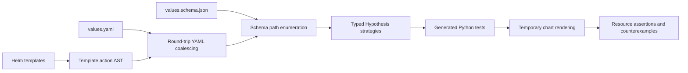

# Hypothesis


Hypothesis turns Helm chart schemas and template references into executable Python
property tests. It discovers undocumented values, generates inputs from their types
and constraints, and renders the chart to expose configuration failures and reduce
them to reproducible examples. Run the suite directly through Helm, with optional
manifest streaming for Kubernetes schema and security validation.

**Table of contents**

- [Hypothesis](#hypothesis)
  - [Install](#install)
  - [Quick Start](#quick-start)
  - [Architecture](#architecture)
  - [Parallel execution](#parallel-execution)
  - [Distributed sharding](#distributed-sharding)
  - [CI and GitHub Action](#ci-and-github-action)
    - [CircleCI inline orb](#circleci-inline-orb)
    - [GitLab CI job](#gitlab-ci-job)
  - [Repository map](#repository-map)
  - [Development](#development)
  - [Documentation](#documentation)
  - [License](#license)

## Install

Requires Helm 3 and Python 3.13+. The plugin installs its Python dependencies,
including the test runner, automatically.

```sh
PYTHON=python3.13 helm plugin install https://github.com/astrivant/hypothesis-helm
```

To install from a local checkout:

```sh
PYTHON=python3.13 helm plugin install .
```

## Quick Start

Test a chart using its values schema and template references:

```sh
helm hypothesis test ./path/to/chart
```

Audit values, configure test generation, or rerun a saved suite:

```sh
helm hypothesis audit ./path/to/chart
helm hypothesis test ./path/to/chart --max-examples 50 --seed 42
helm hypothesis test ./path/to/chart --match replicas
helm hypothesis generate ./path/to/chart --output generated-tests
helm hypothesis run generated-tests
```

`test` generates a Python property per values path, executes the suite inside the
plugin environment, and returns its exit status. Generated source, values,
schemas, JUnit results and a run report stay in `reports/hypothesis-helm` by default.
Use `--artifact-dir` to choose a different location. Tests default to `--jobs auto`,
which adjusts concurrency using PID throughput feedback. Set `--jobs N` for a fixed
worker count or `--jobs 1` to run serially.

Add `--output json` (or `-o json`) to `test` or `run` to stream rendered
manifests as JSON Lines, with progress and test reports on stderr. See
[streaming to Kubeconform and Kubesec](docs/usage.md#stream-rendered-manifests)
for a pipeline that validates each resource as it arrives.

Each generated suite includes Python tests, coalesced YAML, an inferred schema,
and a path/strategy inventory. Source charts remain unchanged. Inferred contracts
and unresolved template constructs need review; sampled tests do not prove
complete template branch coverage or totality.

## Architecture



## Parallel execution

The unit of parallel work is a generated property for a values path. Each property
can render and validate its own inputs without depending on another property's
results, allowing the suite to execute properties concurrently.

1. **Collect and dispatch:** Pytest identifies the selected properties. A thread
   pool dispatches each queued property into a separate pytest process, isolating
   fixtures, Hypothesis state, and temporary chart files. Input generation and
   counterexample shrinking remain sequential within each property.
2. **Measure and adjust:** With `--jobs auto`, each completion feeds a throughput
   measurement. A PID controller uses measured changes in throughput to adjust
   active concurrency, starting at the available CPU count and probing up to four
   times that count, bounded by the number of selected tests. Measurement windows
   smooth timing noise; reducing concurrency lets active tests finish.
3. **Aggregate results:** The parent merges JUnit results and exit statuses, while
   synchronized manifest writes keep each JSON record intact. Completion order
   can vary without changing how individual properties are evaluated.

Custom tests must preserve this independence: shared mutable files or external
resources can introduce interference. Process and fixture startup add overhead,
so small suites may benefit less from parallelism. Automatic tuning seeks higher
throughput within its bounds; it does not guarantee a global optimum. Use
`--jobs N` for fixed concurrency or `--jobs 1` for serial execution. The explicit
whole-chart and exhaustive modes remain serial.

## Distributed sharding

Use `--shard INDEX/TOTAL` to split a suite across independent instances. Each
shard retains its own `--jobs auto` controller and worker pool, providing
parallelism both across runners and within each runner. For example, launch
these commands on three separate runners:

```sh
helm hypothesis test ./chart --shard 1/3 --jobs auto
helm hypothesis test ./chart --shard 2/3 --jobs auto
helm hypothesis test ./chart --shard 3/3 --jobs auto
```

Shards use a stable hash of each property identifier, after `--match` filtering.
Running every shard against the same suite and selection covers each property
exactly once. Reports and generated files are isolated under
`reports/hypothesis-helm/shards/INDEX-of-TOTAL/`. Saved suites also support
`helm hypothesis run generated-tests --shard 1/3`.

Each runner reports its own status; CI must require all shards to succeed.
Worker limits apply per instance, so use fixed `--jobs N` budgets when several
instances share a host. See [sharding](docs/usage.md#distributed-sharding) for
artifact handling, empty partitions, and reproducibility requirements.

## CI and GitHub Action

`--shard auto` is the default. CircleCI and GitLab parallel jobs are detected
from their node environment variables; local and single-job runs use the full
suite. Use `--shard INDEX/TOTAL` to override detection or `--shard none` to
disable it.

The repository includes a [GitHub Action](action.yml) that installs the tool,
runs the chart tests, and uploads per-shard reports and manifests. For a GitHub
matrix, pass `strategy.job-index` and `strategy.job-total` through the action's
`job-index` and `job-total` inputs; GitHub does not export these automatically
as environment variables.

See [CI integration](docs/ci.md) for provider examples, action inputs and outputs,
and publishing steps. The [local action workflow](.github/workflows/action.yml)
can verify the action before it is released.

### CircleCI inline orb

[`.circleci/config.yml`](.circleci/config.yml) defines the reference-only
`hypothesis-helm` inline orb. Its `test` command runs the installed plugin;
its `test-chart` job checks out the repository, installs Helm and the local plugin,
runs the command, and uploads JUnit results and JSON manifests. The repository's
workflows do not invoke this job.

After copying the orb's `orbs:` definition into your configuration, you could
invoke it with this workflow fragment:

```yaml
# Example only; the inline orb definition must also be present in this config.
workflows:
  chart-properties:
    jobs:
      - hypothesis-helm/test-chart:
          chart: examples/workload
          plugin-path: .
          parallelism: 3
          jobs: auto
          max-examples: 50
          seed: 0
          artifact-dir: reports/hypothesis-helm
```

`plugin-path` points to a checkout of this plugin. The job defaults to Python 3.13,
Helm 3.19.0, one CircleCI node, automatic worker concurrency, and 100 examples per
property. With `parallelism: 3`, the tool reads `CIRCLE_NODE_INDEX` and
`CIRCLE_NODE_TOTAL` to assign shards. The command uses `--rerun all` so every
assigned path runs in CI. To reuse only the command in an existing job, call
`hypothesis-helm/test` after installing Helm and the plugin; it accepts the same
chart, worker, example, seed, and artifact parameters.

### GitLab CI job

Add this job to `.gitlab-ci.yml` for a Linux amd64 Docker runner. Adjust
`HELM_CHART` to the chart in your repository. GitLab's [`parallel` jobs](https://docs.gitlab.com/ci/yaml/#parallel)
provide `CI_NODE_INDEX` and `CI_NODE_TOTAL`, which the tool detects automatically.

```yaml
helm-properties:
  image: python:3.13-slim
  stage: test
  parallel: 3
  variables:
    HELM_VERSION: v3.19.0
    HELM_CHART: ./chart
  before_script:
    - apt-get update
    - apt-get install -y --no-install-recommends ca-certificates curl git
    - |
      curl -fsSL "https://get.helm.sh/helm-${HELM_VERSION}-linux-amd64.tar.gz" \
        -o /tmp/helm.tar.gz
      tar -xzf /tmp/helm.tar.gz -C /tmp
      install /tmp/linux-amd64/helm /usr/local/bin/helm
    - PYTHON=python3.13 helm plugin install https://github.com/astrivant/hypothesis-helm
  script:
    - mkdir -p reports/hypothesis-helm
    - |
      helm hypothesis test "$HELM_CHART" \
        --shard auto --jobs auto --max-examples 50 --seed 0 --rerun all \
        --artifact-dir reports/hypothesis-helm --output json \
        > "reports/hypothesis-helm/manifests-${CI_NODE_INDEX}.jsonl"
  artifacts:
    when: always
    name: "helm-properties-${CI_NODE_INDEX}"
    paths:
      - reports/hypothesis-helm/
    reports:
      junit: reports/hypothesis-helm/shards/*/junit.xml
```

Each node runs its own adaptive worker pool and reports its own exit status.
JUnit reports live under `shards/INDEX-of-TOTAL/`; the example also preserves
manifests and diagnostics when tests fail. Pin the plugin installation with
`--version <git-tag-or-commit>` when adopting the example in a release pipeline.

## Repository map

| Location | Responsibility |
| --- | --- |
| [`pkg/hypothesis_helm/`](pkg/hypothesis_helm/) | CLI and public API; implementation grouped under charts, schemas, execution, reporting, and integrations. |
| [`pkg/hypothesis_helm/tests/`](pkg/hypothesis_helm/tests/) | Unit tests and real Helm integration tests. |
| [`examples/`](examples/) | Small charts and a checked-in generated workload suite. |
| [`scripts/`](scripts/) | Project interpreter, validation command and Helm plugin hooks. |
| [`action.yml`](action.yml) | GitHub Action with automatic CI sharding and artifact uploads. |
| [`plugin.yaml`](plugin.yaml) | Installable Helm plugin manifest. |
| [`.circleci/`](.circleci/) | Python checks, Helm integration and package build verification. |
| [`.github/settings.yml`](.github/settings.yml) | Declarative repository settings. |
| [`docs/`](docs/) | Development setup, CLI behavior and testing limitations. |

## Development

The project follows Astrivant's Python tooling: a Poetry-managed local virtualenv,
strict mypy, Ruff with a 100-column Google-docstring convention, pydocstyle,
pydoclint, pre-commit and CircleCI. Tests live beside the package and use pytest
for Hypothesis integration and generated suites.

Contributor setup and repository checks are documented in
[Development](docs/development.md). End users only need the Helm commands above.
CircleCI exercises the same chart-testing workflow and builds the package.

## Documentation

- [CI integration and GitHub Action](docs/ci.md): provider detection, matrix jobs, artifacts, and publishing.
- [Helm command reference](docs/usage.md): chart testing, saved suites, coalescing,
  strategy selection, rendering contracts and Astrivant integration.
- [Development](docs/development.md): contributor setup and repository tooling.
- [Generated workload suite](examples/generated-workload/test_chart_values.py):
  a concrete example of emitted Python properties.
- [Astrivant observation](examples/astrivant-observation.md): a previously found
  mismatch between an open JSON Schema and Helm's accepted inputs.

## License

[GNU General Public License v3.0 only](LICENSE).

Local reruns reuse successful path results and retry failures by default. CI runs
continue to test the full selection. Use `--rerun all` for a fresh run,
`--cache-dir .cache/hypothesis-helm` to choose a persistent cache, or `--no-cache`
to disable it. See [persistent path results](docs/usage.md#persistent-path-results)
and [CI cache setup](docs/ci.md#persisting-path-outcomes).

Enable optional Kubernetes API schema validation with
`helm hypothesis test ./chart --kubeconform --schema-version 1.35.0`.
The version defaults to the latest published stable schemas; strict schemas are
cached through a sparse Git checkout for offline and parallel reuse.
See [API conformity setup](docs/usage.md#kubernetes-api-conformity).
