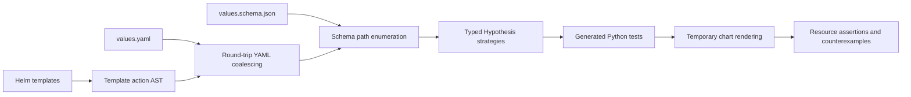

# Hypothesis Helm

Generate Python property tests for Helm chart values. The framework coalesces
undocumented template levers into an in-memory `ruamel.yaml` document, enumerates
schema paths, and selects Hypothesis strategies from their types and constraints.

**Table of contents**

- [Quick start](#quick-start)
- [Architecture](#architecture)
- [Repository map](#repository-map)
- [Development](#development)
- [Documentation](#documentation)
- [License](#license)

## Quick start

Requires Helm 3 and Python 3.13+. The plugin installs its Python dependencies,
including the test runner, automatically.

```sh
PYTHON=python3.13 helm plugin install https://github.com/astrivant/hypothesis-helm
helm hypothesis test ./path/to/chart
```

From a local checkout, use `helm plugin install .`. Chart testing, auditing,
generation, and rerunning saved tests are all Helm commands:

```sh
helm hypothesis audit ./path/to/chart
helm hypothesis test ./path/to/chart --max-examples 50 --seed 42
helm hypothesis test ./path/to/chart --match replicas
helm hypothesis generate ./path/to/chart --output generated-tests
helm hypothesis run generated-tests
```

`test` generates a Python property per values path, executes the suite inside the
plugin environment, and returns its exit status. Generated source, values,
schemas, JUnit results and a run report stay in `reports/hypothesis-helm` by default.
Use `--artifact-dir` to choose a different location.

Add `--output json` (or `-o json`) to `test` or `run` to stream rendered
manifests as JSON Lines, with progress and test reports on stderr. See
[streaming to Kubeconform and Kubesec](docs/usage.md#stream-rendered-manifests)
for a pipeline that validates each resource as it arrives.

Each generated suite includes Python tests, coalesced YAML, an inferred schema,
and a path/strategy inventory. Source charts remain unchanged. Inferred contracts
and unresolved template constructs need review; sampled tests do not prove
complete template branch coverage or totality.

## Architecture



## Repository map

| Location | Responsibility |
| --- | --- |
| [`src/hypothesis_helm/`](src/hypothesis_helm/) | Schema generation, template discovery, rendering and CLI. |
| [`src/hypothesis_helm/tests/`](src/hypothesis_helm/tests/) | Unit tests and real Helm integration tests. |
| [`examples/`](examples/) | Small charts and a checked-in generated workload suite. |
| [`scripts/`](scripts/) | Project interpreter, validation command and Helm plugin hooks. |
| [`plugin.yaml`](plugin.yaml) | Installable Helm plugin manifest. |
| [`.circleci/`](.circleci/) | Python checks, Helm integration and package build verification. |
| [`.github/settings.yml`](.github/settings.yml) | Declarative repository settings. |
| [`docs/`](docs/) | Development setup, CLI behavior and testing limitations. |

## Development

The project follows Astrivant's Python tooling: a Poetry-managed local virtualenv,
strict mypy, Ruff with a 100-column Google-docstring convention, pydocstyle,
pydoclint, pre-commit and CircleCI. Tests live beside the package and use pytest
for Hypothesis integration and generated suites.

Contributor setup and repository checks are documented in
[Development](docs/development.md). End users only need the Helm commands above.
CircleCI exercises the same chart-testing workflow and builds the package.

## Documentation

- [Helm command reference](docs/usage.md): chart testing, saved suites, coalescing,
  strategy selection, rendering contracts and Astrivant integration.
- [Development](docs/development.md): contributor setup and repository tooling.
- [Generated workload suite](examples/generated-workload/test_chart_values.py):
  a concrete example of emitted Python properties.
- [Astrivant observation](examples/astrivant-observation.md): a previously found
  mismatch between an open JSON Schema and Helm's accepted inputs.

## License

[GNU General Public License v3.0 only](LICENSE).
