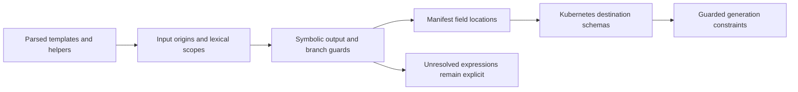

# Analysis passes

<!-- toc:start -->
**Table of contents**

- [Branch knowledge](#branch-knowledge)
- [Input inventory](#input-inventory)
- [Dependency discovery and activation](#dependency-discovery-and-activation)
- [Destination domains](#destination-domains)
- [Explicit rejection discovery](#explicit-rejection-discovery)
  - [Fixed Helm context and concrete templates](#fixed-helm-context-and-concrete-templates)
  - [Incomplete-analysis warnings](#incomplete-analysis-warnings)
  - [Transformed input domains](#transformed-input-domains)
- [Maximum output complexity](#maximum-output-complexity)
- [Sampling profile](#sampling-profile)
<!-- toc:end -->

[Compiler](README.md) · [Syntax trees](syntax-trees.md) · [Selection passes](selection.md)

These passes describe what the chart can consume or produce. Their results guide
testing and populate audits. Test results come from executing the selected checks.

## Branch knowledge

[`branches.py`](../../pkg/hypothesis_helm/compiler/passes/branches.py) narrows possible values inside supported conditions,
removes contradictory nested branches, and merges the surviving alternatives before analyzing later statements.
It runs after literal folding in the exact-equivalence compiler, which is also used by maximum-output analysis.
The [branch knowledge lattice](lattice.md) defines the operations, supported conditions and uncertainty rules.
Audits expose source-level decisions under `complexity.branch_analysis`; test reports include them under `pruning.branch_analysis`.

## Input inventory

[`inputs.py`](../../pkg/hypothesis_helm/compiler/passes/inputs.py) compares three
sources: supplied values, declared schema fields, and references found in
templates. `InputInventory.build` binds these paths to the shared values model
and records their source locations.

The result separates referenced fields missing from values or schema from supplied
fields with no known reference. Dynamic map access, unresolved helper contexts,
and dependency forwarding remain explicit uncertainties. An unmatched field is
not automatically unused.

`known_fields` retains the most specific named references: a parent container is
not counted again when a referenced descendant is known. This supplies a lower
bound for input coverage, not proof that every possible input path was discovered.
`FieldCoverage` records which of those paths changed during testing.<sup>[\[1\]](../inputs/README.md)

## Dependency discovery and activation

[`dependencies.py`](../../pkg/hypothesis_helm/compiler/passes/dependencies.py)
reads chart metadata and installed child charts, including archives. It records
child inputs under their dependency name or alias, ordered Boolean conditions,
shared tag controls, and the parent dependencies that must also be enabled.
The data records live in
[`asts/dependencies.py`](../../pkg/hypothesis_helm/compiler/asts/dependencies.py).

This catches enablement settings that appear only in `Chart.yaml`. For a selected
child field, generation can propose a context that enables the child while
preserving that field's chosen value and the parent schema. The original context
also remains eligible because parent templates can read child values even when
the child is disabled. Finite planning proposes corresponding interaction groups
within its existing group-size budgets.

Discovery and path generation share the installed dependency defaults, including in workers that restore cached input domains.
If a parent chart omits a child's map, changing one nested field leaves its siblings at their installed defaults.
Generation only draws a wider context when needed to satisfy schema constraints.

Missing child sources, ambiguous imports, and unsupported forwarding are reported.
Activation states are predictions checked through Helm execution. They do not
authorize skipping renders: charts with dependencies are outside the current
exact-equivalence and topology proof contract.<sup>[\[2\]](../scanning/README.md#discovery-and-testing)

## Destination domains

The [destination pass](../../pkg/hypothesis_helm/compiler/passes/domains.py) connects a values path to a Kubernetes manifest field.
It uses the shared parsed templates, including installed dependencies, rather than a table of known charts.



The symbolic interpreter follows helper arguments, local aliases, assignments and supported transformations.
The layout analysis tracks block-YAML field paths and joins branch contexts. Independent conditions therefore do
not require a Cartesian product of complete manifests. The final pass propagates a destination's constraints back
through supported operations, retaining the conditions under which an input supplies that field.
When only part of a condition is understood, it can establish a smaller region: for example, `not (A and unknown)`
is certainly true when `A` is false. Constraints apply in that established region; uncertain inputs retain their domain.
Conflicting helper definitions are analyzed as alternatives, and only constraints established by every alternative survive.

| Evidence | Decision |
| --- | --- |
| A helper forwards a string into a Secret or ConfigMap reference | Generate names accepted by the destination's schema. |
| An empty value selects a fallback name | Keep the empty input; constrain the nonempty reference branch. |
| Literal maps are serialized and merged into annotations | Generate scalar contributions accepted by the annotation schema. |
| A quoted expression is unsupported | Leave that expression unresolved; preserve independent field mappings. |
| An unknown fragment can change YAML structure | Block mappings in the affected structure. |
| Input mutation, imported origins, or a resource identity is unresolved | Do not infer constraints that depend on that result. |

This pass narrows the **generation domain**. It does not establish exact-output equivalence or authorize render pruning.
It preserves source-schema contradictions as diagnostics, and the supplied defaults still go to Helm unchanged.
See [input domains](../input-domains/README.md#default-destination-catalog) for supported operations and remaining limits.

## Explicit rejection discovery

[`Contracts.build`](../../pkg/hypothesis_helm/compiler/asts/contracts.py) locates
calls to `fail` and `required` in parsed expressions. It follows supported named
helper calls and evaluates the branches that lead to those calls for a candidate.
It does not classify failures by searching comments or error-message keywords.

A prediction identifies the requirement, its location, the input values read,
and any literal choices inspected on the rejecting branch. Installed dependencies
are included, with aliases mapped back to the parent's values paths. Disabled or
unresolved dependencies cannot establish a child rejection.

For example, a helper may accept `(dict "type" .Values.resourcesPreset)` and test
`hasKey $presets .type` before calling `fail`. If `$presets` was constructed with
literal keys, the compiler retains those keys and traces `.type` back to
`$.resourcesPreset`. It does not extract choices from the error message or infer
them from successful renders. A caller can still bypass that helper when the
preset is `none`, custom resources are supplied, or the resource is disabled.
Those branches keep their existing input domains.

These are **candidate-specific choices**, not an unconditional enum added to
`values.schema.json`. The [rejection policy](selection.md#rejection-guided-generation)
confirms each enum rejection with Helm before proposing a replacement. Reports
retain the source, conditions, original inputs, and choices under
`configuration_rejections.requirements`.

| Template construct | Analysis support |
| --- | --- |
| `if`, `else if`, `else`; `and`, `or`, `not`, `empty` | Follow supported conditions for this candidate; preserve short-circuit evaluation. |
| Named `include` with `.`, `$`, or nested `dict` arguments | Follow helper calls and local `:=` aliases; retain the original values path across context changes. |
| `with`, `else with`; declarations and `=` assignments | Change dot within the selected block, retain the invocation's `$`, and update the nearest enclosing declaration without leaking shadowed variables. |
| `range` over lists or string-key maps; `else`, `break`, `continue` | Follow concrete elements and sorted map keys. Keep loop variables scoped and preserve surrounding assignments. |
| Statically named `template` and `block` | Bind a fresh helper scope to the argument pipeline; an omitted argument supplies nil. Conflicting definitions remain unresolved. |
| Literal `dict` + `hasKey`; literal string `list` + `has` / `mustHas` | Retain source-authored choices when membership fails on a rejecting branch. |
| String-key `index` / `get` | Follow map lookups whose input path can be represented unambiguously. |
| Parenthesized field access, such as `(.Values.global).imagePullSecrets` | Select a field from the enclosed expression; retain its original input path and distinguish field access from method calls. |
| Forwarded dependency globals | Trace selected fields to the ancestor supplying them, including nested dependencies and aliases. Verify every resulting rejection with Helm. |
| `keys`, `sortAlpha`, `join`, `printf` with string `%s` arguments | Construct rejection messages. Unsorted keys may occur in any order, but native verification requires every key exactly once. |
| `eq`, `ne`, `lt`, `le`, `gt`, `ge` | Compare compatible strings, Booleans, or integers; ordered Boolean comparisons are unsupported. |
| `required`, `fail`, `list`, `append`, `without` | Recognize explicit rejection and supported message assembly. |
| `len` on strings, lists and maps | Evaluate collection lengths and UTF-8 byte lengths for strings. |
| `default`, `coalesce` | Evaluate fallback selection, including empty strings, false, zero and empty collections; evaluate arguments eagerly. |
| `lower`, `upper`, `trim` | Model ASCII case conversion and surrounding whitespace removal. |
| `trimAll`, `trimPrefix`, `trimSuffix`, `replace`, `contains`, `hasPrefix`, `hasSuffix` | Model literal string operations in their Helm argument order. |
| `add`, `add1`, `sub`, `mul`, `min`, `max` | Model signed 64-bit integer operands when no intermediate result overflows. |
| `atoi`, `toString` | Model decimal string conversion and string/integer/Boolean formatting; ambiguous conversions remain unresolved. |
| `regexMatch`, `mustRegexMatch` | Evaluate the bounded ASCII regex subset described below. |

Empty `dict` and `list` expressions are supported. `default` and `coalesce` accept the YAML loader's mapping and sequence types,
including anchored values and resolved merge keys, without modifying them. When generating a changed path, aliases are treated as
independent loaded values, matching Helm overrides; changing one occurrence does not change its siblings.

Additional bounded operations include ASCII `trunc`, `splitList`, Boolean `ternary`, string-only `print`, and `int`/`int64` on
supported integer operands. Mixed `printf` supports `%s`, `%d` and `%%`. Integer formatting requires an explicit conversion or a
known integer-producing operation: a raw number loaded from values can have a different Go runtime type. Unsupported formats,
conversions and oversized strings remain native Helm work.

These scope rules follow [Go's template language](https://pkg.go.dev/text/template#hdr-Variables)
and are checked against native Helm. The compiler analyzes up to 16 nested helper
calls by default, counting the first call as level 1. This is our analysis budget,
not a Helm rendering restriction. Configure it in `.hypothesis-helm.yaml` or a file selected with `--config`:

```yaml
compiler:
  max_call_depth: 64
```

This setting applies to `audit`, `generate`, `test`, `scan` and `run`. Both rejection analysis and helper-aware destination
typing use it; workers inherit it, and changing it invalidates cached results.
When the budget is exhausted, analysis leaves the affected code unresolved and
Helm tests continue normally. Raising it permits deeper analysis, but does not
make unsupported expressions or cyclic destination helpers safe to interpret.
Helm has its own [repeated-include recursion guard](https://github.com/helm/helm/blob/v4.3.0/pkg/engine/engine.go),
which this setting does not change.

Other resource budgets are configurable in the same `compiler:` mapping. For example:
```yaml
compiler:
  max_files: 20000
  max_context_bytes: 134217728  # 128 MiB per archive, packed and unpacked.
  max_steps: 20000
  max_range_items: 8192
```

Global budgets can also be overridden per chart through `input_constraints` rules with `path: $`, using the same
chart names or source/name matrices as Hypothesis settings.
See [configuration inheritance](../input-domains/README.md#inheritance-and-test-budgets).

The defaults allow 10,000 archive members and 64 MiB per archive. Both `.Files`
inspection and dependency unpacking use those limits. Nested archives are checked
individually, so the byte budget is not a cap on total process memory. Path and link
safety checks still apply when limits are raised.

Rejection analysis defaults to 10,000 statements and iterations per root template
and 4,096 elements per range. Discovery and helper projection have their own
10,000-node budget (`max_discovery_nodes`). Dynamic template size, dependency depth,
string operations, symbolic branch expansion, proof snapshots, complexity searches,
and repair searches also have configurable budgets. See the
[complete configuration](../input-domains/README.md#complete-configuration-example)
for every setting, default and unit, or export it with `helm hypothesis --generate-config`.
All budgets must be positive integers; omitted settings retain their defaults.
Workers inherit every setting, and a changed setting invalidates cached results.

These settings govern analysis effort, not Helm semantics or test-case validity.
An exhausted analysis budget produces uncertainty; it does not justify excluding a
candidate. Existing finding suppression and `--fail` behavior still apply. Search
budgets may leave a complexity maximum unknown or a repair unproven. Diagnostic
retention limits only bound the number of distinct diagnostic records kept.
Python's recursion limit, supported expression syntax, Go integer ranges and Go
regex repetition rules remain independent safeguards. List-member evidence retains
its containing values path without inventing an editable scalar enum for the whole list.

Unknown expressions remain ordinary Helm tests. The remaining boundaries are:

| Construct | Why it remains unresolved |
| --- | --- |
| Cluster-backed `lookup`, clock and random functions | External or changing state is not injected or predicted. An explicitly offline renderer permits an empty lookup result. |
| Unsupported operations inside `tpl`, template-local definitions and recursive expansion beyond the call budget | The compiler cannot establish the generated program's behavior within its supported subset. |
| `.Files.Glob`, `.Files.GetBytes`, binary files and file contexts exceeding the inspection budget | These file operations remain native Helm work. |
| Integer/channel ranges; ranges over unsorted `keys` results | Iterator semantics or iteration order are outside the supported deterministic subset. |
| `set`, `unset`, `merge` and shared or nested overwrite merges | Can change the context used by later conditions. Writes block prediction; fresh flat-map overwrite merges are supported as described below. |
| Unicode case conversion, floating-point arithmetic, implicit numeric coercion, integer overflow | These operations need additional Go-specific semantics; Python's behavior is not assumed to match. |
| Regex groups, alternation, flags, character-class shortcuts and multiple variable repetitions | These expressions exceed the deliberately restricted regex evaluator. |
| Candidate-supplied maps/lists | Their observed members do not prove a fixed enum. Membership can still establish a supported rejection. |
| Ambiguous helper definitions, unresolved globals/imports | The compiler cannot reliably identify the input origin or execution context. |
| Helper calls exceeding `compiler.max_call_depth` (default: 16) | The configured analysis budget has been exhausted; increase it to analyze deeper call chains. |

### Fixed Helm context and concrete templates

Rejection analysis can now follow guards that depend on the renderer's capabilities,
chart files, or a concrete `tpl` string:

| Input to the guard | How analysis obtains it |
| --- | --- |
| `.Capabilities.KubeVersion` and `.Capabilities.APIVersions.Has` | A small probe using the same Helm binary and `--kube-version` as the real render. Results are cached per process. |
| `semverCompare` | Helm evaluates the concrete constraint and version; the compiler does not substitute Python version-comparison rules. |
| `.Files.Get` and `.Files.Lines` | Helm packages a temporary snapshot, applying its own loader and `.helmignore` rules. Analysis reads each chart's accessible files, including dependencies and aliases. |
| `tpl` | The compiler parses the current candidate's actual string, including file-backed text, and evaluates supported expressions with a fresh helper scope. |

Supported `.Chart` metadata comes from the same Helm-loaded snapshot, including names, versions, annotations and `IsRoot`.
Dependency aliases retain their own chart names and metadata. Fields affected by unmodeled dependency processing remain unknown,
rather than being treated as missing. `.Template.Name` and `.Template.BasePath` identify the calling chart and source file;
filename includes constructed from that base path can resolve to parsed templates within the configured call-depth budget.

Schema availability does not establish cluster API availability. These capabilities describe
the current offline `helm template` invocation, not a live cluster. The context probes do not
execute the chart's original templates or modify its files. File snapshots respect
`compiler.max_context_bytes` and `compiler.max_files`; individual `tpl` strings respect
`compiler.max_template_bytes` and share the configured helper call-depth limit.

Every rejection involving capabilities, chart metadata, template context, file contents or `tpl` requires a native Helm
verification render, even after earlier candidates matched. Authored-schema contradictions
remain findings. This support guides rejection filtering; it does not extend the separate
[exact-equivalence proof contract](selection.md#exact-equivalence-pruning).

The implementation follows Helm's [file access methods](https://github.com/helm/helm/blob/v4.3.0/pkg/engine/files.go),
[chart loader](https://github.com/helm/helm/blob/v4.3.0/pkg/chart/v2/loader/load.go), and
[`tpl` execution scope](https://github.com/helm/helm/blob/v4.3.0/pkg/engine/engine.go).

### Incomplete-analysis warnings

`HH2007` warns before native rendering when an attempted analysis cannot establish a result.
It includes the template location and reason, and avoids repeating the same warning within
an analysis instance. Workers retain their own diagnostics. An unknown expression never
justifies discarding a candidate. A separate, explicit rejection may still exclude it after
Helm verifies that rejection. Exact-equivalence analysis also emits this code when a candidate
must fall back to rendering.

If a helper assignment cannot be evaluated, later uses of that variable retain the original
failure location and reason. They do not produce a new warning at each use. A genuinely missing
variable still reports its name, and helper calls cannot access the caller's local variables.

For dependency globals, a read of `.Values.global.mode` can originate at `$.global.mode`
or at a child-specific override. The compiler follows ancestor precedence before naming an
editable input. Merged maps can contain fields from different ancestors, so their members are
traced individually. Incompatible containers or absent origins remain unresolved. Authored
dependency schemas remain authoritative, and all predictions involving forwarded globals
require native Helm verification, even after earlier candidates were confirmed.

Clock, randomness and cluster lookups keep their normal Helm behavior; this change does not
inject a clock, seed Helm's random functions or simulate a Kubernetes cluster.
An attached offline renderer context allows `lookup` to return its native empty map;
disabled DNS similarly allows an empty `getHostByName` result. These are fixed
execution settings, not assumptions about a cluster. The complete
[function effect inventory](functions.md) includes aliases and less obvious sources
of randomness such as password hashing, encryption and certificate generation.
The rejection report records `analysis_fallbacks` and `incomplete_evaluations`; the
pruning report records `fallback_reasons`. The evaluation count includes repeated inputs and
proposed repairs, so it is not a count of distinct rendered inputs. These are analysis limits,
not confirmed chart defects.

Silence the warning without removing any tests:

```sh
helm hypothesis test ./chart --filter --disable-codes HH2007
```

Or use global `ignored: [HH2007]` or a targeted rule:

```yaml
input_constraints:
  - charts: [my-chart]
    path: $.extraConfig
    ignored: [HH2007]
```

`enabled: [HH2007]` enables it under a branch despite global suppression.
With `--fail`, an unsuppressed warning stops the chart run; without it, testing continues.

### Transformed input domains

[`transformations.py`](../../pkg/hypothesis_helm/compiler/asts/transformations.py)
retains a transformation tree alongside each evaluated value. Its leaves point
back to the original values paths. For example:

```gotemplate
{{ $mode := .Values.mode | trim | lower | default "small" }}
{{ if not (has $mode (list "small" "large")) }}
  {{ fail "unsupported mode" }}
{{ end }}
```

The allowed **outputs** are `small` and `large`. The original inputs also include
`SMALL`, ` Large ` and the empty string, because those transformations produce
an allowed output. The compiler therefore retains the condition "the transformed
value belongs to this allowlist" instead of replacing the input schema with those
two strings. Mathematically, this is the **preimage** of the output allowlist under
the transformation, restricted to the branch being tested.

For sampled generation, the compiler works backwards through supported operations
to propose a few input values. For instance, an output of `"8"` from
`toString (add .Values.count 3)` suggests `count: 5`. Every proposal is evaluated
forwards through the complete expression, then checked against the chart's schema,
remaining requirements and native Helm rendering. These witnesses do not enumerate
the whole preimage; a missing witness does not establish that the domain is empty.
Finite assignments stay fixed, valid aliases remain eligible, and authored-schema
conflicts remain findings. Reports retain the expression and allowed outputs under
`configuration_rejections.requirements[].transformed_domains`.

The model follows the supported [Sprig string and arithmetic functions](https://github.com/Masterminds/sprig/blob/v3.3.0/functions.go)
and [fallback semantics](https://github.com/Masterminds/sprig/blob/v3.3.0/defaults.go).
In particular, fallback arguments are evaluated eagerly even when not selected.
All rejection predictions involving these transformations require native Helm
confirmation before exclusion.

Conflicting helper definitions block analysis of their callers, while independent
templates can still establish rejection conditions. Any prediction reached after
an unresolved template requires native confirmation. Reports list the conflicting
names under `configuration_rejections.ambiguous_helpers`.
When a helper's text is used only as manifest output, the pass follows its rejection
conditions without reproducing unused serialization. This lets a valid resource
preset precede another preset's failing enum check. Output used by a condition or
assignment still requires full evaluation; it is never replaced with an invented
value. Predictions that skip output formatting require native verification for
each candidate, including candidates that matched an earlier rejection.
Dependency globals retain their supplying ancestor's values path; an omitted
optional field is treated as nil. YAML anchors and scalar wrappers do not change
that origin. Incompatible ancestor values still prevent a prediction.

Formatting around a validator no longer prevents reaching its allowlist. The evaluator supports
`quote` for ASCII strings, Booleans and null arguments, plus `indent` and `nindent` with literal or
explicitly converted integer widths. It follows [Sprig's formatting implementations](https://github.com/Masterminds/sprig/blob/v3.3.0/strings.go),
including control-character escapes, trailing-line indentation and null omission. Output is bounded by `compiler.max_string_chars`.

`mergeOverwrite (dict) ...` and `mustMergeOverwrite (dict) ...` accept flat maps with scalar values.
The destination must be a literal empty dictionary; sources are bounded by `compiler.max_range_items`.
Winning entries retain their original values paths, so a merged helper argument can still lead back to its input's enum.
Shared destinations and nested maps remain unresolved: [Sprig's merges](https://github.com/Masterminds/sprig/blob/v3.3.0/dict.go)
can mutate aliased containers. Treating every fresh destination as a deep copy would make later rejection predictions unsafe.

`omit` retains the source paths of surviving map entries, and `concat` and `split`
respect `compiler.max_range_items`. `kindIs` supports strings, maps, lists, Booleans
and nil; numeric reflection kinds remain unresolved because Helm can change their
representation when loading values. Selecting a field from a derived map retains
its transformation history.

Regex evaluation supports ASCII literals, dot, simple character classes, `^`/`$`
anchors, ASCII `\d` and alternatives with at most one variable repetition per
alternative, such as `[a-z0-9-]+`. Fixed counted repetitions are also supported.
`regexFind` returns the first match, and `regexReplaceAll` supports literal
replacement text when the pattern cannot match an empty string. Capture expansion
remains unresolved. Patterns are limited to 256 characters, subjects
to 4,096, and repeat counts to 1,000. The end anchor is translated to require the
actual end of the string, including when the input ends in a newline. Other Go
regex constructs remain ordinary Helm tests; Python-only regex features are never
accepted as Helm semantics. See the [Go regex syntax](https://pkg.go.dev/regexp/syntax).
Other string transformations have a 16,384-character analysis budget; preimage
search visits at most 128 proposal nodes per observed allowlist.

This support belongs to rejection analysis. Projecting arbitrary transformed
manifest fields back into destination schemas, or proving output equivalence
through those transformations, remains outside this pass.

## Maximum output complexity

[`complexity.py`](../../pkg/hypothesis_helm/compiler/passes/complexity.py) searches
for the largest supported manifest structure that allowed values can produce.
Its score is **breadth × depth**: breadth counts the largest number of nodes on
any one level of the output tree; depth counts the longest path from the bundle
root. Resources, field values, and array entries contribute nodes. Longer scalar
text does not increase the score.<sup>[\[3\]](../inputs/README.md)

The deterministic search proceeds as follows:

1. Split a supported finite input domain into factors, each with allowed choices.
2. Identify the factors each template reads and evaluate that template's local
   assignments. Store the resulting output shapes in a component table.
3. Assign factors in a stable order that prioritizes shared uses and conditions.
   For each partial assignment, compute an upper bound from compatible table rows.
4. Skip a subtree when its bound cannot improve the best valid complete output
   already found. Validate complete assignments and their assembled resource
   bundles before accepting a new best result.

This is **branch-and-bound**: a bound can rule out many assignments without
visiting each one. It does not assume that enabling every Boolean independently
produces the largest valid chart.

Repeated upper-bound calculations run through [Lupa](https://github.com/scoder/lupa) using the bundled
[`compiler/lua/bounds.lua`](../../pkg/hypothesis_helm/compiler/lua/bounds.lua) script and Lua 5.4 integer arithmetic.
The first bound uses Python, avoiding runtime setup when the search finishes immediately. If more bounds are needed,
numeric component tables are copied once into a runtime owned by that analysis. Later calls pass only the partial assignment.
The script computes the same component maxima and summed depth counts as the Python reference; it does not interpret Helm templates.

Conversion overflow, integer addition/multiplication overflow, Lua errors or allocation exhaustion switch the remaining
calculations to Python's unbounded integers. Cancellation still propagates. The default `compiler.max_lua_memory_bytes`
is 67,108,864 (64 MiB of Lua allocations per analysis), with the same global and per-chart overrides as other compiler budgets.
This is separate from Python's component-table memory. Audit complexity results record the actual backend and fallback reason
under `bound_backend`. Cache fingerprints include both the Lua source and Lupa version.

A local microbenchmark with Lupa 2.8 and Python 3.13 on macOS ARM64 compared 127 bound queries over tables with 64 cases per
component and eight output levels. These are medians of seven runs, alternating execution order; Lua times include runtime
setup, table conversion and its first Python query. They measure this calculation, not complete chart-scan runtime.

| Components | Python | Lua | Speedup |
| ---: | ---: | ---: | ---: |
| 1 | 7.4 ms | 2.3 ms | 3.2x |
| 8 | 52.9 ms | 12.8 ms | 4.1x |
| 32 | 233.5 ms | 52.7 ms | 4.4x |
| 64 | 468.4 ms | 98.4 ms | 4.8x |

Generated differential tests compare repeated native bounds with the Python reference, while independent exhaustive tests
check that partial bounds never underestimate reachable scores. Complete chart searches check identical maxima, witnesses
and search counts with Lua enabled and with its memory budget deliberately exhausted.

Complete component tables and a completed search establish `compiled-maximum`
within the supported model. Unsupported operations or an exhausted budget produce
`unknown`; any retained lower bound comes from a checked complete configuration.
The analysis uses compiled output, without invoking Helm or Kubernetes API schema
validation. It measures potential output structure, not bug count or runtime.
[`compiler/complexity.py`](../../pkg/hypothesis_helm/compiler/complexity.py) supplies
the tree metric and size-based theoretical ceiling.

## Sampling profile

[`sampling.py`](../../pkg/hypothesis_helm/compiler/passes/sampling.py) combines a
fresh complexity result with input domain sizes, scalar kinds, conditional nesting
depth, and the largest number of distinct direct values references in a template.
The latter is reported as `interaction_order`, describing the template's input
references. Measuring causal interactions requires testing their effects on output.

A **gate** in these records means a conditional decision. Gate depth counts how
many such decisions can enclose a template statement. A source fingerprint binds
the profile to the analyzed chart. Unknown complexity or changing source bytes
prevents a supported profile.

The adaptive sampling policy uses this profile to seek applicable benchmark
calibration. `sampling.py` describes the chart; it does not choose a sample size
by itself. Unsupported or unmatched profiles retain ordinary filtering instead
of assuming a bug-discovery rate.<sup>[\[4\]](../adaptive-filtering/README.md)
