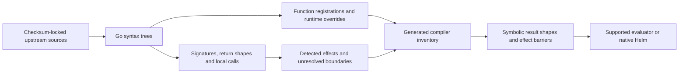

# Helm builtin functions

<!-- toc:start -->
**Table of contents**

- [Testing random outputs](#testing-random-outputs)
- [Coverage and limits](#coverage-and-limits)
- [Checked evaluation coverage](#checked-evaluation-coverage)
- [Effects and compiler decisions](#effects-and-compiler-decisions)
- [Findings addressed](#findings-addressed)
- [Function matrix](#function-matrix)
- [Sources and upgrades](#sources-and-upgrades)
  - [What comes from source, and what still needs a contract](#what-comes-from-source-and-what-still-needs-a-contract)
<!-- toc:end -->

[Compiler guide](README.md) · [Syntax trees](syntax-trees.md) · [Rejection analysis](analysis.md#explicit-rejection-discovery)

The compiler records what a function can affect before deciding whether it can
analyze the result. For example, `upper` changes text, `set` changes a dictionary
that other variables may also reference, and `randAlphaNum` can change output
between otherwise identical renders.

## Testing random outputs

`--renderer-policy auto` is the default. For charts with possible runtime effects, it lets Hypothesis generate and shrink
supported random outputs separately from the chart's values. For example, `randAlphaNum 8` becomes an input with exactly
eight ASCII letters or digits, including uppercase and digit-only strings.

| Policy | Execution | When control is unavailable |
| --- | --- | --- |
| `auto` (default) | Use the prepared, compatible renderer for potential runtime effects; ordinary charts use Helm. | Log the reason and rerender the whole case with native Helm. |
| `native` | Always use the configured Helm executable during testing. | Random outputs remain native and cannot be replayed from a draw tape. |
| `strict` | Require the pinned renderer and control every effect reached during that render. | Stop with an unavailable result, not a chart-defect finding. |

Prepare the controlled renderer once, then test or scan normally:

```sh
hypothesis-helm-renderer --build
helm hypothesis test ./chart --filter --max-examples 10
helm hypothesis test ./chart --renderer-policy strict
helm hypothesis test ./chart --renderer-policy native
```

The build requires Go and downloads the pinned Go 1.26 toolchain and Helm 4.3.0 SDK when needed. Its source-addressed executable
lives under `.cache/random-renderer/`; `--go /path/to/go` selects the compiler. Repository refresh builds it automatically.
Automatic testing does not download or compile tools inside a chart's execution budget. An absent build causes a visible native
fallback. Strict chart testing prepares its required build before the test budget starts.

The selected Helm executable must report version 4.3.0, matching the reviewed SDK. A different version, including a prerelease,
causes automatic fallback or strict rejection. This checks version compatibility; it does not certify custom Helm builds.
Version probes are cached per executable identity. Changing source, values, release settings or the renderer invalidates replay.

Configure the policy globally or for a chart selected by an `input_constraints` entry with `path: $`:

```yaml
hypothesis:
  renderer_policy: auto
```

This replaces the earlier `--random-inputs` testing switch and `hypothesis.random_inputs` Boolean. The replay command below
still uses `--random-inputs FILE` to select its saved tape.

The native Go parser assigns identities to random calls in a loaded, in-memory chart. Helm's function hook supplies the test
values; chart files and `values.yaml` remain unchanged. Each executed call receives an independent draw, including loop and
helper invocations. Reusing a variable reuses its value. Calls inside dynamically generated `tpl` code are recorded under an
explicit dynamic-call identity. Helm still checks argument types, coalesces dependencies, validates the values schema, and
executes the templates.

Each case starts **one renderer process**. A JSON stream requests a draw when execution reaches a random call, and Hypothesis
replies while that same Helm render waits. Previous prefixes are not rendered again. The process exits after that case; it is
not a persistent service shared between tests. Stdout and stderr are drained together, and timeouts or interruptions stop and
join the owned process group.

Hypothesis owns the draws during sampled tests, so the existing seed and shrinking settings apply. Defaults and finite plans
use a fixed all-zero alphanumeric representative. Their counts cover values configurations, not every possible random string.
**Sampled outputs never justify rejection or exact-equivalence pruning.** Static analysis can still report `HH2007` at a random
call because a sampled value is not a proven constant.

An executed clock, lookup, or unsupported random function makes that case unavailable for controlled replay. Automatic mode
discards its partial draw tape and rerenders the original input entirely with native Helm, using the remaining execution budget.
The output and any resulting finding carry `replayable: false` and the fallback reason. Reports show the limitation, and run
coverage records observed controlled renders and native fallback reasons. Native failures remain findings. Unreached unsupported
branches do not prevent replay of the executed path.

Malformed tapes, changed replay context, actual chart failures and expired execution budgets never trigger automatic fallback.
Explicit replay always requires full control, regardless of the chart's automatic policy.

Path scans and saved suites include a root property for renderer inputs, so charts with an empty values file still exercise
random outputs. Reports show the synthetic call paths and strings alongside ordinary changed values.

Failure artifacts include `random-inputs.json` beside `values.json`. The tape retains call paths, lengths, exact strings, and
hashes of the chart, values and renderer. Replay rejects changed inputs, missing or unused draws, and strings outside the
function's domain:

```sh
hypothesis-helm-renderer ./chart --values artifacts/values.json --random-inputs artifacts/random-inputs.json
```

Supply the same Helm executable (`--helm`), release, namespace and Kubernetes version when those options were used originally. The original chart must
still have its dependencies prepared. Replays restore the renderer inputs; custom Python assertions still require the original
test. `compiler.max_string_chars`, `compiler.max_steps`, and the render timeout bound generated lengths, call counts and the
total time spent completing a draw tape. One streamed render completes a tape. An automatic native fallback shares that same timeout.

## Coverage and limits

<!-- [[[cog
import json
from importlib.resources import files
from hypothesis_helm.compiler import builtins
snapshot = json.loads(files("hypothesis_helm.compiler.assets").joinpath("builtin_inventory.json").read_text(encoding="utf-8"))
versions = ", ".join(source["version"] for source in snapshot["sources"])
cog.outl(f"The inventory covers **{len(builtins.BUILTINS)} functions** from {versions}.")
]]] -->
The inventory covers **251 functions** from Go 1.26.0, Sprig 3.3.0, Helm 4.3.0.
<!-- [[[end]]] -->
A Go AST extractor reads their function maps, aliases, removals and renderer
assignments. The compiler loads its generated JSON instead of maintaining a
second list of function families.

The [source lock](../../pkg/hypothesis_helm_catalog/data/builtin-sources.json)
pins artifact checksums. The [generated inventory](../../pkg/hypothesis_helm/compiler/assets/builtin_inventory.json)
records package file hashes, implementations, signatures, return shapes,
call relationships, effect evidence and unresolved operations. No upstream Go
function is executed during extraction. A changed registration syntax fails the
rebuild instead of silently losing entries.

Three levels of support are separate:

| Level | What it establishes | What it does not establish |
| --- | --- | --- |
| Effect classification | Whether a function can mutate context, execute code, read external state or change between renders. | The function's concrete output. |
| Discovery model | Possible input dependencies, collection members, scalar arguments and selected result fields. | An accepted input domain or identical manifests. |
| Concrete evaluation or equality proof | A result within a pass's explicitly supported subset. | The behavior of unsupported arguments, functions or renderer modes. |

Every listed function has a generated source record. Only supported operations
have concrete models. A known return shape is insufficient to prove truthiness,
an enum or equivalent manifests. Unsupported expressions retain uncertainty and
remain eligible for Helm testing. A new function absent from this pinned inventory
is also unknown; it is never automatically treated as pure.

## Checked evaluation coverage

Every upstream function also needs a representative semantic test and a documented analysis boundary.
The table below is generated from [the coverage contract](../../pkg/hypothesis_helm/compiler/assets/builtin_coverage.json).
Its names must exactly match the upstream inventory. Adding or removing a function without reviewing its coverage fails
tests and generated-documentation checks, including repository refresh.

`evaluated` means the representative call is compared against the selected Helm executable. It does **not** mean every
possible operand is supported. `symbolic` preserves uncertainty such as map-key ordering. `rejection` checks an explicit
`fail` or `required` result against Helm. `deferred` asserts that the compiler returns unknown and cannot use that call to
prune an input; the last column explains the missing semantics or external dependency. The existing boundary suite also
exercises missing arguments, nils, empty values, mixed types, collections and incorrect argument counts for every name.

The remaining deferred representative calls have a **runtime effect**, or invoke a **dynamic call**. A runtime effect can
execute during a test, but its observed value does not establish a constant across inputs or renders. A dynamic call needs
a callable value and a contract for the effects of its target. Invalid arguments and unsupported compositions can still
defer even when a function's representative call evaluates concretely.

For example, `print` on a numeric port now uses bounded native Go formatting. The adapter preserves chart-value numeric
types separately from template literals and explicit `int`/`int64` conversions. This matters because Go adds a space
between adjacent operands only when neither is a string. `println` uses Go's newline/spacing behavior too. Unknown
transformed numeric kinds and unordered symbolic text remain unresolved rather than being coerced incorrectly.
`printf` also supports native flags, widths, precision, explicit operand indices and additional verbs within the allocation
budget. A mismatched format can return Go's diagnostic text; it is not automatically an exception.

Native evaluation uses the configured Helm executable. No second Go installation or compiler-specific build is required.
The adapter covers deterministic text, numeric, collection, reflection, serialization, digest, version and fixed-date
operations. A frozen recipe preserves Go types through later calls, including `time.Time`, semantic versions, typed slices
and named duration values. Input text stays JSON data and is never inserted into executable template source.

Calls are cached by executable identity, operands, timezone and timeout. Sequence lengths, repetition, regex expansion, format widths,
operand trees and payloads are bounded before execution using the chart's [compiler settings](../input-domains/README.md).
Native invocation timeouts and process ownership also apply. Native evaluation adds process overhead on cache misses.

The compiler distinguishes a fixed date from a date operand that would silently use the current time. It does not freeze
the order of a multi-entry `values` result. Deep copies own their local maps; shared input maps stay protected. If a copied
native result is later mutated, its old recipe cannot be reused: subsequent native operations defer until its updated Go
type can be established. None of these deferrals suppresses a Helm test or proves an enum or equivalent output.

The coverage fixture includes a generated test-only certificate and key to exercise deterministic `buildCustomCert` parsing;
they are public test data, not application credentials.

<!-- [[[cog
from hypothesis_helm.compiler.builtin_coverage import reference
cog.outl(reference())
]]] -->
All **251 registered functions** have a checked support decision. The representative probes produce **227 concrete results**, **1 symbolic result**, **2 explicit rejections**, and **21 deferred results**.

| Function | Probe outcome | Representative expression | Supported scope or reason for deferral |
| --- | --- | --- | --- |
| `abbrev` | evaluated | `abbrev 5 .Values.text` | Concrete evaluation uses the selected Helm binary, retaining native operand types and input origins. Invalid operands, uncertain ordering and compiler budget exhaustion remain unresolved. |
| `abbrevboth` | evaluated | `abbrevboth 2 5 .Values.text` | Concrete evaluation uses the selected Helm binary, retaining native operand types and input origins. Invalid operands, uncertain ordering and compiler budget exhaustion remain unresolved. |
| `add` | evaluated | `add 2 3` | Integer arithmetic is modeled where implemented; floating-point arithmetic and unimplemented aliases remain unresolved. |
| `add1` | evaluated | `add1 2` | Numeric conversion, rounding and result-kind semantics are required before folding this operation. |
| `add1f` | evaluated | `add1f 2` | Concrete evaluation uses the selected Helm binary, retaining native operand types and input origins. Invalid operands, uncertain ordering and compiler budget exhaustion remain unresolved. |
| `addf` | evaluated | `addf 2 3` | Concrete evaluation uses the selected Helm binary, retaining native operand types and input origins. Invalid operands, uncertain ordering and compiler budget exhaustion remain unresolved. |
| `adler32sum` | evaluated | `adler32sum .Values.text` | Concrete evaluation uses the selected Helm binary, retaining native operand types and input origins. Invalid operands, uncertain ordering and compiler budget exhaustion remain unresolved. |
| `ago` | deferred (runtime effect) | `ago 0` | Relative time depends on the current clock; sampled timestamps cannot prove a static result. |
| `all` | evaluated | `all true false` | Concrete evaluation uses the selected Helm binary, retaining native operand types and input origins. Invalid operands, uncertain ordering and compiler budget exhaustion remain unresolved. |
| `and` | evaluated | `and true false` | Go short-circuit and/or are modeled; Sprig all/any do not yet have concrete emptiness handlers. |
| `any` | evaluated | `any true false` | Concrete evaluation uses the selected Helm binary, retaining native operand types and input origins. Invalid operands, uncertain ordering and compiler budget exhaustion remain unresolved. |
| `append` | evaluated | `append (list "first") .Values.text` | Discovery follows collection elements; concrete evaluation is available only for implemented collection calls and aliases. |
| `atoi` | evaluated | `atoi "12"` | Decimal string conversion with Go integer bounds; invalid strings follow Sprig conversion behavior. |
| `b32dec` | evaluated | `b32dec "MZXW6==="` | Concrete evaluation uses the selected Helm binary, retaining native operand types and input origins. Invalid operands, uncertain ordering and compiler budget exhaustion remain unresolved. |
| `b32enc` | evaluated | `b32enc .Values.text` | Concrete evaluation uses the selected Helm binary, retaining native operand types and input origins. Invalid operands, uncertain ordering and compiler budget exhaustion remain unresolved. |
| `b64dec` | evaluated | `b64dec "aGVsbG8="` | Native Helm decoding with UTF-8 output; invalid byte sequences remain unresolved. |
| `b64enc` | evaluated | `b64enc .Values.text` | Base64 UTF-8 encoding is modeled; Base32 alphabet and padding rules have no concrete handler yet. |
| `base` | evaluated | `base "/a/b.txt"` | Concrete evaluation uses the selected Helm binary, retaining native operand types and input origins. Invalid operands, uncertain ordering and compiler budget exhaustion remain unresolved. |
| `bcrypt` | deferred (runtime effect) | `bcrypt "password"` | Password hashing uses randomness and/or expensive work; results stay with native Helm and cannot prove static equality. |
| `biggest` | evaluated | `biggest 2 3` | Concrete evaluation uses the selected Helm binary, retaining native operand types and input origins. Invalid operands, uncertain ordering and compiler budget exhaustion remain unresolved. |
| `buildCustomCert` | evaluated | `buildCustomCert .Values.certEncoded .Values.keyEncoded` | Concrete evaluation uses the selected Helm binary, retaining native operand types and input origins. Invalid operands, uncertain ordering and compiler budget exhaustion remain unresolved. |
| `call` | deferred (dynamic call) | `call .Values.text` | Dynamic invocation requires a Go function value and its effects; values-file strings are not executable functions. |
| `camelcase` | evaluated | `camelcase .Values.text` | Concrete evaluation uses the selected Helm binary, retaining native operand types and input origins. Invalid operands, uncertain ordering and compiler budget exhaustion remain unresolved. |
| `cat` | evaluated | `cat "hello" .Values.text` | Concrete evaluation uses the selected Helm binary, retaining native operand types and input origins. Invalid operands, uncertain ordering and compiler budget exhaustion remain unresolved. |
| `ceil` | evaluated | `ceil 2` | Concrete evaluation uses the selected Helm binary, retaining native operand types and input origins. Invalid operands, uncertain ordering and compiler budget exhaustion remain unresolved. |
| `chunk` | evaluated | `chunk 2 (list "a" "b" "c")` | Concrete evaluation uses the selected Helm binary, retaining native operand types and input origins. Invalid operands, uncertain ordering and compiler budget exhaustion remain unresolved. |
| `clean` | evaluated | `clean "/a/b.txt"` | Concrete evaluation uses the selected Helm binary, retaining native operand types and input origins. Invalid operands, uncertain ordering and compiler budget exhaustion remain unresolved. |
| `coalesce` | evaluated | `coalesce "" .Values.text` | Select the first nonempty supported value using Helm-compatible emptiness; unsupported Go types remain unresolved. |
| `compact` | evaluated | `compact (list "first" "second")` | Concrete evaluation uses the selected Helm binary, retaining native operand types and input origins. Invalid operands, uncertain ordering and compiler budget exhaustion remain unresolved. |
| `concat` | evaluated | `concat (list "a") (list .Values.text)` | Concatenate concrete lists while retaining element provenance and typed nil distinctions. |
| `contains` | evaluated | `contains "hello" .Values.text` | Concrete string operands only; no type coercion is inferred. |
| `date` | evaluated | `date "2006-01-02" 0` | Fixed dates and durations use native Go semantics. Operands that would implicitly read the clock are deferred; timezone context is renderer-dependent. |
| `dateInZone` | evaluated | `dateInZone "2006-01-02" 0 "UTC"` | Fixed dates and durations use native Go semantics. Operands that would implicitly read the clock are deferred; timezone context is renderer-dependent. |
| `dateModify` | evaluated | `dateModify "1h" (toDate "2006-01-02" "2026-01-02")` | Native record or named-type results retain a frozen operand recipe and Go type for subsequent calls, reflection and supported field access. |
| `date_in_zone` | evaluated | `date_in_zone "2006-01-02" 0 "UTC"` | Fixed dates and durations use native Go semantics. Operands that would implicitly read the clock are deferred; timezone context is renderer-dependent. |
| `date_modify` | evaluated | `date_modify "1h" (toDate "2006-01-02" "2026-01-02")` | Native record or named-type results retain a frozen operand recipe and Go type for subsequent calls, reflection and supported field access. |
| `decryptAES` | evaluated | `decryptAES "password" .Values.ciphertext` | Concrete evaluation uses the selected Helm binary, retaining native operand types and input origins. Invalid operands, uncertain ordering and compiler budget exhaustion remain unresolved. |
| `deepCopy` | evaluated | `deepCopy (dict "key" "value")` | Native copying creates a fresh local map. Aliases to the copy share writes; the original input is unchanged. Modified replay snapshots defer instead of replaying stale data. |
| `deepEqual` | evaluated | `deepEqual (dict "key" "value") (dict "key" "value")` | Concrete evaluation uses the selected Helm binary, retaining native operand types and input origins. Invalid operands, uncertain ordering and compiler budget exhaustion remain unresolved. |
| `default` | evaluated | `default "fallback" .Values.text` | Known scalar/list/map emptiness only; fallback evaluation is eager and still retains its effects. |
| `derivePassword` | evaluated | `derivePassword 1 "long" "password" "user" "site"` | Concrete evaluation uses the selected Helm binary, retaining native operand types and input origins. Invalid operands, uncertain ordering and compiler budget exhaustion remain unresolved. |
| `dict` | evaluated | `dict "key" .Values.text` | Literal-key dictionaries retain origins; malformed arguments and unsupported key coercions remain unresolved. |
| `dig` | evaluated | `dig "key" "fallback" (dict "key" "value")` | Concrete evaluation uses the selected Helm binary, retaining native operand types and input origins. Invalid operands, uncertain ordering and compiler budget exhaustion remain unresolved. |
| `dir` | evaluated | `dir "/a/b.txt"` | Concrete evaluation uses the selected Helm binary, retaining native operand types and input origins. Invalid operands, uncertain ordering and compiler budget exhaustion remain unresolved. |
| `div` | evaluated | `div 5 2` | Concrete evaluation uses the selected Helm binary, retaining native operand types and input origins. Invalid operands, uncertain ordering and compiler budget exhaustion remain unresolved. |
| `divf` | evaluated | `divf 5 2` | Concrete evaluation uses the selected Helm binary, retaining native operand types and input origins. Invalid operands, uncertain ordering and compiler budget exhaustion remain unresolved. |
| `duration` | evaluated | `duration "1h"` | Concrete evaluation uses the selected Helm binary, retaining native operand types and input origins. Invalid operands, uncertain ordering and compiler budget exhaustion remain unresolved. |
| `durationDays` | evaluated | `durationDays "1h"` | Concrete evaluation uses the selected Helm binary, retaining native operand types and input origins. Invalid operands, uncertain ordering and compiler budget exhaustion remain unresolved. |
| `durationHours` | evaluated | `durationHours "1h"` | Concrete evaluation uses the selected Helm binary, retaining native operand types and input origins. Invalid operands, uncertain ordering and compiler budget exhaustion remain unresolved. |
| `durationMicroseconds` | evaluated | `durationMicroseconds "1h"` | Concrete evaluation uses the selected Helm binary, retaining native operand types and input origins. Invalid operands, uncertain ordering and compiler budget exhaustion remain unresolved. |
| `durationMilliseconds` | evaluated | `durationMilliseconds "1h"` | Concrete evaluation uses the selected Helm binary, retaining native operand types and input origins. Invalid operands, uncertain ordering and compiler budget exhaustion remain unresolved. |
| `durationMinutes` | evaluated | `durationMinutes "1h"` | Concrete evaluation uses the selected Helm binary, retaining native operand types and input origins. Invalid operands, uncertain ordering and compiler budget exhaustion remain unresolved. |
| `durationNanoseconds` | evaluated | `durationNanoseconds "1h"` | Concrete evaluation uses the selected Helm binary, retaining native operand types and input origins. Invalid operands, uncertain ordering and compiler budget exhaustion remain unresolved. |
| `durationRound` | evaluated | `durationRound "1h"` | Fixed dates and durations use native Go semantics. Operands that would implicitly read the clock are deferred; timezone context is renderer-dependent. |
| `durationRoundTo` | evaluated | `durationRoundTo "1h" "1m"` | Concrete evaluation uses the selected Helm binary, retaining native operand types and input origins. Invalid operands, uncertain ordering and compiler budget exhaustion remain unresolved. |
| `durationSeconds` | evaluated | `durationSeconds "1h"` | Concrete evaluation uses the selected Helm binary, retaining native operand types and input origins. Invalid operands, uncertain ordering and compiler budget exhaustion remain unresolved. |
| `durationTruncateTo` | evaluated | `durationTruncateTo "1h" "1m"` | Concrete evaluation uses the selected Helm binary, retaining native operand types and input origins. Invalid operands, uncertain ordering and compiler budget exhaustion remain unresolved. |
| `durationWeeks` | evaluated | `durationWeeks "1h"` | Concrete evaluation uses the selected Helm binary, retaining native operand types and input origins. Invalid operands, uncertain ordering and compiler budget exhaustion remain unresolved. |
| `empty` | evaluated | `empty false` | Known scalar and container emptiness; no claim about arbitrary Go objects. |
| `encryptAES` | deferred (runtime effect) | `encryptAES "password" "text"` | Encryption randomness and binary/padding error behavior have no concrete contract; decryption is also deferred rather than guessed. |
| `eq` | evaluated | `eq 2 3` | Comparison is restricted to supported compatible types; renderer-specific numeric kinds can remain unresolved. |
| `ext` | evaluated | `ext "/a/b.txt"` | Concrete evaluation uses the selected Helm binary, retaining native operand types and input origins. Invalid operands, uncertain ordering and compiler budget exhaustion remain unresolved. |
| `fail` | rejection | `fail "coverage rejection"` | An explicit rejection is evidence to verify with Helm, never a successful render. |
| `first` | evaluated | `first (list "first" "second")` | Collection shape tracking is separate from concrete slice operations; nil slices, equality and alias behavior bound support. |
| `float64` | evaluated | `float64 "12"` | Concrete evaluation uses the selected Helm binary, retaining native operand types and input origins. Invalid operands, uncertain ordering and compiler budget exhaustion remain unresolved. |
| `floor` | evaluated | `floor 2` | Concrete evaluation uses the selected Helm binary, retaining native operand types and input origins. Invalid operands, uncertain ordering and compiler budget exhaustion remain unresolved. |
| `fromJson` | evaluated | `fromJson "{}"` | Native JSON/YAML parsing is available for implemented calls; TOML and unimplemented must aliases need their own return/error contracts. |
| `fromJsonArray` | evaluated | `fromJsonArray "[]"` | Concrete evaluation uses the selected Helm binary, retaining native operand types and input origins. Invalid operands, uncertain ordering and compiler budget exhaustion remain unresolved. |
| `fromToml` | evaluated | `fromToml "{}"` | Concrete evaluation uses the selected Helm binary, retaining native operand types and input origins. Invalid operands, uncertain ordering and compiler budget exhaustion remain unresolved. |
| `fromYaml` | evaluated | `fromYaml "{}"` | Native JSON/YAML parsing is available for implemented calls; TOML and unimplemented must aliases need their own return/error contracts. |
| `fromYamlArray` | evaluated | `fromYamlArray "[]"` | Concrete evaluation uses the selected Helm binary, retaining native operand types and input origins. Invalid operands, uncertain ordering and compiler budget exhaustion remain unresolved. |
| `ge` | evaluated | `ge 2 3` | Comparison is restricted to supported compatible types; renderer-specific numeric kinds can remain unresolved. |
| `genCA` | deferred (runtime effect) | `genCA "ca" 1` | Certificate creation uses randomness and time. Discovery tracks Cert/Key; concrete contents remain with Helm. |
| `genCAWithKey` | deferred (runtime effect) | `genCAWithKey "ca" 1 "key"` | Certificate creation uses randomness and time. Discovery tracks Cert/Key; concrete contents remain with Helm. |
| `genPrivateKey` | deferred (runtime effect) | `genPrivateKey "ecdsa"` | Key generation uses randomness and expensive native work; no static value can represent all outputs. |
| `genSelfSignedCert` | deferred (runtime effect) | `genSelfSignedCert "example" nil nil 1` | Certificate generation uses randomness and time; only record shape and input origins are tracked. |
| `genSelfSignedCertWithKey` | deferred (runtime effect) | `genSelfSignedCertWithKey "example" nil nil 1 "key"` | Certificate generation uses randomness and time; only record shape and input origins are tracked. |
| `genSignedCert` | deferred (runtime effect) | `genSignedCert "example" nil nil 1 .Values.certificate` | Signing requires a concrete certificate/key record and native randomness/time; concrete output is deferred. |
| `genSignedCertWithKey` | deferred (runtime effect) | `genSignedCertWithKey "example" nil nil 1 .Values.certificate "key"` | Signing requires a concrete certificate/key record and native randomness/time; concrete output is deferred. |
| `get` | evaluated | `get (dict "key" .Values.text) "key"` | Known dictionary keys; missing keys follow the modeled Go/Sprig lookup semantics. |
| `getHostByName` | evaluated | `getHostByName "localhost"` | Evaluates as empty only when the verified renderer disables DNS; enabled DNS remains external state. |
| `gt` | evaluated | `gt 2 3` | Comparison is restricted to supported compatible types; renderer-specific numeric kinds can remain unresolved. |
| `has` | evaluated | `has .Values.text (list "hello world")` | Membership over supported concrete string lists; sampled members do not establish a chart-authored enum. |
| `hasKey` | evaluated | `hasKey (dict "key" .Values.text) "key"` | Literal dictionary keys can establish a guarded allowlist; sampled keys cannot. |
| `hasPrefix` | evaluated | `hasPrefix "hello" .Values.text` | Concrete string operands only; no type coercion is inferred. |
| `hasSuffix` | evaluated | `hasSuffix "hello" .Values.text` | Concrete string operands only; no type coercion is inferred. |
| `hello` | evaluated | `hello` | Concrete evaluation uses the selected Helm binary, retaining native operand types and input origins. Invalid operands, uncertain ordering and compiler budget exhaustion remain unresolved. |
| `html` | evaluated | `html .Values.text` | Concrete evaluation uses the selected Helm binary, retaining native operand types and input origins. Invalid operands, uncertain ordering and compiler budget exhaustion remain unresolved. |
| `htmlDate` | evaluated | `htmlDate 0` | Fixed dates and durations use native Go semantics. Operands that would implicitly read the clock are deferred; timezone context is renderer-dependent. |
| `htmlDateInZone` | evaluated | `htmlDateInZone 0 "UTC"` | Fixed dates and durations use native Go semantics. Operands that would implicitly read the clock are deferred; timezone context is renderer-dependent. |
| `htpasswd` | deferred (runtime effect) | `htpasswd "user" "password"` | Password hashing uses randomness and/or expensive work; results stay with native Helm and cannot prove static equality. |
| `include` | evaluated | `include "coverage.echo" .` | Known helpers and resolvable contexts; recursive calls obey compiler limits and unresolved code remains with Helm. |
| `indent` | evaluated | `indent 2 .Values.text` | Known integer widths and concrete text bounded by max_string_chars; arbitrary width types remain unresolved. |
| `index` | evaluated | `index (list "a" .Values.text) 1` | Known collection and supported index; out-of-range access remains a potential chart failure, not a rejection rule. |
| `initial` | evaluated | `initial (list "first" "second")` | Concrete evaluation uses the selected Helm binary, retaining native operand types and input origins. Invalid operands, uncertain ordering and compiler budget exhaustion remain unresolved. |
| `initials` | evaluated | `initials .Values.text` | Concrete evaluation uses the selected Helm binary, retaining native operand types and input origins. Invalid operands, uncertain ordering and compiler budget exhaustion remain unresolved. |
| `int` | evaluated | `int 12` | Known integer operands within signed 64-bit bounds; other coercions remain unresolved. |
| `int64` | evaluated | `int64 12` | Known integer operands within signed 64-bit bounds; other coercions remain unresolved. |
| `isAbs` | evaluated | `isAbs "/a/b.txt"` | Concrete evaluation uses the selected Helm binary, retaining native operand types and input origins. Invalid operands, uncertain ordering and compiler budget exhaustion remain unresolved. |
| `join` | evaluated | `join "," (list "a" .Values.text)` | Concrete evaluation uses the selected Helm binary, retaining native operand types and input origins. Invalid operands, uncertain ordering and compiler budget exhaustion remain unresolved. |
| `js` | evaluated | `js .Values.text` | Concrete evaluation uses the selected Helm binary, retaining native operand types and input origins. Invalid operands, uncertain ordering and compiler budget exhaustion remain unresolved. |
| `kebabcase` | evaluated | `kebabcase .Values.text` | Concrete evaluation uses the selected Helm binary, retaining native operand types and input origins. Invalid operands, uncertain ordering and compiler budget exhaustion remain unresolved. |
| `keys` | symbolic | `keys (dict "key" .Values.text)` | Returns symbolic unordered keys; membership can be proved without claiming one iteration order. |
| `kindIs` | evaluated | `kindIs "string" .Values.text` | Stable nonnumeric reflection kinds; raw numeric Go kinds require renderer context. |
| `kindOf` | evaluated | `kindOf .Values.text` | Concrete evaluation uses the selected Helm binary, retaining native operand types and input origins. Invalid operands, uncertain ordering and compiler budget exhaustion remain unresolved. |
| `last` | evaluated | `last (list "first" "second")` | Concrete evaluation uses the selected Helm binary, retaining native operand types and input origins. Invalid operands, uncertain ordering and compiler budget exhaustion remain unresolved. |
| `le` | evaluated | `le 2 3` | Comparison is restricted to supported compatible types; renderer-specific numeric kinds can remain unresolved. |
| `len` | evaluated | `len (list .Values.text)` | Known strings and containers only; input length bounds do not make an unknown value concrete. |
| `list` | evaluated | `list .Values.text "second"` | Discovery preserves element origins; unimplemented aliases remain unavailable to concrete evaluation. |
| `lookup` | evaluated | `lookup "v1" "Secret" "default" "example"` | Empty only under a verified offline renderer; live cluster state cannot justify a static rejection. |
| `lower` | evaluated | `lower .Values.text` | Reviewed ASCII case/whitespace rules; unsupported Unicode transformations remain unresolved. |
| `lt` | evaluated | `lt 2 3` | Comparison is restricted to supported compatible types; renderer-specific numeric kinds can remain unresolved. |
| `max` | evaluated | `max 2 3` | Integer arithmetic is modeled where implemented; floating-point arithmetic and unimplemented aliases remain unresolved. |
| `maxf` | evaluated | `maxf 2 3` | Concrete evaluation uses the selected Helm binary, retaining native operand types and input origins. Invalid operands, uncertain ordering and compiler budget exhaustion remain unresolved. |
| `merge` | evaluated | `merge (dict) (dict "key" .Values.text)` | Fresh local dictionaries and supported precedence; shared input mutation, cycles and unsupported nested merges remain unresolved. |
| `mergeOverwrite` | evaluated | `mergeOverwrite (dict) (dict "key" .Values.text)` | Fresh local dictionaries and supported precedence; shared input mutation, cycles and unsupported nested merges remain unresolved. |
| `min` | evaluated | `min 2 3` | Integer arithmetic is modeled where implemented; floating-point arithmetic and unimplemented aliases remain unresolved. |
| `minf` | evaluated | `minf 2 3` | Concrete evaluation uses the selected Helm binary, retaining native operand types and input origins. Invalid operands, uncertain ordering and compiler budget exhaustion remain unresolved. |
| `mod` | evaluated | `mod 5 2` | Concrete evaluation uses the selected Helm binary, retaining native operand types and input origins. Invalid operands, uncertain ordering and compiler budget exhaustion remain unresolved. |
| `mul` | evaluated | `mul 2 3` | Integer arithmetic is modeled where implemented; floating-point arithmetic and unimplemented aliases remain unresolved. |
| `mulf` | evaluated | `mulf 2 3` | Concrete evaluation uses the selected Helm binary, retaining native operand types and input origins. Invalid operands, uncertain ordering and compiler budget exhaustion remain unresolved. |
| `mustAppend` | evaluated | `mustAppend (list "first") .Values.text` | Concrete evaluation uses the selected Helm binary, retaining native operand types and input origins. Invalid operands, uncertain ordering and compiler budget exhaustion remain unresolved. |
| `mustChunk` | evaluated | `mustChunk 2 (list "a" "b" "c")` | Concrete evaluation uses the selected Helm binary, retaining native operand types and input origins. Invalid operands, uncertain ordering and compiler budget exhaustion remain unresolved. |
| `mustCompact` | evaluated | `mustCompact (list "first" "second")` | Concrete evaluation uses the selected Helm binary, retaining native operand types and input origins. Invalid operands, uncertain ordering and compiler budget exhaustion remain unresolved. |
| `mustDateModify` | evaluated | `mustDateModify "1h" (toDate "2006-01-02" "2026-01-02")` | Native record or named-type results retain a frozen operand recipe and Go type for subsequent calls, reflection and supported field access. |
| `mustDeepCopy` | evaluated | `mustDeepCopy (dict "key" "value")` | Native copying creates a fresh local map. Aliases to the copy share writes; the original input is unchanged. Modified replay snapshots defer instead of replaying stale data. |
| `mustFirst` | evaluated | `mustFirst (list "first" "second")` | Concrete evaluation uses the selected Helm binary, retaining native operand types and input origins. Invalid operands, uncertain ordering and compiler budget exhaustion remain unresolved. |
| `mustFromJson` | evaluated | `mustFromJson "{}"` | Concrete evaluation uses the selected Helm binary, retaining native operand types and input origins. Invalid operands, uncertain ordering and compiler budget exhaustion remain unresolved. |
| `mustHas` | evaluated | `mustHas .Values.text (list "hello world")` | Membership over supported concrete string lists; sampled members do not establish a chart-authored enum. |
| `mustInitial` | evaluated | `mustInitial (list "first" "second")` | Concrete evaluation uses the selected Helm binary, retaining native operand types and input origins. Invalid operands, uncertain ordering and compiler budget exhaustion remain unresolved. |
| `mustLast` | evaluated | `mustLast (list "first" "second")` | Concrete evaluation uses the selected Helm binary, retaining native operand types and input origins. Invalid operands, uncertain ordering and compiler budget exhaustion remain unresolved. |
| `mustMerge` | evaluated | `mustMerge (dict) (dict "key" .Values.text)` | Fresh local dictionaries and supported precedence; shared input mutation, cycles and unsupported nested merges remain unresolved. |
| `mustMergeOverwrite` | evaluated | `mustMergeOverwrite (dict) (dict "key" .Values.text)` | Fresh local dictionaries and supported precedence; shared input mutation, cycles and unsupported nested merges remain unresolved. |
| `mustPrepend` | evaluated | `mustPrepend (list "first") .Values.text` | Concrete evaluation uses the selected Helm binary, retaining native operand types and input origins. Invalid operands, uncertain ordering and compiler budget exhaustion remain unresolved. |
| `mustPush` | evaluated | `mustPush (list "first") .Values.text` | Concrete evaluation uses the selected Helm binary, retaining native operand types and input origins. Invalid operands, uncertain ordering and compiler budget exhaustion remain unresolved. |
| `mustRegexFind` | evaluated | `mustRegexFind "hello" .Values.text` | Native Go regular expressions within configured pattern/subject budgets; invalid required expressions stay unresolved. |
| `mustRegexFindAll` | evaluated | `mustRegexFindAll "l" .Values.text -1` | Concrete evaluation uses the selected Helm binary, retaining native operand types and input origins. Invalid operands, uncertain ordering and compiler budget exhaustion remain unresolved. |
| `mustRegexMatch` | evaluated | `mustRegexMatch "hello" .Values.text` | Native Go regular expressions within configured pattern/subject budgets; invalid required expressions stay unresolved. |
| `mustRegexReplaceAll` | evaluated | `mustRegexReplaceAll "hello" .Values.text "hi"` | Native Go replacement bounded before execution; replacement expansion and invalid patterns can exceed the supported contract. |
| `mustRegexReplaceAllLiteral` | evaluated | `mustRegexReplaceAllLiteral "hello" .Values.text "hi"` | Native Go replacement bounded before execution; replacement expansion and invalid patterns can exceed the supported contract. |
| `mustRegexSplit` | evaluated | `mustRegexSplit "l" .Values.text -1` | Concrete evaluation uses the selected Helm binary, retaining native operand types and input origins. Invalid operands, uncertain ordering and compiler budget exhaustion remain unresolved. |
| `mustRest` | evaluated | `mustRest (list "first" "second")` | Concrete evaluation uses the selected Helm binary, retaining native operand types and input origins. Invalid operands, uncertain ordering and compiler budget exhaustion remain unresolved. |
| `mustReverse` | evaluated | `mustReverse (list "first" "second")` | Concrete evaluation uses the selected Helm binary, retaining native operand types and input origins. Invalid operands, uncertain ordering and compiler budget exhaustion remain unresolved. |
| `mustSlice` | evaluated | `mustSlice (list "a" "b") 0 1` | Concrete evaluation uses the selected Helm binary, retaining native operand types and input origins. Invalid operands, uncertain ordering and compiler budget exhaustion remain unresolved. |
| `mustToDate` | evaluated | `mustToDate "2006-01-02" "2026-01-02"` | Native record or named-type results retain a frozen operand recipe and Go type for subsequent calls, reflection and supported field access. |
| `mustToDuration` | evaluated | `mustToDuration "1h"` | Native record or named-type results retain a frozen operand recipe and Go type for subsequent calls, reflection and supported field access. |
| `mustToJson` | evaluated | `mustToJson (dict "key" .Values.text)` | Concrete evaluation uses the selected Helm binary, retaining native operand types and input origins. Invalid operands, uncertain ordering and compiler budget exhaustion remain unresolved. |
| `mustToPrettyJson` | evaluated | `mustToPrettyJson (dict "key" .Values.text)` | Concrete evaluation uses the selected Helm binary, retaining native operand types and input origins. Invalid operands, uncertain ordering and compiler budget exhaustion remain unresolved. |
| `mustToRawJson` | evaluated | `mustToRawJson (dict "key" .Values.text)` | Concrete evaluation uses the selected Helm binary, retaining native operand types and input origins. Invalid operands, uncertain ordering and compiler budget exhaustion remain unresolved. |
| `mustToToml` | evaluated | `mustToToml (dict "key" .Values.text)` | Concrete evaluation uses the selected Helm binary, retaining native operand types and input origins. Invalid operands, uncertain ordering and compiler budget exhaustion remain unresolved. |
| `mustToYaml` | evaluated | `mustToYaml (dict "key" .Values.text)` | Concrete evaluation uses the selected Helm binary, retaining native operand types and input origins. Invalid operands, uncertain ordering and compiler budget exhaustion remain unresolved. |
| `mustUniq` | evaluated | `mustUniq (list "first" "second")` | Concrete evaluation uses the selected Helm binary, retaining native operand types and input origins. Invalid operands, uncertain ordering and compiler budget exhaustion remain unresolved. |
| `mustWithout` | evaluated | `mustWithout (list "a" "b") "a"` | Concrete evaluation uses the selected Helm binary, retaining native operand types and input origins. Invalid operands, uncertain ordering and compiler budget exhaustion remain unresolved. |
| `must_date_modify` | evaluated | `must_date_modify "1h" (toDate "2006-01-02" "2026-01-02")` | Native record or named-type results retain a frozen operand recipe and Go type for subsequent calls, reflection and supported field access. |
| `ne` | evaluated | `ne 2 3` | Comparison is restricted to supported compatible types; renderer-specific numeric kinds can remain unresolved. |
| `nindent` | evaluated | `nindent 2 .Values.text` | Known integer widths and concrete text bounded by max_string_chars; arbitrary width types remain unresolved. |
| `nospace` | evaluated | `nospace .Values.text` | Concrete evaluation uses the selected Helm binary, retaining native operand types and input origins. Invalid operands, uncertain ordering and compiler budget exhaustion remain unresolved. |
| `not` | evaluated | `not false` | Known scalar and container emptiness; no claim about arbitrary Go objects. |
| `now` | deferred (runtime effect) | `now` | The current clock is external to chart values and cannot establish a static constant. |
| `omit` | evaluated | `omit (dict "key" .Values.text) "key"` | Supported string-key dictionaries with provenance-preserving field selection. |
| `or` | evaluated | `or true false` | Go short-circuit and/or are modeled; Sprig all/any do not yet have concrete emptiness handlers. |
| `osBase` | evaluated | `osBase "/a/b.txt"` | Concrete evaluation uses the selected Helm binary, retaining native operand types and input origins. Invalid operands, uncertain ordering and compiler budget exhaustion remain unresolved. |
| `osClean` | evaluated | `osClean "/a/b.txt"` | Concrete evaluation uses the selected Helm binary, retaining native operand types and input origins. Invalid operands, uncertain ordering and compiler budget exhaustion remain unresolved. |
| `osDir` | evaluated | `osDir "/a/b.txt"` | Concrete evaluation uses the selected Helm binary, retaining native operand types and input origins. Invalid operands, uncertain ordering and compiler budget exhaustion remain unresolved. |
| `osExt` | evaluated | `osExt "/a/b.txt"` | Concrete evaluation uses the selected Helm binary, retaining native operand types and input origins. Invalid operands, uncertain ordering and compiler budget exhaustion remain unresolved. |
| `osIsAbs` | evaluated | `osIsAbs "/a/b.txt"` | Concrete evaluation uses the selected Helm binary, retaining native operand types and input origins. Invalid operands, uncertain ordering and compiler budget exhaustion remain unresolved. |
| `pick` | evaluated | `pick (dict "key" .Values.text) "key"` | Supported string-key dictionaries with provenance-preserving field selection. |
| `pluck` | evaluated | `pluck "key" (dict "key" .Values.text)` | Concrete evaluation uses the selected Helm binary, retaining native operand types and input origins. Invalid operands, uncertain ordering and compiler budget exhaustion remain unresolved. |
| `plural` | evaluated | `plural "one" "many" 2` | Concrete evaluation uses the selected Helm binary, retaining native operand types and input origins. Invalid operands, uncertain ordering and compiler budget exhaustion remain unresolved. |
| `prepend` | evaluated | `prepend (list "first") .Values.text` | Concrete evaluation uses the selected Helm binary, retaining native operand types and input origins. Invalid operands, uncertain ordering and compiler budget exhaustion remain unresolved. |
| `print` | evaluated | `print .Values.port` | Formatting preserves native Go types, spacing, flags and type-error diagnostics. Widths and precision are bounded before execution; symbolic key order is never fixed by sampling. |
| `printf` | evaluated | `printf "%s:%s" "host" (print .Values.port)` | Formatting preserves native Go types, spacing, flags and type-error diagnostics. Widths and precision are bounded before execution; symbolic key order is never fixed by sampling. |
| `println` | evaluated | `println .Values.port` | Formatting preserves native Go types, spacing, flags and type-error diagnostics. Widths and precision are bounded before execution; symbolic key order is never fixed by sampling. |
| `push` | evaluated | `push (list "first") .Values.text` | Concrete evaluation uses the selected Helm binary, retaining native operand types and input origins. Invalid operands, uncertain ordering and compiler budget exhaustion remain unresolved. |
| `quote` | evaluated | `quote .Values.text` | Reviewed string/Boolean quoting; quote can use native Helm for concrete operands, while unsupported squote coercions remain unresolved. |
| `randAlpha` | deferred (runtime effect) | `randAlpha 8` | Random output cannot prove a static branch. Native rendering retains it; randAlphaNum also supports controlled sampling/replay. |
| `randAlphaNum` | deferred (runtime effect) | `randAlphaNum 8` | Random output cannot prove a static branch. Native rendering retains it; randAlphaNum also supports controlled sampling/replay. |
| `randAscii` | deferred (runtime effect) | `randAscii 8` | Random output cannot prove a static branch. Native rendering retains it; randAlphaNum also supports controlled sampling/replay. |
| `randBytes` | deferred (runtime effect) | `randBytes 8` | Random output cannot prove a static branch. Native rendering retains it; randAlphaNum also supports controlled sampling/replay. |
| `randInt` | deferred (runtime effect) | `randInt 0 10` | Random integers cannot prove static branches; native rendering owns the random draw. |
| `randNumeric` | deferred (runtime effect) | `randNumeric 8` | Random output cannot prove a static branch. Native rendering retains it; randAlphaNum also supports controlled sampling/replay. |
| `regexFind` | evaluated | `regexFind "hello" .Values.text` | Native Go regular expressions within configured pattern/subject budgets; invalid required expressions stay unresolved. |
| `regexFindAll` | evaluated | `regexFindAll "l" .Values.text -1` | Concrete evaluation uses the selected Helm binary, retaining native operand types and input origins. Invalid operands, uncertain ordering and compiler budget exhaustion remain unresolved. |
| `regexMatch` | evaluated | `regexMatch "hello" .Values.text` | Native Go regular expressions within configured pattern/subject budgets; invalid required expressions stay unresolved. |
| `regexQuoteMeta` | evaluated | `regexQuoteMeta .Values.text` | Concrete evaluation uses the selected Helm binary, retaining native operand types and input origins. Invalid operands, uncertain ordering and compiler budget exhaustion remain unresolved. |
| `regexReplaceAll` | evaluated | `regexReplaceAll "hello" .Values.text "hi"` | Native Go replacement bounded before execution; replacement expansion and invalid patterns can exceed the supported contract. |
| `regexReplaceAllLiteral` | evaluated | `regexReplaceAllLiteral "hello" .Values.text "hi"` | Native Go replacement bounded before execution; replacement expansion and invalid patterns can exceed the supported contract. |
| `regexSplit` | evaluated | `regexSplit "l" .Values.text -1` | Concrete evaluation uses the selected Helm binary, retaining native operand types and input origins. Invalid operands, uncertain ordering and compiler budget exhaustion remain unresolved. |
| `repeat` | evaluated | `repeat 2 .Values.text` | Concrete evaluation uses the selected Helm binary, retaining native operand types and input origins. Invalid operands, uncertain ordering and compiler budget exhaustion remain unresolved. |
| `replace` | evaluated | `replace "hello" "hi" .Values.text` | Concrete string replacement within configured output limits, including empty search strings. |
| `required` | rejection | `required "coverage rejection" ""` | Reject known empty operands; nonempty operands preserve their input origin. |
| `rest` | evaluated | `rest (list "first" "second")` | Concrete evaluation uses the selected Helm binary, retaining native operand types and input origins. Invalid operands, uncertain ordering and compiler budget exhaustion remain unresolved. |
| `reverse` | evaluated | `reverse (list "first" "second")` | Collection shape tracking is separate from concrete slice operations; nil slices, equality and alias behavior bound support. |
| `round` | evaluated | `round 1 2` | Concrete evaluation uses the selected Helm binary, retaining native operand types and input origins. Invalid operands, uncertain ordering and compiler budget exhaustion remain unresolved. |
| `semver` | evaluated | `semver "1.2.3"` | Native record or named-type results retain a frozen operand recipe and Go type for subsequent calls, reflection and supported field access. |
| `semverCompare` | evaluated | `semverCompare ">=1.0.0" "1.2.3"` | Native Helm version comparison under configured input-length and invocation limits. |
| `seq` | evaluated | `seq 1 3` | Concrete evaluation uses the selected Helm binary, retaining native operand types and input origins. Invalid operands, uncertain ordering and compiler budget exhaustion remain unresolved. |
| `set` | evaluated | `set (dict) "key" .Values.text` | Only owned local maps may be mutated; shared values, alias escapes and cycles remain explicit barriers. |
| `sha1sum` | evaluated | `sha1sum .Values.text` | Concrete evaluation uses the selected Helm binary, retaining native operand types and input origins. Invalid operands, uncertain ordering and compiler budget exhaustion remain unresolved. |
| `sha256sum` | evaluated | `sha256sum .Values.text` | Digest evaluation is implemented only for reviewed algorithms; other algorithms retain input origins without a digest proof. |
| `sha512sum` | evaluated | `sha512sum .Values.text` | Concrete evaluation uses the selected Helm binary, retaining native operand types and input origins. Invalid operands, uncertain ordering and compiler budget exhaustion remain unresolved. |
| `shuffle` | deferred (runtime effect) | `shuffle .Values.text` | Random permutations cannot prove static output equality; native rendering owns the shuffle. |
| `slice` | evaluated | `slice (list "a" "b") 0 1` | Concrete evaluation uses the selected Helm binary, retaining native operand types and input origins. Invalid operands, uncertain ordering and compiler budget exhaustion remain unresolved. |
| `snakecase` | evaluated | `snakecase .Values.text` | Concrete evaluation uses the selected Helm binary, retaining native operand types and input origins. Invalid operands, uncertain ordering and compiler budget exhaustion remain unresolved. |
| `sortAlpha` | evaluated | `sortAlpha (list "b" "a")` | Sort concrete string lists and symbolic dictionary keys; unsupported coercions remain unresolved. |
| `split` | evaluated | `split " " .Values.text` | Concrete string splitting; map-style split retains its lexical-key iteration semantics. |
| `splitList` | evaluated | `splitList " " .Values.text` | Concrete string splitting; map-style split retains its lexical-key iteration semantics. |
| `splitn` | evaluated | `splitn " " 2 .Values.text` | Concrete evaluation uses the selected Helm binary, retaining native operand types and input origins. Invalid operands, uncertain ordering and compiler budget exhaustion remain unresolved. |
| `squote` | evaluated | `squote .Values.text` | Reviewed string/Boolean quoting; quote can use native Helm for concrete operands, while unsupported squote coercions remain unresolved. |
| `sub` | evaluated | `sub 5 2` | Integer arithmetic is bounded; division, remainder and floating-point coercions need separate handlers. |
| `subf` | evaluated | `subf 5 2` | Concrete evaluation uses the selected Helm binary, retaining native operand types and input origins. Invalid operands, uncertain ordering and compiler budget exhaustion remain unresolved. |
| `substr` | evaluated | `substr 0 3 .Values.text` | Concrete evaluation uses the selected Helm binary, retaining native operand types and input origins. Invalid operands, uncertain ordering and compiler budget exhaustion remain unresolved. |
| `swapcase` | evaluated | `swapcase .Values.text` | Concrete evaluation uses the selected Helm binary, retaining native operand types and input origins. Invalid operands, uncertain ordering and compiler budget exhaustion remain unresolved. |
| `ternary` | evaluated | `ternary "yes" "no" true` | Boolean selector only; both value arguments are evaluated and their effects must be retained. |
| `title` | evaluated | `title .Values.text` | Concrete evaluation uses the selected Helm binary, retaining native operand types and input origins. Invalid operands, uncertain ordering and compiler budget exhaustion remain unresolved. |
| `toDate` | evaluated | `toDate "2006-01-02" "2026-01-02"` | Native record or named-type results retain a frozen operand recipe and Go type for subsequent calls, reflection and supported field access. |
| `toDecimal` | evaluated | `toDecimal "12"` | Concrete evaluation uses the selected Helm binary, retaining native operand types and input origins. Invalid operands, uncertain ordering and compiler budget exhaustion remain unresolved. |
| `toJson` | evaluated | `toJson (dict "key" .Values.text)` | Implemented serializers use native Helm; alternate layouts, HTML escaping, TOML and must variants require separate adapters. |
| `toPrettyJson` | evaluated | `toPrettyJson (dict "key" .Values.text)` | Concrete evaluation uses the selected Helm binary, retaining native operand types and input origins. Invalid operands, uncertain ordering and compiler budget exhaustion remain unresolved. |
| `toRawJson` | evaluated | `toRawJson (dict "key" .Values.text)` | Concrete evaluation uses the selected Helm binary, retaining native operand types and input origins. Invalid operands, uncertain ordering and compiler budget exhaustion remain unresolved. |
| `toString` | evaluated | `toString .Values.port` | Known strings, Booleans and integers; other scalar/container coercions remain unresolved. |
| `toStrings` | evaluated | `toStrings (list "a" 2)` | Concrete evaluation uses the selected Helm binary, retaining native operand types and input origins. Invalid operands, uncertain ordering and compiler budget exhaustion remain unresolved. |
| `toToml` | evaluated | `toToml (dict "key" .Values.text)` | Concrete evaluation uses the selected Helm binary, retaining native operand types and input origins. Invalid operands, uncertain ordering and compiler budget exhaustion remain unresolved. |
| `toYaml` | evaluated | `toYaml (dict "key" .Values.text)` | Implemented serializers use native Helm; alternate layouts, HTML escaping, TOML and must variants require separate adapters. |
| `toYamlPretty` | evaluated | `toYamlPretty (dict "key" .Values.text)` | Concrete evaluation uses the selected Helm binary, retaining native operand types and input origins. Invalid operands, uncertain ordering and compiler budget exhaustion remain unresolved. |
| `tpl` | evaluated | `tpl "{{ .Values.text }}" .` | Concrete template source and a resolvable context are recursively analyzed within step, byte and depth budgets. |
| `trim` | evaluated | `trim .Values.text` | Reviewed ASCII case/whitespace rules; unsupported Unicode transformations remain unresolved. |
| `trimAll` | evaluated | `trimAll "x" .Values.text` | Reviewed ASCII trimAll character-set semantics; lowercase aliases need explicit evaluator dispatch. |
| `trimPrefix` | evaluated | `trimPrefix "hello" .Values.text` | Remove a concrete prefix/suffix without regex interpretation. |
| `trimSuffix` | evaluated | `trimSuffix "hello" .Values.text` | Remove a concrete prefix/suffix without regex interpretation. |
| `trimall` | evaluated | `trimall "x" .Values.text` | Concrete evaluation uses the selected Helm binary, retaining native operand types and input origins. Invalid operands, uncertain ordering and compiler budget exhaustion remain unresolved. |
| `trunc` | evaluated | `trunc 3 .Values.text` | Bounded ASCII byte truncation with supported signed literal/converted widths. |
| `tuple` | evaluated | `tuple .Values.text "second"` | Concrete evaluation uses the selected Helm binary, retaining native operand types and input origins. Invalid operands, uncertain ordering and compiler budget exhaustion remain unresolved. |
| `typeIs` | evaluated | `typeIs "string" .Values.text` | Supported stable types only; pointer dereferencing and renderer-specific type identity are not inferred. |
| `typeIsLike` | evaluated | `typeIsLike "string" .Values.text` | Concrete evaluation uses the selected Helm binary, retaining native operand types and input origins. Invalid operands, uncertain ordering and compiler budget exhaustion remain unresolved. |
| `typeOf` | evaluated | `typeOf .Values.text` | Concrete evaluation uses the selected Helm binary, retaining native operand types and input origins. Invalid operands, uncertain ordering and compiler budget exhaustion remain unresolved. |
| `uniq` | evaluated | `uniq (list "first" "second")` | Concrete evaluation uses the selected Helm binary, retaining native operand types and input origins. Invalid operands, uncertain ordering and compiler budget exhaustion remain unresolved. |
| `unixEpoch` | evaluated | `unixEpoch (toDate "2006-01-02" "2026-01-02")` | Concrete evaluation uses the selected Helm binary, retaining native operand types and input origins. Invalid operands, uncertain ordering and compiler budget exhaustion remain unresolved. |
| `unset` | evaluated | `unset (dict "key" .Values.text) "key"` | Only owned local maps may be mutated; shared values and alias escapes remain explicit barriers. |
| `until` | evaluated | `until 3` | Concrete evaluation uses the selected Helm binary, retaining native operand types and input origins. Invalid operands, uncertain ordering and compiler budget exhaustion remain unresolved. |
| `untilStep` | evaluated | `untilStep 0 3 1` | Concrete evaluation uses the selected Helm binary, retaining native operand types and input origins. Invalid operands, uncertain ordering and compiler budget exhaustion remain unresolved. |
| `untitle` | evaluated | `untitle .Values.text` | Concrete evaluation uses the selected Helm binary, retaining native operand types and input origins. Invalid operands, uncertain ordering and compiler budget exhaustion remain unresolved. |
| `upper` | evaluated | `upper .Values.text` | Reviewed ASCII case/whitespace rules; unsupported Unicode transformations remain unresolved. |
| `urlJoin` | evaluated | `urlJoin (dict "scheme" "https" "host" "example.org" "path" "/path")` | Concrete evaluation uses the selected Helm binary, retaining native operand types and input origins. Invalid operands, uncertain ordering and compiler budget exhaustion remain unresolved. |
| `urlParse` | evaluated | `urlParse "https://example.org/path"` | Native Helm parsing under a verified renderer; parsed field origins remain derived. |
| `urlquery` | evaluated | `urlquery .Values.text` | Concrete evaluation uses the selected Helm binary, retaining native operand types and input origins. Invalid operands, uncertain ordering and compiler budget exhaustion remain unresolved. |
| `uuidv4` | deferred (runtime effect) | `uuidv4` | Random UUID generation remains native and cannot justify a static branch or equality proof. |
| `values` | evaluated | `values (dict "key" .Values.text)` | Empty or single-entry maps evaluate concretely. Multiple entries retain unspecified Go map order and remain unresolved. |
| `without` | evaluated | `without (list "a" "b") "a"` | Concrete list removal is available only for implemented calls; equality and aliases bound the supported cases. |
| `wrap` | evaluated | `wrap 8 .Values.text` | Concrete evaluation uses the selected Helm binary, retaining native operand types and input origins. Invalid operands, uncertain ordering and compiler budget exhaustion remain unresolved. |
| `wrapWith` | evaluated | `wrapWith 8 "&#124;" .Values.text` | Concrete evaluation uses the selected Helm binary, retaining native operand types and input origins. Invalid operands, uncertain ordering and compiler budget exhaustion remain unresolved. |
<!-- [[[end]]] -->

`if`, `range`, `with`, `template`, `block`, `define`, `break` and `continue` are
language actions, not function-map entries. `.Capabilities` and `.Files` are
context objects with methods. Their analysis is described in the
[syntax guide](syntax-trees.md) and [renderer-context contract](analysis.md).

## Effects and compiler decisions

| Effect | Examples | Compiler response |
| --- | --- | --- |
| Argument-dependent output | `upper`, `add`, `sha256sum` | Preserve input origins. Evaluate only the supported subset; otherwise let Helm calculate the result. |
| Map mutation | `set`, `unset`, both `merge` variants and their `must` aliases | Invalidate affected map facts, including aliases. Rejection analysis supports [owned local writes and flat-map merges](analysis.md#transformed-input-domains); shared writes and nested merges remain barriers. |
| Dynamic code | `include`, `tpl`, `call` | Analyze a resolvable helper or available template source. Unresolved code cannot justify pruning. |
| Randomness | `shuffle`, `randInt`, `encryptAES`, `bcrypt`, certificate generators | Preserve dependencies and report the native effect. Do not assign a repeatable concrete result. |
| Clock or timezone | `now`, `ago`, date conversion, certificate validity periods | Keep the environment-dependent result unknown. Explicit fixed arguments may permit a future narrower model. |
| External state | `lookup`, `getHostByName` | Require matching renderer settings before using offline behavior; otherwise keep the result unknown. |
| Unspecified order | `keys`, `values` | Do not assume map enumeration order. A Go template `range` over a string-keyed map itself visits sorted keys. |
| Operating-system behavior | `osBase`, `osClean` and related functions | Do not substitute Python path semantics for Helm's platform. |
| Explicit rejection | `fail`, `required` | Derive supported guarded requirements and verify rejection predictions with Helm. |

These effects can overlap. A generated certificate depends on both randomness
and time. The `must` prefix changes error handling; it does not remove mutation
or make an operation pure. All functions can also fail on invalid arguments.
The matrix is not an assertion that unmarked calls always succeed.

Plain `helm template` has no Kubernetes connection: `lookup` returns an empty map.
With DNS disabled, `getHostByName` returns an empty string. Rejection analysis uses
these results only after the executor attaches those renderer settings. Standalone
discovery, an unconfigured evaluator, and a renderer permitting cluster or DNS
access retain uncertainty. The audit, generation and planning entry points explicitly
select the tool's offline execution mode. No live cluster contents are invented.

## Findings addressed

| Pattern | Analysis behavior |
| --- | --- |
| `range.Values.items`, `if.Values.enabled`, chained `else if.Values.other` | Both syntax trees recognize the compact Go syntax and retain balanced blocks. |
| `split`, `splitn`, `splitList` with literal text | Track exact members. Dictionary keys such as `_10` sort before `_2`; list entries retain position order. |
| `concat` and supported list aliases | Preserve member origins and distinguish exact lists from unknown-length collections. |
| Scalar helper arguments such as `include "label" (printf "%s" .Values.name)` | Analyze scalar dot contexts and preserve the original input path. Invalid field access on a scalar still warns. |
| An odd number of `dict` arguments | Explain that Helm supplies an empty final value. Do not silently assume the intended helper context. |
| Unsupported mutation, dynamic helper output or unavailable `tpl` source | Keep the limitation visible and retain affected tests. |

The Airflow annotation merge calls that pass two maps without wrapping them in
`list` are not parser errors: Sprig accepts the odd dictionary argument list.
They can nevertheless pass a different context and collection than the helper
expects. This requires a chart correction, not suppressing the finding.

Decoding and error behavior also matter. For example, `fromYaml` may return a map
containing an `Error` entry; a successful template invocation alone does not prove
that the intended data survived. Helm remains the authority for rendered output.

## Function matrix

Result families describe possible shapes after a successful call, not exact
values. The implementation column identifies the upstream code; the source inventory
contains signatures and evidence. An unresolved count includes imported calls,
method dispatch and writes the extractor cannot resolve. Zero detected effects
is not a purity proof, even when no unresolved calls were recorded.

<!-- [[[cog
from hypothesis_helm.compiler.builtins import reference
cog.outl(reference())
]]] -->
| Function | Upstream implementation | Result | Detected effects | Unresolved calls/writes |
| --- | --- | --- | --- | ---: |
| `abbrev` | `abbrev` | scalar | None detected (not a purity proof) | 1 |
| `abbrevboth` | `abbrevboth` | scalar | None detected (not a purity proof) | 1 |
| `add` | `closure` | scalar | None detected (not a purity proof) | 1 |
| `add1` | `closure` | scalar | None detected (not a purity proof) | 1 |
| `add1f` | `closure` | scalar | None detected (not a purity proof) | 5 |
| `addf` | `closure` | scalar | None detected (not a purity proof) | 6 |
| `adler32sum` | `adler32sum` | scalar | None detected (not a purity proof) | 3 |
| `ago` | `dateAgo` | scalar | clock-or-timezone | 5 |
| `all` | `all` | scalar | None detected (not a purity proof) | 10 |
| `and` | `and` | any | None detected (not a purity proof) | 0 |
| `any` | `any` | scalar | None detected (not a purity proof) | 10 |
| `append` | `push` | sequence | None detected (not a purity proof) | 8 |
| `atoi` | `closure` | scalar | None detected (not a purity proof) | 1 |
| `b32dec` | `base32decode` | scalar | None detected (not a purity proof) | 2 |
| `b32enc` | `base32encode` | scalar | None detected (not a purity proof) | 2 |
| `b64dec` | `base64decode` | scalar | None detected (not a purity proof) | 2 |
| `b64enc` | `base64encode` | scalar | None detected (not a purity proof) | 2 |
| `base` | `path.Base` | any | None detected (not a purity proof) | 1 |
| `bcrypt` | `bcrypt` | scalar | randomness | 3 |
| `biggest` | `max` | scalar | None detected (not a purity proof) | 1 |
| `buildCustomCert` | `buildCustomCertificate` | record | None detected (not a purity proof) | 13 |
| `call` | `emptyCall` | any | dynamic-code | 0 |
| `camelcase` | `xstrings.ToPascalCase` | any | None detected (not a purity proof) | 1 |
| `cat` | `cat` | scalar | None detected (not a purity proof) | 3 |
| `ceil` | `ceil` | scalar | None detected (not a purity proof) | 2 |
| `chunk` | `chunk` | sequence | None detected (not a purity proof) | 11 |
| `clean` | `path.Clean` | any | None detected (not a purity proof) | 1 |
| `coalesce` | `coalesce` | any | None detected (not a purity proof) | 10 |
| `compact` | `compact` | sequence | None detected (not a purity proof) | 16 |
| `concat` | `concat` | any | None detected (not a purity proof) | 7 |
| `contains` | `closure` | scalar | None detected (not a purity proof) | 1 |
| `date` | `date` | scalar | clock-or-timezone | 5 |
| `dateInZone` | `dateInZone` | scalar | clock-or-timezone | 5 |
| `dateModify` | `dateModify` | any | None detected (not a purity proof) | 2 |
| `date_in_zone` | `dateInZone` | scalar | clock-or-timezone | 5 |
| `date_modify` | `dateModify` | any | None detected (not a purity proof) | 2 |
| `decryptAES` | `decryptAES` | scalar | None detected (not a purity proof) | 5 |
| `deepCopy` | `deepCopy` | any | None detected (not a purity proof) | 2 |
| `deepEqual` | `reflect.DeepEqual` | any | None detected (not a purity proof) | 1 |
| `default` | `dfault` | any | None detected (not a purity proof) | 10 |
| `derivePassword` | `derivePassword` | scalar | None detected (not a purity proof) | 12 |
| `dict` | `dict` | map | None detected (not a purity proof) | 4 |
| `dig` | `dig` | any | None detected (not a purity proof) | 1 |
| `dir` | `path.Dir` | any | None detected (not a purity proof) | 1 |
| `div` | `closure` | scalar | None detected (not a purity proof) | 1 |
| `divf` | `closure` | scalar | None detected (not a purity proof) | 5 |
| `duration` | `duration` | scalar | None detected (not a purity proof) | 3 |
| `durationDays` | `durationDays` | scalar | None detected (not a purity proof) | 14 |
| `durationHours` | `durationHours` | scalar | None detected (not a purity proof) | 14 |
| `durationMicroseconds` | `durationMicroseconds` | scalar | None detected (not a purity proof) | 14 |
| `durationMilliseconds` | `durationMilliseconds` | scalar | None detected (not a purity proof) | 14 |
| `durationMinutes` | `durationMinutes` | scalar | None detected (not a purity proof) | 14 |
| `durationNanoseconds` | `durationNanoseconds` | scalar | None detected (not a purity proof) | 14 |
| `durationRound` | `durationRound` | scalar | clock-or-timezone | 4 |
| `durationRoundTo` | `durationRoundTo` | any | None detected (not a purity proof) | 14 |
| `durationSeconds` | `durationSeconds` | scalar | None detected (not a purity proof) | 14 |
| `durationTruncateTo` | `durationTruncateTo` | any | None detected (not a purity proof) | 14 |
| `durationWeeks` | `durationWeeks` | scalar | None detected (not a purity proof) | 14 |
| `empty` | `empty` | scalar | None detected (not a purity proof) | 10 |
| `encryptAES` | `encryptAES` | scalar | randomness | 8 |
| `eq` | `eq` | scalar | None detected (not a purity proof) | 26 |
| `ext` | `path.Ext` | any | None detected (not a purity proof) | 1 |
| `fail` | `closure` | scalar | rejection | 2 |
| `first` | `first` | any | None detected (not a purity proof) | 7 |
| `float64` | `toFloat64` | scalar | None detected (not a purity proof) | 1 |
| `floor` | `floor` | scalar | None detected (not a purity proof) | 2 |
| `fromJson` | `fromJSON` | any | None detected (not a purity proof) | 4 |
| `fromJsonArray` | `fromJSONArray` | sequence | None detected (not a purity proof) | 3 |
| `fromToml` | `fromTOML` | map | None detected (not a purity proof) | 4 |
| `fromYaml` | `fromYAML` | map | None detected (not a purity proof) | 4 |
| `fromYamlArray` | `fromYAMLArray` | sequence | None detected (not a purity proof) | 3 |
| `ge` | `ge` | scalar | None detected (not a purity proof) | 13 |
| `genCA` | `generateCertificateAuthority` | record | clock-or-timezone, external-state, randomness | 24 |
| `genCAWithKey` | `generateCertificateAuthorityWithPEMKey` | record | clock-or-timezone, external-state, randomness | 31 |
| `genPrivateKey` | `generatePrivateKey` | scalar | randomness | 12 |
| `genSelfSignedCert` | `generateSelfSignedCertificate` | record | clock-or-timezone, external-state, randomness | 22 |
| `genSelfSignedCertWithKey` | `generateSelfSignedCertificateWithPEMKey` | record | clock-or-timezone, external-state, randomness | 29 |
| `genSignedCert` | `generateSignedCertificate` | record | clock-or-timezone, external-state, randomness | 31 |
| `genSignedCertWithKey` | `generateSignedCertificateWithPEMKey` | record | clock-or-timezone, external-state, randomness | 30 |
| `get` | `get` | any | None detected (not a purity proof) | 0 |
| `getHostByName` | `closure` | scalar | external-state, randomness | 2 |
| `gt` | `gt` | scalar | None detected (not a purity proof) | 31 |
| `has` | `has` | scalar | None detected (not a purity proof) | 8 |
| `hasKey` | `hasKey` | scalar | None detected (not a purity proof) | 0 |
| `hasPrefix` | `closure` | scalar | None detected (not a purity proof) | 1 |
| `hasSuffix` | `closure` | scalar | None detected (not a purity proof) | 1 |
| `hello` | `closure` | scalar | None detected (not a purity proof) | 0 |
| `html` | `HTMLEscaper` | scalar | mutation | 7 |
| `htmlDate` | `htmlDate` | scalar | clock-or-timezone | 5 |
| `htmlDateInZone` | `htmlDateInZone` | scalar | clock-or-timezone | 5 |
| `htpasswd` | `htpasswd` | scalar | randomness | 4 |
| `include` | `includeFun` | scalar | dynamic-code | 5 |
| `indent` | `indent` | scalar | None detected (not a purity proof) | 2 |
| `index` | `index` | any | None detected (not a purity proof) | 25 |
| `initial` | `initial` | sequence | None detected (not a purity proof) | 8 |
| `initials` | `initials` | scalar | None detected (not a purity proof) | 1 |
| `int` | `toInt` | scalar | None detected (not a purity proof) | 1 |
| `int64` | `toInt64` | scalar | None detected (not a purity proof) | 1 |
| `isAbs` | `path.IsAbs` | any | None detected (not a purity proof) | 1 |
| `join` | `join` | scalar | None detected (not a purity proof) | 9 |
| `js` | `JSEscaper` | scalar | mutation | 10 |
| `kebabcase` | `xstrings.ToKebabCase` | any | None detected (not a purity proof) | 1 |
| `keys` | `keys` | sequence | unordered | 0 |
| `kindIs` | `kindIs` | scalar | None detected (not a purity proof) | 3 |
| `kindOf` | `kindOf` | scalar | None detected (not a purity proof) | 3 |
| `last` | `last` | any | None detected (not a purity proof) | 7 |
| `le` | `le` | scalar | None detected (not a purity proof) | 31 |
| `len` | `length` | scalar | None detected (not a purity proof) | 5 |
| `list` | `list` | sequence | None detected (not a purity proof) | 0 |
| `lookup` | `newLookupFunction(ctx, *e.clientProvider)` | any | external-state | 1 |
| `lower` | `strings.ToLower` | any | None detected (not a purity proof) | 1 |
| `lt` | `lt` | scalar | None detected (not a purity proof) | 13 |
| `max` | `max` | scalar | None detected (not a purity proof) | 1 |
| `maxf` | `maxf` | scalar | None detected (not a purity proof) | 2 |
| `merge` | `merge` | any | mutation | 1 |
| `mergeOverwrite` | `mergeOverwrite` | any | mutation | 1 |
| `min` | `min` | scalar | None detected (not a purity proof) | 1 |
| `minf` | `minf` | scalar | None detected (not a purity proof) | 2 |
| `mod` | `closure` | scalar | None detected (not a purity proof) | 1 |
| `mul` | `closure` | scalar | None detected (not a purity proof) | 1 |
| `mulf` | `closure` | scalar | None detected (not a purity proof) | 5 |
| `mustAppend` | `mustPush` | sequence | None detected (not a purity proof) | 8 |
| `mustChunk` | `mustChunk` | sequence | None detected (not a purity proof) | 11 |
| `mustCompact` | `mustCompact` | sequence | None detected (not a purity proof) | 16 |
| `mustDateModify` | `mustDateModify` | any | None detected (not a purity proof) | 2 |
| `mustDeepCopy` | `mustDeepCopy` | any | None detected (not a purity proof) | 1 |
| `mustFirst` | `mustFirst` | any | None detected (not a purity proof) | 7 |
| `mustFromJson` | `mustFromJson` | any | None detected (not a purity proof) | 2 |
| `mustHas` | `mustHas` | scalar | None detected (not a purity proof) | 8 |
| `mustInitial` | `mustInitial` | sequence | None detected (not a purity proof) | 8 |
| `mustLast` | `mustLast` | any | None detected (not a purity proof) | 7 |
| `mustMerge` | `mustMerge` | any | mutation | 1 |
| `mustMergeOverwrite` | `mustMergeOverwrite` | any | mutation | 1 |
| `mustPrepend` | `mustPrepend` | sequence | None detected (not a purity proof) | 8 |
| `mustPush` | `mustPush` | sequence | None detected (not a purity proof) | 8 |
| `mustRegexFind` | `mustRegexFind` | scalar | None detected (not a purity proof) | 2 |
| `mustRegexFindAll` | `mustRegexFindAll` | sequence | None detected (not a purity proof) | 2 |
| `mustRegexMatch` | `mustRegexMatch` | scalar | None detected (not a purity proof) | 1 |
| `mustRegexReplaceAll` | `mustRegexReplaceAll` | scalar | None detected (not a purity proof) | 2 |
| `mustRegexReplaceAllLiteral` | `mustRegexReplaceAllLiteral` | scalar | None detected (not a purity proof) | 2 |
| `mustRegexSplit` | `mustRegexSplit` | sequence | None detected (not a purity proof) | 2 |
| `mustRest` | `mustRest` | sequence | None detected (not a purity proof) | 8 |
| `mustReverse` | `mustReverse` | sequence | None detected (not a purity proof) | 8 |
| `mustSlice` | `mustSlice` | any | None detected (not a purity proof) | 8 |
| `mustToDate` | `mustToDate` | any | clock-or-timezone | 1 |
| `mustToDuration` | `mustToDuration` | any | None detected (not a purity proof) | 13 |
| `mustToJson` | `mustToJSON` | scalar | None detected (not a purity proof) | 1 |
| `mustToPrettyJson` | `mustToPrettyJson` | scalar | None detected (not a purity proof) | 1 |
| `mustToRawJson` | `mustToRawJson` | scalar | None detected (not a purity proof) | 5 |
| `mustToToml` | `mustToTOML` | scalar | None detected (not a purity proof) | 4 |
| `mustToYaml` | `mustToYAML` | scalar | None detected (not a purity proof) | 2 |
| `mustUniq` | `mustUniq` | sequence | None detected (not a purity proof) | 8 |
| `mustWithout` | `mustWithout` | sequence | None detected (not a purity proof) | 8 |
| `must_date_modify` | `mustDateModify` | any | None detected (not a purity proof) | 2 |
| `ne` | `ne` | scalar | None detected (not a purity proof) | 26 |
| `nindent` | `nindent` | scalar | None detected (not a purity proof) | 2 |
| `nospace` | `util.DeleteWhiteSpace` | any | None detected (not a purity proof) | 1 |
| `not` | `not` | scalar | None detected (not a purity proof) | 2 |
| `now` | `time.Now` | any | clock-or-timezone | 1 |
| `omit` | `omit` | map | None detected (not a purity proof) | 2 |
| `or` | `or` | any | None detected (not a purity proof) | 0 |
| `osBase` | `filepath.Base` | any | platform | 1 |
| `osClean` | `filepath.Clean` | any | platform | 1 |
| `osDir` | `filepath.Dir` | any | platform | 1 |
| `osExt` | `filepath.Ext` | any | platform | 1 |
| `osIsAbs` | `filepath.IsAbs` | any | platform | 1 |
| `pick` | `pick` | map | None detected (not a purity proof) | 1 |
| `pluck` | `pluck` | sequence | None detected (not a purity proof) | 0 |
| `plural` | `plural` | scalar | None detected (not a purity proof) | 0 |
| `prepend` | `prepend` | sequence | None detected (not a purity proof) | 8 |
| `print` | `fmt.Sprint` | any | None detected (not a purity proof) | 1 |
| `printf` | `fmt.Sprintf` | any | None detected (not a purity proof) | 1 |
| `println` | `fmt.Sprintln` | any | None detected (not a purity proof) | 1 |
| `push` | `push` | sequence | None detected (not a purity proof) | 8 |
| `quote` | `quote` | scalar | None detected (not a purity proof) | 4 |
| `randAlpha` | `randAlpha` | scalar | randomness | 1 |
| `randAlphaNum` | `randAlphaNumeric` | scalar | randomness | 1 |
| `randAscii` | `randAscii` | scalar | randomness | 1 |
| `randBytes` | `randBytes` | scalar | randomness | 2 |
| `randInt` | `closure` | scalar | randomness | 1 |
| `randNumeric` | `randNumeric` | scalar | randomness | 1 |
| `regexFind` | `regexFind` | scalar | None detected (not a purity proof) | 2 |
| `regexFindAll` | `regexFindAll` | sequence | None detected (not a purity proof) | 2 |
| `regexMatch` | `regexMatch` | scalar | None detected (not a purity proof) | 1 |
| `regexQuoteMeta` | `regexQuoteMeta` | scalar | None detected (not a purity proof) | 1 |
| `regexReplaceAll` | `regexReplaceAll` | scalar | None detected (not a purity proof) | 2 |
| `regexReplaceAllLiteral` | `regexReplaceAllLiteral` | scalar | None detected (not a purity proof) | 2 |
| `regexSplit` | `regexSplit` | sequence | None detected (not a purity proof) | 2 |
| `repeat` | `closure` | scalar | None detected (not a purity proof) | 1 |
| `replace` | `replace` | scalar | None detected (not a purity proof) | 1 |
| `required` | `closure` | any | rejection | 2 |
| `rest` | `rest` | sequence | None detected (not a purity proof) | 8 |
| `reverse` | `reverse` | sequence | None detected (not a purity proof) | 8 |
| `round` | `round` | scalar | None detected (not a purity proof) | 5 |
| `semver` | `semver` | any | None detected (not a purity proof) | 1 |
| `semverCompare` | `semverCompare` | scalar | None detected (not a purity proof) | 3 |
| `seq` | `seq` | scalar | None detected (not a purity proof) | 4 |
| `set` | `set` | map | mutation | 0 |
| `sha1sum` | `sha1sum` | scalar | None detected (not a purity proof) | 3 |
| `sha256sum` | `sha256sum` | scalar | None detected (not a purity proof) | 3 |
| `sha512sum` | `sha512sum` | scalar | None detected (not a purity proof) | 3 |
| `shuffle` | `xstrings.Shuffle` | any | randomness | 1 |
| `slice` | `slice` | any | None detected (not a purity proof) | 22 |
| `snakecase` | `xstrings.ToSnakeCase` | any | None detected (not a purity proof) | 1 |
| `sortAlpha` | `sortAlpha` | sequence | None detected (not a purity proof) | 12 |
| `split` | `split` | map | None detected (not a purity proof) | 3 |
| `splitList` | `closure` | sequence | None detected (not a purity proof) | 1 |
| `splitn` | `splitn` | map | None detected (not a purity proof) | 3 |
| `squote` | `squote` | scalar | None detected (not a purity proof) | 2 |
| `sub` | `closure` | scalar | None detected (not a purity proof) | 1 |
| `subf` | `closure` | scalar | None detected (not a purity proof) | 5 |
| `substr` | `substring` | scalar | None detected (not a purity proof) | 0 |
| `swapcase` | `util.SwapCase` | any | None detected (not a purity proof) | 1 |
| `ternary` | `ternary` | any | None detected (not a purity proof) | 0 |
| `title` | `strings.Title` | any | None detected (not a purity proof) | 1 |
| `toDate` | `toDate` | any | clock-or-timezone | 1 |
| `toDecimal` | `toDecimal` | scalar | None detected (not a purity proof) | 2 |
| `toJson` | `toJSON` | scalar | None detected (not a purity proof) | 1 |
| `toPrettyJson` | `toPrettyJson` | scalar | None detected (not a purity proof) | 1 |
| `toRawJson` | `toRawJson` | scalar | None detected (not a purity proof) | 5 |
| `toString` | `strval` | scalar | None detected (not a purity proof) | 3 |
| `toStrings` | `strslice` | sequence | None detected (not a purity proof) | 8 |
| `toToml` | `toTOML` | scalar | None detected (not a purity proof) | 5 |
| `toYaml` | `toYAML` | scalar | None detected (not a purity proof) | 2 |
| `toYamlPretty` | `toYAMLPretty` | scalar | None detected (not a purity proof) | 5 |
| `tpl` | `tplFun` | any | dynamic-code | 12 |
| `trim` | `strings.TrimSpace` | any | None detected (not a purity proof) | 1 |
| `trimAll` | `closure` | scalar | None detected (not a purity proof) | 1 |
| `trimPrefix` | `closure` | scalar | None detected (not a purity proof) | 1 |
| `trimSuffix` | `closure` | scalar | None detected (not a purity proof) | 1 |
| `trimall` | `closure` | scalar | None detected (not a purity proof) | 1 |
| `trunc` | `trunc` | scalar | None detected (not a purity proof) | 0 |
| `tuple` | `list` | sequence | None detected (not a purity proof) | 0 |
| `typeIs` | `typeIs` | scalar | None detected (not a purity proof) | 1 |
| `typeIsLike` | `typeIsLike` | scalar | None detected (not a purity proof) | 1 |
| `typeOf` | `typeOf` | scalar | None detected (not a purity proof) | 1 |
| `uniq` | `uniq` | sequence | None detected (not a purity proof) | 8 |
| `unixEpoch` | `unixEpoch` | scalar | None detected (not a purity proof) | 2 |
| `unset` | `unset` | map | mutation | 0 |
| `until` | `until` | sequence | None detected (not a purity proof) | 0 |
| `untilStep` | `untilStep` | sequence | None detected (not a purity proof) | 0 |
| `untitle` | `untitle` | scalar | None detected (not a purity proof) | 1 |
| `upper` | `strings.ToUpper` | any | None detected (not a purity proof) | 1 |
| `urlJoin` | `urlJoin` | scalar | None detected (not a purity proof) | 9 |
| `urlParse` | `urlParse` | map | None detected (not a purity proof) | 12 |
| `urlquery` | `URLQueryEscaper` | scalar | mutation | 4 |
| `uuidv4` | `uuidv4` | scalar | randomness | 2 |
| `values` | `values` | sequence | unordered | 0 |
| `without` | `without` | sequence | None detected (not a purity proof) | 8 |
| `wrap` | `closure` | scalar | None detected (not a purity proof) | 1 |
| `wrapWith` | `closure` | scalar | None detected (not a purity proof) | 1 |
<!-- [[[end]]] -->

## Sources and upgrades

Start with [dependency maintenance](../dependencies.md#helm-sprig-and-go) when upgrading these sources. It also identifies the
separate native renderer module, replay metadata, CLI versions and CI pins that a Helm upgrade must account for.

- [Helm function map and serialization helpers](https://github.com/helm/helm/blob/v4.3.0/pkg/engine/funcs.go).
- [Helm renderer overrides, offline lookup and DNS behavior](https://github.com/helm/helm/blob/v4.3.0/pkg/engine/engine.go).
- [Sprig function map and aliases](https://github.com/Masterminds/sprig/blob/v3.3.0/functions.go).
- [Go template builtin functions](https://github.com/golang/go/blob/go1.26.0/src/text/template/funcs.go).

Rebuild the inventory and its reference before releasing:

```bash
poetry install --only-root
poetry run hypothesis-helm-builtins
poetry run cog -r docs/compiler/functions.md
```

Use `hypothesis-helm-builtins --check` to regenerate and compare without writing.
Use `--offline` after the sources are cached, `--go /path/to/go` to select the
Go executable, and `--source-lock path.json` to test a reviewed upstream upgrade.
The source downloads and Go build cache live under `.cache/compiler-builtins/`
by default. Ordinary chart tests load the bundled JSON and need neither Go nor
network access. Tagged release builds verify the inventory before packaging.

Both catalog commands build the same Go package under
[`hypothesis_helm_catalog/upstream`](../../pkg/hypothesis_helm_catalog/upstream/):
`main.go` handles command dispatch and shared utilities, `helm.go` analyzes Helm,
Sprig and Go template functions, and `kubernetes.go` extracts API constraints and
checks their boundary cases against Kubernetes validators. The first build caches
the pinned Go dependencies; subsequent `--offline` builds require those dependencies
and the upstream source downloads in the selected cache directory. The extractor
fingerprint includes all three Go files and both dependency manifests.

### What comes from source, and what still needs a contract



Local-call traversal propagates detected effects through wrappers and aliases,
including recursive call graphs. Primitive API contracts identify randomness,
clock access, network access and map merging; Helm's rejection and renderer
intrinsics need explicit contracts too. These are small semantic boundaries,
not a classification of every exposed function name. Imported implementations
and unresolved method calls remain recorded as analysis gaps.

This is a conservative source-fact extractor, not a complete Go effect system.
It does not prove purity, infer arbitrary interface behavior, invert functions,
or synthesize exact evaluators. Its reported effects can include internal helper
work; their presence is conservative, and their absence is not evidence that a
call has no effects. Conditional renderer replacements retain effects from both
implementations, so an offline placeholder cannot hide a live-cluster operation.
Compiler passes retain their reviewed argument-level semantics; generated facts
alone cannot prove a rejection, accepted input domain or equivalent manifests.

Return declarations can improve the symbolic IR automatically: for example, a
new slice-returning function yields a collection of unknown length, retaining its
input dependencies. A known scalar return does not supply a value or truthiness.
Imported or interface-valued return types remain unconstrained until a supported
model establishes more.

The extractor uses Go's [syntax-tree parser](https://pkg.go.dev/go/parser).
A future inter-package analysis could use [Go SSA](https://pkg.go.dev/golang.org/x/tools/go/ssa)
for typed call and memory-flow analysis; reflection, callbacks and renderer state
would still require explicit conservative boundaries. No runtime speedup from
using Go is claimed here: this command runs during release preparation.
