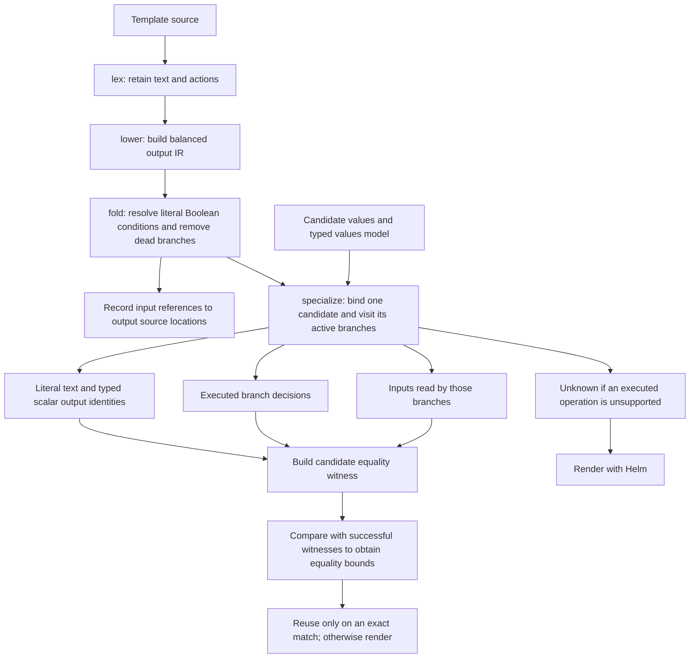

# Syntax trees and values model

<!-- toc:start -->
**Table of contents**

- [Shared lexer, different representations](#shared-lexer-different-representations)
- [Output compilation stages](#output-compilation-stages)
- [Shared values model](#shared-values-model)
<!-- toc:end -->

[Compiler](README.md) · [Analysis passes](analysis.md) · [Selection passes](selection.md)

An **abstract syntax tree (AST)** records how statements nest inside a template.
An `if` node has a true branch and an alternative branch; walking its children
reaches the statements controlled by that condition. Source line numbers connect
findings back to the chart.

A named helper is a reusable template declared with `define`, often in
`templates/_helpers.tpl`. When a resource template calls it with a statically
named `include`, the analysis records a call edge from the caller to that helper.
Two resource templates can call the same helper, so their separate syntax trees
form a graph with a shared destination. Dynamic names
and ambiguous definitions remain unresolved.

The analysis also retains where an expression occurred. A requirement discovered
inside a helper can therefore point to `templates/_helpers.tpl` and its line
number, while the call relationship explains which resource template reaches it.
The filename and line identify the expression in the chart source.

Values discovery follows literal `include`, `template`, and `block` calls through
unique helper definitions, including installed dependency archives. A helper receives
the context passed by its caller: both `.` and `$` start at that argument, and the
caller's local variables are unavailable. Literal `dict` arguments preserve the
origin of each field, so `(dict "value" .Values.worker)` lets discovery map
`.value.livenessProbe` in the helper to `$.worker.livenessProbe`.

A missing key in a literal helper dictionary is known to be absent. An argument
whose source cannot be resolved remains unknown. This distinction avoids warnings
for omitted optional arguments such as `.skipQuote` without hiding uncertain
inputs. Parenthesized selectors, such as `(.context.Values.global).apiVersions`,
are resolved against their receiver rather than the surrounding `.` context.

File-template calls such as `include (print $.Template.BasePath "/config.yaml") .`
are followed when the chart name, suffix and calling context are known. The chart
name comes from `Chart.yaml`. Names depending on arbitrary values remain unresolved.

Discovery also tracks where computed values came from. For example,
`$version := semver .Values.image.tag` makes `$version.Major` a derived field of
the image tag, not a new `image.tag.Major` input. Certificate generation exposes
`Cert` and `Key` result fields; `lookup` exposes an external result. Both still
produce `HH2005` at the operation that generates or fetches the data. Their contents
are left to Helm, and selecting result fields does not create repeated warnings.

An `else if` keeps the surrounding `.` context. An `else with` changes `.` only
inside its own body. Each alternative has its own subtree, including its final
`else`, so literal branch pruning retains the correct statements.

Assignments to an existing variable retain the possible input sources from every
branch. A new local declaration shadows that variable only within its own block.
Known helper arguments can prove that a branch cannot execute. For example, a
literal dictionary containing `context` satisfies `hasKey . "context"`, and an
omitted argument defaulting to an empty list cannot enter a `range` body.
These decisions use template construction, never the current values defaults.
Input-controlled branches remain in discovery even when disabled by default.

List operations (`concat`, `append`, `prepend`, `first`, `last`, `reverse`, `uniq` and
`sortAlpha`) preserve the possible origins of their members. `pick` and `omit`
retain the original paths for fields they keep. Unsupported map mutation still
warns and invalidates affected key facts, including aliases and cached helper
effects. An earlier `hasKey` result cannot authorize pruning after such a mutation.

Literal lists and string-keyed dictionaries are visited in their known iteration
order. A literal `splitList "." "security.privileged"` therefore follows two keys
and reaches `$.security.privileged`; it does not grow an unknown-depth wildcard
path. These finite walks share the statement budget described below.
`split` and `splitn` produce dictionaries with numbered keys, which follow Go's
lexical key ordering. Compact block syntax such as `range.Values.items` is valid
and is recognized by both syntax trees. Scalar helper arguments retain their
input origins without being mistaken for a values dictionary.
The [builtin inventory](functions.md) distinguishes result-shape models from
effect classification and exact evaluation.
For unknown-length collections, loop analysis includes the zero-iteration case
and repeats until the possible input sources stop changing. Growing lists are
summarized by their possible members. If other origins have not stabilized after
eight passes, discovery retains the known sources plus an unknown alternative
and reports the limit.

Looking up an input-selected key in a literal dictionary retains all possible
entry origins. A surrounding `hasKey` guard proves membership within its matching
branch; an unguarded lookup also retains the missing-key possibility. This does
not declare a global input enum or replace [rejection analysis](analysis.md#explicit-rejection-discovery).

For `tpl`, discovery follows aliases, `default`/`coalesce` alternatives and supported
text conversions to inspect available strings from the supplied values. Known
strings are analyzed even when another alternative is unresolved; that uncertainty
still produces a diagnostic. Literal dictionary contexts preserve their mapped
values paths. This inspection does not establish what arbitrary future template
strings will execute or prove output equivalence.

Unknown helper names, conflicting definitions, unsupported argument transformations,
recursion and exhausted analysis budgets still produce `HH2005` diagnostics.
Helper traversal respects `compiler.max_call_depth`; discovery also stops after
`compiler.max_discovery_nodes` visited actions (10,000 by default) and reports that
limit. Dynamic template expansion uses `max_tpl_depth` and `max_template_bytes`;
dependency inspection uses `max_dependency_depth`, `max_files` and `max_context_bytes`.
See the [analysis budgets](analysis.md#explicit-rejection-discovery). Uncalled helper definitions do not
execute and are not treated as root templates. These are discovery rules, not
proofs of equivalent rendered output. Scans show remaining diagnostics with their
template filename and line number, deduplicated per chart, and still honor
[`--fail` and suppression rules](../rules/README.md).

## Shared lexer, different representations

[`lexing.py`](../../pkg/hypothesis_helm/compiler/asts/lexing.py) separates literal
text from template actions while respecting quoted delimiters, comments, and Go
whitespace trimming. Two consumers use that token stream:

| Representation | Preserves | Used for |
| --- | --- | --- |
| `Action` | Action text, tokens, source lines, and branches. | Scope-aware values discovery. |
| `Node` | Literal output, expressions, branches, and unsupported blocks. | Output analysis and rejection evaluation. |

These types live in [`actions.py`](../../pkg/hypothesis_helm/compiler/asts/actions.py)
and [`templates.py`](../../pkg/hypothesis_helm/compiler/asts/templates.py), respectively.

The action tree omits literal output. It can help locate a value without proving
what Helm would print. Output analysis needs the text-preserving representation,
called an **intermediate representation (IR)**. A node marked **opaque** contains
an operation that the output evaluator cannot interpret.

The rejection evaluator in
[`contracts.py`](../../pkg/hypothesis_helm/compiler/asts/contracts.py) parses
expressions and follows supported, statically named helper calls. Its supported
operations differ from those admitted for output-equivalence proofs. Understanding
a `fail` condition does not establish the complete output of its template.
Helper arguments retain their original values paths, so `.type` inside a helper
can refer back to the caller's `$.resourcesPreset` even after passing through a
nested dictionary. The [supported-expression table](analysis.md#explicit-rejection-discovery)
describes the current boundaries.

Supported transformations retain an expression tree as well as their concrete
result. For `lower .Values.mode`, the tree records the `lower` operation and the
original `mode` path. That distinction lets the compiler reason about accepted
inputs without treating a normalized output as the original value. See
[transformed input domains](analysis.md#transformed-input-domains).

## Output compilation stages

These are logical stages, not seven independent Python pass modules. `fold`
handles literal conditions; `specialize` combines candidate-specific branch
selection, output identities, and live input tracking.

**Constant propagation** resolves a condition whose value is already known.
**Dead branch elimination** removes the branch that cannot execute. Literal
`true` and `false` can be resolved before choosing inputs; a values-dependent
condition is resolved separately for each candidate. Defaults are not constants
across the whole test space.

**Unused input elimination** leaves inputs out of an equality witness when the
active template path never reads them. It does not delete them from the candidate
or bypass schema validation. A **partition** records which branches executed.
**Symbolic output** records literal text and typed scalar identities without
attempting to reproduce every Helm formatting rule.

The **influence matrix** links values paths to template source locations, marking
condition reads and direct scalar output. It is a partial dependency map, not a
mapping to Kubernetes manifest field paths, and cannot authorize pruning by itself.
The [equivalence contract](../safe-pruning.md#compiler-stages) specifies the bounds
and the supported language subset.

## Shared values model

[`ValuesModel`](../../pkg/hypothesis_helm/schemas/model.py) builds a tree from the
schema. Each node has a values path, constraints, and a type. Object nodes can
produce dynamic attrs classes; cattrs converts between these records and values
documents while preserving missing entries separately from explicit nulls.

Passes use references to this model to describe the same field consistently.
An unresolved reference keeps its type marked as unknown. The model supports generation and analysis; schema validation still checks
complete candidates and relationships between fields.
