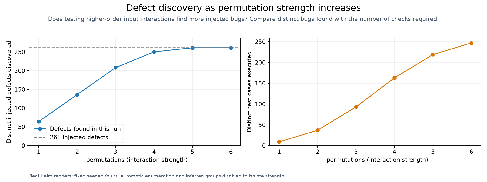
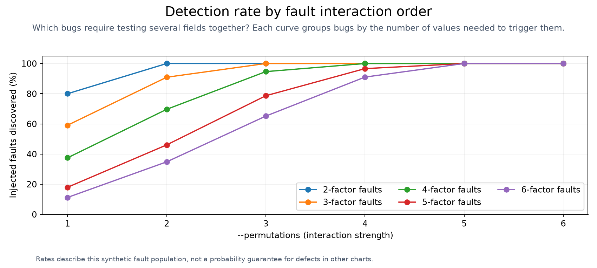

# Bug discovery by interaction strength

<!-- toc:start -->
**Table of contents**

- [Bug discovery by interaction strength](#bug-discovery-by-interaction-strength)
<!-- toc:end -->

[Benchmarking](<../../docs/benchmarking/README.md>)

This fixed fixture contains 261 injected faults. The planner varies interaction strength from one to six, with automatic enumeration and inferred exhaustive groups disabled to isolate strength. Every selected input is rendered with Helm 4.

| Strength | Inputs tested / planned | Faults found / total | Missed faults | Seconds | Status |
| ---: | ---: | ---: | ---: | ---: | --- |
| 1 | 9 / 9 | 64 / 261 | 197 | 0.74 | passed |
| 2 | 37 / 37 | 136 / 261 | 125 | 2.72 | passed |
| 3 | 93 / 93 | 208 / 261 | 53 | 7.09 | passed |
| 4 | 163 / 163 | 250 / 261 | 11 | 15.87 | passed |
| 5 | 219 / 219 | 261 / 261 | 0 | 16.75 | passed |
| 6 | 247 / 247 | 261 / 261 | 0 | 19.45 | passed |

JSON ledger (local run data) · CSV table (local run data) · Chart parameters (local run data)

These are distinct injected faults; several input assignments can trigger the same fault. Rates describe this seeded fixture, not expected bug recall for an arbitrary chart.
