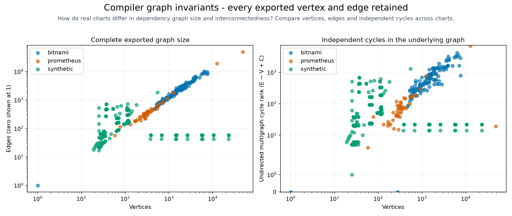

# Chart topology graphs

<!-- toc:start -->
**Table of contents**

- [Chart topology graphs](#chart-topology-graphs)
<!-- toc:end -->

[Benchmarking](<../../docs/benchmarking/README.md>)

348 charts: 340 graphs with rendered baselines, 7 static-only graphs, and 1 chart without a values file. Verification checks account for every exported vertex and edge.

These are directed multigraphs G = (V, E) from the compiler, rendered with Matplotlib. Every exported vertex and edge is retained, including parallel references; overlapping marks are not removed.

Vertices represent values, control flow, templates, manifests, and manifest fields. Edges retain the compiler’s potential-reference, condition, control-flow, observed-render, and containment relations. PNG/SVG drawings and per-vertex coordinate tables accompany the full JSON/DOT graphs.

The horizontal rank is the longest directed dependency path from a source; vertical placement orders parents deterministically. Geometry shows the dependency layout. Dependency-chain length counts edges along a directed path.

C is the number of weak components. The cycle rank E − V + C is the first Betti number of the one-dimensional underlying undirected multigraph. Parallel reference edges count separately. These invariants describe graph structure; runtime effects require separate measurements. Opaque template access remains unresolved.

A rendered baseline is one observation. Static-only graphs could not obtain that baseline; missing-values and incomplete jobs are explicit. Unresolved access remains marked as unknown.

CSV table (local run data) · JSON inventory (local run data) · [Vector overview](graph-invariants.svg)

| Repository | Chart | Baseline / export | V | E | C | Cycle rank |
| --- | --- | --- | ---: | ---: | ---: | ---: |
| bitnami | [bitnami/airflow](bitnami/airflow/README.md) | rendered | 6241 | 8910 | 461 | 3130 |
| bitnami | [bitnami/apache](bitnami/apache/README.md) | rendered | 678 | 829 | 94 | 245 |
| bitnami | [bitnami/apisix](bitnami/apisix/README.md) | rendered | 3533 | 4460 | 331 | 1258 |
| bitnami | [bitnami/appsmith](bitnami/appsmith/README.md) | rendered | 3657 | 5931 | 218 | 2492 |
| bitnami | [bitnami/argo-cd](bitnami/argo-cd/README.md) | rendered | 4083 | 6062 | 435 | 2414 |
| bitnami | [bitnami/argo-workflows](bitnami/argo-workflows/README.md) | rendered | 2790 | 4121 | 190 | 1521 |
| bitnami | [bitnami/aspnet-core](bitnami/aspnet-core/README.md) | rendered | 598 | 719 | 84 | 205 |
| bitnami | [bitnami/cadvisor](bitnami/cadvisor/README.md) | rendered | 565 | 678 | 69 | 182 |
| bitnami | [bitnami/cassandra](bitnami/cassandra/README.md) | rendered | 912 | 1138 | 111 | 337 |
| bitnami | [bitnami/cert-manager](bitnami/cert-manager/README.md) | rendered | 2401 | 2654 | 170 | 423 |
| bitnami | [bitnami/chainloop](bitnami/chainloop/README.md) | rendered | 3931 | 5375 | 225 | 1669 |
| bitnami | [bitnami/cilium](bitnami/cilium/README.md) | rendered | 3691 | 4713 | 519 | 1541 |
| bitnami | [bitnami/clickhouse](bitnami/clickhouse/README.md) | rendered | 1909 | 2287 | 197 | 575 |
| bitnami | [bitnami/clickhouse-operator](bitnami/clickhouse-operator/README.md) | rendered | 1141 | 1306 | 122 | 287 |
| bitnami | [bitnami/cloudnative-pg](bitnami/cloudnative-pg/README.md) | static-only | 723 | 1053 | 148 | 478 |
| bitnami | [bitnami/common](bitnami/common/README.md) | static-only | 277 | 255 | 22 | 0 |
| bitnami | [bitnami/concourse](bitnami/concourse/README.md) | rendered | 1991 | 3162 | 154 | 1325 |
| bitnami | [bitnami/consul](bitnami/consul/README.md) | rendered | 782 | 953 | 99 | 270 |
| bitnami | [bitnami/contour](bitnami/contour/README.md) | rendered | 7641 | 8182 | 253 | 794 |
| bitnami | [bitnami/deepspeed](bitnami/deepspeed/README.md) | rendered | 1303 | 1381 | 187 | 265 |
| bitnami | [bitnami/discourse](bitnami/discourse/README.md) | rendered | 2453 | 4232 | 131 | 1910 |
| bitnami | [bitnami/dremio](bitnami/dremio/README.md) | rendered | 4961 | 6102 | 460 | 1601 |
| bitnami | [bitnami/drupal](bitnami/drupal/README.md) | rendered | 1541 | 2175 | 117 | 751 |
| bitnami | [bitnami/ejbca](bitnami/ejbca/README.md) | rendered | 1400 | 1974 | 83 | 657 |
| bitnami | [bitnami/elasticsearch](bitnami/elasticsearch/README.md) | rendered | 3047 | 4161 | 305 | 1419 |
| bitnami | [bitnami/envoy-gateway](bitnami/envoy-gateway/README.md) | rendered | 1465 | 1683 | 128 | 346 |
| bitnami | [bitnami/etcd](bitnami/etcd/README.md) | rendered | 1204 | 1593 | 149 | 538 |
| bitnami | [bitnami/external-dns](bitnami/external-dns/README.md) | rendered | 1202 | 1574 | 113 | 485 |
| bitnami | [bitnami/flink](bitnami/flink/README.md) | rendered | 1047 | 1202 | 112 | 267 |
| bitnami | [bitnami/fluent-bit](bitnami/fluent-bit/README.md) | rendered | 651 | 866 | 88 | 303 |
| bitnami | [bitnami/fluentd](bitnami/fluentd/README.md) | rendered | 1355 | 1648 | 162 | 455 |
| bitnami | [bitnami/flux](bitnami/flux/README.md) | static-only | 1788 | 2774 | 399 | 1385 |
| bitnami | [bitnami/ghost](bitnami/ghost/README.md) | rendered | 1225 | 1874 | 86 | 735 |
| bitnami | [bitnami/gitea](bitnami/gitea/README.md) | rendered | 1462 | 2235 | 84 | 857 |
| bitnami | [bitnami/gitlab-runner](bitnami/gitlab-runner/README.md) | rendered | 622 | 817 | 87 | 282 |
| bitnami | [bitnami/grafana](bitnami/grafana/README.md) | rendered | 843 | 1052 | 106 | 315 |
| bitnami | [bitnami/grafana-alloy](bitnami/grafana-alloy/README.md) | rendered | 924 | 1088 | 115 | 279 |
| bitnami | [bitnami/grafana-k6-operator](bitnami/grafana-k6-operator/README.md) | rendered | 766 | 867 | 79 | 180 |
| bitnami | [bitnami/grafana-loki](bitnami/grafana-loki/README.md) | rendered | 5473 | 7921 | 517 | 2965 |
| bitnami | [bitnami/grafana-mimir](bitnami/grafana-mimir/README.md) | rendered | 6786 | 9715 | 603 | 3532 |
| bitnami | [bitnami/grafana-operator](bitnami/grafana-operator/README.md) | rendered | 919 | 1019 | 116 | 216 |
| bitnami | [bitnami/grafana-tempo](bitnami/grafana-tempo/README.md) | rendered | 3779 | 4972 | 394 | 1587 |
| bitnami | [bitnami/haproxy](bitnami/haproxy/README.md) | rendered | 530 | 632 | 71 | 173 |
| bitnami | [bitnami/harbor](bitnami/harbor/README.md) | rendered | 5876 | 8542 | 599 | 3265 |
| bitnami | [bitnami/influxdb](bitnami/influxdb/README.md) | rendered | 881 | 1279 | 135 | 533 |
| bitnami | [bitnami/jaeger](bitnami/jaeger/README.md) | rendered | 1952 | 2319 | 189 | 556 |
| bitnami | [bitnami/janusgraph](bitnami/janusgraph/README.md) | rendered | 1445 | 1791 | 132 | 478 |
| bitnami | [bitnami/jenkins](bitnami/jenkins/README.md) | rendered | 898 | 1191 | 107 | 400 |
| bitnami | [bitnami/jupyterhub](bitnami/jupyterhub/README.md) | rendered | 2511 | 3450 | 219 | 1158 |
| bitnami | [bitnami/kafka](bitnami/kafka/README.md) | rendered | 2096 | 2641 | 309 | 854 |
| bitnami | [bitnami/keycloak](bitnami/keycloak/README.md) | rendered | 1874 | 2864 | 146 | 1136 |
| bitnami | [bitnami/keydb](bitnami/keydb/README.md) | rendered | 1533 | 1961 | 204 | 632 |
| bitnami | [bitnami/kibana](bitnami/kibana/README.md) | rendered | 577 | 820 | 88 | 331 |
| bitnami | [bitnami/kong](bitnami/kong/README.md) | rendered | 2580 | 3735 | 133 | 1288 |
| bitnami | [bitnami/kube-arangodb](bitnami/kube-arangodb/README.md) | rendered | 1896 | 2188 | 123 | 415 |
| bitnami | [bitnami/kube-prometheus](bitnami/kube-prometheus/README.md) | rendered | 7030 | 8312 | 361 | 1643 |
| bitnami | [bitnami/kube-prometheus/charts/kube-prometheus-crds](bitnami/kube-prometheus/charts/kube-prometheus-crds/README.md) | rendered | 1 | 0 | 1 | 0 |
| bitnami | [bitnami/kube-state-metrics](bitnami/kube-state-metrics/README.md) | rendered | 880 | 1069 | 69 | 258 |
| bitnami | [bitnami/kuberay](bitnami/kuberay/README.md) | rendered | 2089 | 2496 | 190 | 597 |
| bitnami | [bitnami/kubernetes-event-exporter](bitnami/kubernetes-event-exporter/README.md) | rendered | 543 | 600 | 92 | 149 |
| bitnami | [bitnami/logstash](bitnami/logstash/README.md) | rendered | 634 | 779 | 74 | 219 |
| bitnami | [bitnami/mariadb](bitnami/mariadb/README.md) | rendered | 1321 | 1709 | 261 | 649 |
| bitnami | [bitnami/mariadb-galera](bitnami/mariadb-galera/README.md) | rendered | 921 | 1131 | 116 | 326 |
| bitnami | [bitnami/mastodon](bitnami/mastodon/README.md) | rendered | 6334 | 10189 | 284 | 4139 |
| bitnami | [bitnami/matomo](bitnami/matomo/README.md) | rendered | 1760 | 2481 | 141 | 862 |
| bitnami | [bitnami/memcached](bitnami/memcached/README.md) | rendered | 691 | 944 | 118 | 371 |
| bitnami | [bitnami/metallb](bitnami/metallb/README.md) | rendered | 2824 | 3087 | 155 | 418 |
| bitnami | [bitnami/metrics-server](bitnami/metrics-server/README.md) | rendered | 589 | 665 | 67 | 143 |
| bitnami | [bitnami/milvus](bitnami/milvus/README.md) | rendered | 7501 | 9568 | 792 | 2859 |
| bitnami | [bitnami/mlflow](bitnami/mlflow/README.md) | rendered | 3285 | 4481 | 282 | 1478 |
| bitnami | [bitnami/mongodb](bitnami/mongodb/README.md) | rendered | 1935 | 2972 | 300 | 1337 |
| bitnami | [bitnami/mongodb-sharded](bitnami/mongodb-sharded/README.md) | rendered | 2358 | 2865 | 240 | 747 |
| bitnami | [bitnami/moodle](bitnami/moodle/README.md) | rendered | 1456 | 2085 | 109 | 738 |
| bitnami | [bitnami/multus-cni](bitnami/multus-cni/README.md) | rendered | 483 | 508 | 66 | 91 |
| bitnami | [bitnami/mysql](bitnami/mysql/README.md) | rendered | 1275 | 1747 | 192 | 664 |
| bitnami | [bitnami/nats](bitnami/nats/README.md) | rendered | 797 | 969 | 132 | 304 |
| bitnami | [bitnami/neo4j](bitnami/neo4j/README.md) | rendered | 526 | 716 | 81 | 271 |
| bitnami | [bitnami/nessie](bitnami/nessie/README.md) | rendered | 1609 | 2387 | 120 | 898 |
| bitnami | [bitnami/nginx](bitnami/nginx/README.md) | rendered | 877 | 1170 | 112 | 405 |
| bitnami | [bitnami/node-exporter](bitnami/node-exporter/README.md) | rendered | 535 | 716 | 73 | 254 |
| bitnami | [bitnami/oauth2-proxy](bitnami/oauth2-proxy/README.md) | rendered | 1470 | 2614 | 82 | 1226 |
| bitnami | [bitnami/odoo](bitnami/odoo/README.md) | rendered | 1431 | 2211 | 86 | 866 |
| bitnami | [bitnami/opensearch](bitnami/opensearch/README.md) | rendered | 3259 | 4236 | 433 | 1410 |
| bitnami | [bitnami/parse](bitnami/parse/README.md) | rendered | 1748 | 2925 | 129 | 1306 |
| bitnami | [bitnami/phpmyadmin](bitnami/phpmyadmin/README.md) | rendered | 996 | 1604 | 88 | 696 |
| bitnami | [bitnami/pinniped](bitnami/pinniped/README.md) | rendered | 2183 | 2485 | 125 | 427 |
| bitnami | [bitnami/postgresql](bitnami/postgresql/README.md) | rendered | 1596 | 2228 | 263 | 895 |
| bitnami | [bitnami/postgresql-ha](bitnami/postgresql-ha/README.md) | rendered | 2088 | 2749 | 263 | 924 |
| bitnami | [bitnami/prometheus](bitnami/prometheus/README.md) | rendered | 1460 | 1776 | 244 | 560 |
| bitnami | [bitnami/pytorch](bitnami/pytorch/README.md) | rendered | 620 | 801 | 86 | 267 |
| bitnami | [bitnami/rabbitmq](bitnami/rabbitmq/README.md) | rendered | 1229 | 1521 | 150 | 442 |
| bitnami | [bitnami/rabbitmq-cluster-operator](bitnami/rabbitmq-cluster-operator/README.md) | rendered | 2443 | 2827 | 141 | 525 |
| bitnami | [bitnami/redis](bitnami/redis/README.md) | rendered | 2348 | 3473 | 360 | 1485 |
| bitnami | [bitnami/redis-cluster](bitnami/redis-cluster/README.md) | rendered | 1028 | 1323 | 134 | 429 |
| bitnami | [bitnami/redmine](bitnami/redmine/README.md) | rendered | 2263 | 3512 | 122 | 1371 |
| bitnami | [bitnami/schema-registry](bitnami/schema-registry/README.md) | rendered | 1673 | 2454 | 82 | 863 |
| bitnami | [bitnami/scylladb](bitnami/scylladb/README.md) | rendered | 1087 | 1349 | 143 | 405 |
| bitnami | [bitnami/sealed-secrets](bitnami/sealed-secrets/README.md) | rendered | 716 | 922 | 75 | 281 |
| bitnami | [bitnami/seaweedfs](bitnami/seaweedfs/README.md) | rendered | 4162 | 6340 | 456 | 2634 |
| bitnami | [bitnami/solr](bitnami/solr/README.md) | rendered | 1588 | 2132 | 132 | 676 |
| bitnami | [bitnami/sonarqube](bitnami/sonarqube/README.md) | rendered | 1742 | 2529 | 181 | 968 |
| bitnami | [bitnami/spark](bitnami/spark/README.md) | rendered | 1104 | 1456 | 125 | 477 |
| bitnami | [bitnami/superset](bitnami/superset/README.md) | rendered | 3580 | 5605 | 281 | 2306 |
| bitnami | [bitnami/tensorflow-resnet](bitnami/tensorflow-resnet/README.md) | rendered | 525 | 572 | 74 | 121 |
| bitnami | [bitnami/thanos](bitnami/thanos/README.md) | rendered | 3962 | 6660 | 495 | 3193 |
| bitnami | [bitnami/tomcat](bitnami/tomcat/README.md) | rendered | 704 | 763 | 119 | 178 |
| bitnami | [bitnami/valkey](bitnami/valkey/README.md) | rendered | 2106 | 3228 | 262 | 1384 |
| bitnami | [bitnami/valkey-cluster](bitnami/valkey-cluster/README.md) | rendered | 1000 | 1260 | 130 | 390 |
| bitnami | [bitnami/vault](bitnami/vault/README.md) | rendered | 1829 | 2197 | 223 | 591 |
| bitnami | [bitnami/victoriametrics](bitnami/victoriametrics/README.md) | rendered | 3044 | 3861 | 370 | 1187 |
| bitnami | [bitnami/whereabouts](bitnami/whereabouts/README.md) | rendered | 461 | 480 | 62 | 81 |
| bitnami | [bitnami/wildfly](bitnami/wildfly/README.md) | rendered | 691 | 847 | 84 | 240 |
| bitnami | [bitnami/wordpress](bitnami/wordpress/README.md) | rendered | 1889 | 2811 | 157 | 1079 |
| bitnami | [bitnami/zipkin](bitnami/zipkin/README.md) | static-only | 713 | 1130 | 128 | 545 |
| bitnami | [bitnami/zookeeper](bitnami/zookeeper/README.md) | rendered | 950 | 1257 | 102 | 409 |
| prometheus | [charts/alertmanager](prometheus/alertmanager/README.md) | static-only | 414 | 440 | 120 | 146 |
| prometheus | [charts/alertmanager-snmp-notifier](prometheus/alertmanager-snmp-notifier/README.md) | rendered | 313 | 345 | 53 | 85 |
| prometheus | [charts/jiralert](prometheus/jiralert/README.md) | rendered | 331 | 325 | 60 | 54 |
| prometheus | [charts/kube-prometheus-stack](prometheus/kube-prometheus-stack/README.md) | rendered | 12632 | 19008 | 535 | 6911 |
| prometheus | [charts/kube-prometheus-stack/charts/crds](prometheus/kube-prometheus-stack/charts/crds/README.md) | rendered | 77 | 113 | 2 | 38 |
| prometheus | [charts/kube-state-metrics](prometheus/kube-state-metrics/README.md) | rendered | 909 | 1140 | 64 | 295 |
| prometheus | [charts/prom-label-proxy](prometheus/prom-label-proxy/README.md) | rendered | 324 | 348 | 53 | 77 |
| prometheus | [charts/prometheus](prometheus/prometheus/README.md) | static-only | 1261 | 1813 | 225 | 777 |
| prometheus | [charts/prometheus-adapter](prometheus/prometheus-adapter/README.md) | rendered | 569 | 697 | 42 | 170 |
| prometheus | [charts/prometheus-blackbox-exporter](prometheus/prometheus-blackbox-exporter/README.md) | rendered | 529 | 494 | 133 | 98 |
| prometheus | [charts/prometheus-cloudwatch-exporter](prometheus/prometheus-cloudwatch-exporter/README.md) | rendered | 343 | 389 | 25 | 71 |
| prometheus | [charts/prometheus-conntrack-stats-exporter](prometheus/prometheus-conntrack-stats-exporter/README.md) | rendered | 132 | 137 | 17 | 22 |
| prometheus | [charts/prometheus-consul-exporter](prometheus/prometheus-consul-exporter/README.md) | rendered | 216 | 234 | 12 | 30 |
| prometheus | [charts/prometheus-couchdb-exporter](prometheus/prometheus-couchdb-exporter/README.md) | rendered | 190 | 201 | 11 | 22 |
| prometheus | [charts/prometheus-druid-exporter](prometheus/prometheus-druid-exporter/README.md) | rendered | 165 | 180 | 5 | 20 |
| prometheus | [charts/prometheus-elasticsearch-exporter](prometheus/prometheus-elasticsearch-exporter/README.md) | rendered | 358 | 392 | 47 | 81 |
| prometheus | [charts/prometheus-fastly-exporter](prometheus/prometheus-fastly-exporter/README.md) | rendered | 253 | 267 | 27 | 41 |
| prometheus | [charts/prometheus-ipmi-exporter](prometheus/prometheus-ipmi-exporter/README.md) | rendered | 281 | 230 | 91 | 40 |
| prometheus | [charts/prometheus-json-exporter](prometheus/prometheus-json-exporter/README.md) | rendered | 300 | 311 | 40 | 51 |
| prometheus | [charts/prometheus-kafka-exporter](prometheus/prometheus-kafka-exporter/README.md) | rendered | 300 | 354 | 33 | 87 |
| prometheus | [charts/prometheus-memcached-exporter](prometheus/prometheus-memcached-exporter/README.md) | rendered | 218 | 259 | 12 | 53 |
| prometheus | [charts/prometheus-modbus-exporter](prometheus/prometheus-modbus-exporter/README.md) | rendered | 227 | 194 | 49 | 16 |
| prometheus | [charts/prometheus-mongodb-exporter](prometheus/prometheus-mongodb-exporter/README.md) | rendered | 277 | 290 | 28 | 41 |
| prometheus | [charts/prometheus-mysql-exporter](prometheus/prometheus-mysql-exporter/README.md) | rendered | 330 | 396 | 38 | 104 |
| prometheus | [charts/prometheus-nats-exporter](prometheus/prometheus-nats-exporter/README.md) | rendered | 168 | 183 | 12 | 27 |
| prometheus | [charts/prometheus-nginx-exporter](prometheus/prometheus-nginx-exporter/README.md) | rendered | 259 | 284 | 20 | 45 |
| prometheus | [charts/prometheus-node-exporter](prometheus/prometheus-node-exporter/README.md) | rendered | 625 | 749 | 58 | 182 |
| prometheus | [charts/prometheus-operator-admission-webhook](prometheus/prometheus-operator-admission-webhook/README.md) | rendered | 742 | 857 | 68 | 183 |
| prometheus | [charts/prometheus-operator-crds](prometheus/prometheus-operator-crds/README.md) | rendered | 48567 | 48574 | 12 | 19 |
| prometheus | [charts/prometheus-operator-crds/charts/crds](prometheus/prometheus-operator-crds/charts/crds/README.md) | missing-values | N/A | N/A | N/A | N/A |
| prometheus | [charts/prometheus-pgbouncer-exporter](prometheus/prometheus-pgbouncer-exporter/README.md) | rendered | 325 | 360 | 35 | 70 |
| prometheus | [charts/prometheus-pingdom-exporter](prometheus/prometheus-pingdom-exporter/README.md) | rendered | 174 | 186 | 11 | 23 |
| prometheus | [charts/prometheus-pingmesh-exporter](prometheus/prometheus-pingmesh-exporter/README.md) | rendered | 548 | 567 | 138 | 157 |
| prometheus | [charts/prometheus-postgres-exporter](prometheus/prometheus-postgres-exporter/README.md) | static-only | 259 | 328 | 49 | 118 |
| prometheus | [charts/prometheus-pushgateway](prometheus/prometheus-pushgateway/README.md) | rendered | 389 | 390 | 74 | 75 |
| prometheus | [charts/prometheus-rabbitmq-exporter](prometheus/prometheus-rabbitmq-exporter/README.md) | rendered | 273 | 311 | 21 | 59 |
| prometheus | [charts/prometheus-redis-exporter](prometheus/prometheus-redis-exporter/README.md) | rendered | 323 | 403 | 33 | 113 |
| prometheus | [charts/prometheus-smartctl-exporter](prometheus/prometheus-smartctl-exporter/README.md) | rendered | 289 | 220 | 84 | 15 |
| prometheus | [charts/prometheus-snmp-exporter](prometheus/prometheus-snmp-exporter/README.md) | rendered | 390 | 493 | 49 | 152 |
| prometheus | [charts/prometheus-sql-exporter](prometheus/prometheus-sql-exporter/README.md) | rendered | 358 | 381 | 44 | 67 |
| prometheus | [charts/prometheus-stackdriver-exporter](prometheus/prometheus-stackdriver-exporter/README.md) | rendered | 273 | 333 | 27 | 87 |
| prometheus | [charts/prometheus-statsd-exporter](prometheus/prometheus-statsd-exporter/README.md) | rendered | 300 | 349 | 21 | 70 |
| prometheus | [charts/prometheus-systemd-exporter](prometheus/prometheus-systemd-exporter/README.md) | rendered | 311 | 284 | 65 | 38 |
| prometheus | [charts/prometheus-to-sd](prometheus/prometheus-to-sd/README.md) | rendered | 58 | 57 | 5 | 4 |
| prometheus | [charts/prometheus-windows-exporter](prometheus/prometheus-windows-exporter/README.md) | rendered | 433 | 465 | 39 | 71 |
| prometheus | [charts/prometheus-yet-another-cloudwatch-exporter](prometheus/prometheus-yet-another-cloudwatch-exporter/README.md) | rendered | 289 | 340 | 23 | 74 |
| synthetic | [bug-density/chart](synthetic/bug-density/chart/README.md) | rendered | 546 | 1848 | 1 | 1303 |
| synthetic | [calibration-variation/charts/fields-6-depth-1-placement-0-breadth-1-output-depth-0](synthetic/calibration-variation/charts/fields-6-depth-1-placement-0-breadth-1-output-depth-0/README.md) | rendered | 27 | 28 | 4 | 5 |
| synthetic | [calibration-variation/charts/fields-6-depth-1-placement-0-breadth-1-output-depth-1](synthetic/calibration-variation/charts/fields-6-depth-1-placement-0-breadth-1-output-depth-1/README.md) | rendered | 31 | 32 | 4 | 5 |
| synthetic | [calibration-variation/charts/fields-6-depth-1-placement-0-breadth-1-output-depth-2](synthetic/calibration-variation/charts/fields-6-depth-1-placement-0-breadth-1-output-depth-2/README.md) | rendered | 35 | 36 | 4 | 5 |
| synthetic | [calibration-variation/charts/fields-6-depth-1-placement-0-breadth-4-output-depth-0](synthetic/calibration-variation/charts/fields-6-depth-1-placement-0-breadth-4-output-depth-0/README.md) | rendered | 63 | 82 | 4 | 23 |
| synthetic | [calibration-variation/charts/fields-6-depth-1-placement-0-breadth-4-output-depth-1](synthetic/calibration-variation/charts/fields-6-depth-1-placement-0-breadth-4-output-depth-1/README.md) | rendered | 67 | 86 | 4 | 23 |
| synthetic | [calibration-variation/charts/fields-6-depth-1-placement-0-breadth-4-output-depth-2](synthetic/calibration-variation/charts/fields-6-depth-1-placement-0-breadth-4-output-depth-2/README.md) | rendered | 71 | 90 | 4 | 23 |
| synthetic | [calibration-variation/charts/fields-6-depth-1-placement-0-breadth-8-output-depth-0](synthetic/calibration-variation/charts/fields-6-depth-1-placement-0-breadth-8-output-depth-0/README.md) | rendered | 111 | 154 | 4 | 47 |
| synthetic | [calibration-variation/charts/fields-6-depth-1-placement-0-breadth-8-output-depth-1](synthetic/calibration-variation/charts/fields-6-depth-1-placement-0-breadth-8-output-depth-1/README.md) | rendered | 115 | 158 | 4 | 47 |
| synthetic | [calibration-variation/charts/fields-6-depth-1-placement-0-breadth-8-output-depth-2](synthetic/calibration-variation/charts/fields-6-depth-1-placement-0-breadth-8-output-depth-2/README.md) | rendered | 119 | 162 | 4 | 47 |
| synthetic | [calibration-variation/charts/fields-6-depth-1-placement-1-breadth-1-output-depth-0](synthetic/calibration-variation/charts/fields-6-depth-1-placement-1-breadth-1-output-depth-0/README.md) | rendered | 27 | 28 | 5 | 6 |
| synthetic | [calibration-variation/charts/fields-6-depth-1-placement-1-breadth-1-output-depth-1](synthetic/calibration-variation/charts/fields-6-depth-1-placement-1-breadth-1-output-depth-1/README.md) | rendered | 31 | 32 | 5 | 6 |
| synthetic | [calibration-variation/charts/fields-6-depth-1-placement-1-breadth-1-output-depth-2](synthetic/calibration-variation/charts/fields-6-depth-1-placement-1-breadth-1-output-depth-2/README.md) | rendered | 35 | 36 | 5 | 6 |
| synthetic | [calibration-variation/charts/fields-6-depth-1-placement-1-breadth-4-output-depth-0](synthetic/calibration-variation/charts/fields-6-depth-1-placement-1-breadth-4-output-depth-0/README.md) | rendered | 63 | 82 | 5 | 24 |
| synthetic | [calibration-variation/charts/fields-6-depth-1-placement-1-breadth-4-output-depth-1](synthetic/calibration-variation/charts/fields-6-depth-1-placement-1-breadth-4-output-depth-1/README.md) | rendered | 67 | 86 | 5 | 24 |
| synthetic | [calibration-variation/charts/fields-6-depth-1-placement-1-breadth-4-output-depth-2](synthetic/calibration-variation/charts/fields-6-depth-1-placement-1-breadth-4-output-depth-2/README.md) | rendered | 71 | 90 | 5 | 24 |
| synthetic | [calibration-variation/charts/fields-6-depth-1-placement-1-breadth-8-output-depth-0](synthetic/calibration-variation/charts/fields-6-depth-1-placement-1-breadth-8-output-depth-0/README.md) | rendered | 111 | 154 | 5 | 48 |
| synthetic | [calibration-variation/charts/fields-6-depth-1-placement-1-breadth-8-output-depth-1](synthetic/calibration-variation/charts/fields-6-depth-1-placement-1-breadth-8-output-depth-1/README.md) | rendered | 115 | 158 | 5 | 48 |
| synthetic | [calibration-variation/charts/fields-6-depth-1-placement-1-breadth-8-output-depth-2](synthetic/calibration-variation/charts/fields-6-depth-1-placement-1-breadth-8-output-depth-2/README.md) | rendered | 119 | 162 | 5 | 48 |
| synthetic | [calibration-variation/charts/fields-6-depth-3-placement-0-breadth-1-output-depth-0](synthetic/calibration-variation/charts/fields-6-depth-3-placement-0-breadth-1-output-depth-0/README.md) | rendered | 27 | 46 | 1 | 20 |
| synthetic | [calibration-variation/charts/fields-6-depth-3-placement-0-breadth-1-output-depth-1](synthetic/calibration-variation/charts/fields-6-depth-3-placement-0-breadth-1-output-depth-1/README.md) | rendered | 31 | 50 | 1 | 20 |
| synthetic | [calibration-variation/charts/fields-6-depth-3-placement-0-breadth-1-output-depth-2](synthetic/calibration-variation/charts/fields-6-depth-3-placement-0-breadth-1-output-depth-2/README.md) | rendered | 35 | 54 | 1 | 20 |
| synthetic | [calibration-variation/charts/fields-6-depth-3-placement-0-breadth-4-output-depth-0](synthetic/calibration-variation/charts/fields-6-depth-3-placement-0-breadth-4-output-depth-0/README.md) | rendered | 63 | 154 | 1 | 92 |
| synthetic | [calibration-variation/charts/fields-6-depth-3-placement-0-breadth-4-output-depth-1](synthetic/calibration-variation/charts/fields-6-depth-3-placement-0-breadth-4-output-depth-1/README.md) | rendered | 67 | 158 | 1 | 92 |
| synthetic | [calibration-variation/charts/fields-6-depth-3-placement-0-breadth-4-output-depth-2](synthetic/calibration-variation/charts/fields-6-depth-3-placement-0-breadth-4-output-depth-2/README.md) | rendered | 71 | 162 | 1 | 92 |
| synthetic | [calibration-variation/charts/fields-6-depth-3-placement-0-breadth-8-output-depth-0](synthetic/calibration-variation/charts/fields-6-depth-3-placement-0-breadth-8-output-depth-0/README.md) | rendered | 111 | 298 | 1 | 188 |
| synthetic | [calibration-variation/charts/fields-6-depth-3-placement-0-breadth-8-output-depth-1](synthetic/calibration-variation/charts/fields-6-depth-3-placement-0-breadth-8-output-depth-1/README.md) | rendered | 115 | 302 | 1 | 188 |
| synthetic | [calibration-variation/charts/fields-6-depth-3-placement-0-breadth-8-output-depth-2](synthetic/calibration-variation/charts/fields-6-depth-3-placement-0-breadth-8-output-depth-2/README.md) | rendered | 119 | 306 | 1 | 188 |
| synthetic | [calibration-variation/charts/fields-6-depth-3-placement-1-breadth-1-output-depth-0](synthetic/calibration-variation/charts/fields-6-depth-3-placement-1-breadth-1-output-depth-0/README.md) | rendered | 27 | 46 | 2 | 21 |
| synthetic | [calibration-variation/charts/fields-6-depth-3-placement-1-breadth-1-output-depth-1](synthetic/calibration-variation/charts/fields-6-depth-3-placement-1-breadth-1-output-depth-1/README.md) | rendered | 31 | 50 | 2 | 21 |
| synthetic | [calibration-variation/charts/fields-6-depth-3-placement-1-breadth-1-output-depth-2](synthetic/calibration-variation/charts/fields-6-depth-3-placement-1-breadth-1-output-depth-2/README.md) | rendered | 35 | 54 | 2 | 21 |
| synthetic | [calibration-variation/charts/fields-6-depth-3-placement-1-breadth-4-output-depth-0](synthetic/calibration-variation/charts/fields-6-depth-3-placement-1-breadth-4-output-depth-0/README.md) | rendered | 63 | 154 | 2 | 93 |
| synthetic | [calibration-variation/charts/fields-6-depth-3-placement-1-breadth-4-output-depth-1](synthetic/calibration-variation/charts/fields-6-depth-3-placement-1-breadth-4-output-depth-1/README.md) | rendered | 67 | 158 | 2 | 93 |
| synthetic | [calibration-variation/charts/fields-6-depth-3-placement-1-breadth-4-output-depth-2](synthetic/calibration-variation/charts/fields-6-depth-3-placement-1-breadth-4-output-depth-2/README.md) | rendered | 71 | 162 | 2 | 93 |
| synthetic | [calibration-variation/charts/fields-6-depth-3-placement-1-breadth-8-output-depth-0](synthetic/calibration-variation/charts/fields-6-depth-3-placement-1-breadth-8-output-depth-0/README.md) | rendered | 111 | 298 | 2 | 189 |
| synthetic | [calibration-variation/charts/fields-6-depth-3-placement-1-breadth-8-output-depth-1](synthetic/calibration-variation/charts/fields-6-depth-3-placement-1-breadth-8-output-depth-1/README.md) | rendered | 115 | 302 | 2 | 189 |
| synthetic | [calibration-variation/charts/fields-6-depth-3-placement-1-breadth-8-output-depth-2](synthetic/calibration-variation/charts/fields-6-depth-3-placement-1-breadth-8-output-depth-2/README.md) | rendered | 119 | 306 | 2 | 189 |
| synthetic | [calibration-variation/charts/fields-6-depth-5-placement-0-breadth-1-output-depth-0](synthetic/calibration-variation/charts/fields-6-depth-5-placement-0-breadth-1-output-depth-0/README.md) | rendered | 27 | 64 | 1 | 38 |
| synthetic | [calibration-variation/charts/fields-6-depth-5-placement-0-breadth-1-output-depth-1](synthetic/calibration-variation/charts/fields-6-depth-5-placement-0-breadth-1-output-depth-1/README.md) | rendered | 31 | 68 | 1 | 38 |
| synthetic | [calibration-variation/charts/fields-6-depth-5-placement-0-breadth-1-output-depth-2](synthetic/calibration-variation/charts/fields-6-depth-5-placement-0-breadth-1-output-depth-2/README.md) | rendered | 35 | 72 | 1 | 38 |
| synthetic | [calibration-variation/charts/fields-6-depth-5-placement-0-breadth-4-output-depth-0](synthetic/calibration-variation/charts/fields-6-depth-5-placement-0-breadth-4-output-depth-0/README.md) | rendered | 63 | 226 | 1 | 164 |
| synthetic | [calibration-variation/charts/fields-6-depth-5-placement-0-breadth-4-output-depth-1](synthetic/calibration-variation/charts/fields-6-depth-5-placement-0-breadth-4-output-depth-1/README.md) | rendered | 67 | 230 | 1 | 164 |
| synthetic | [calibration-variation/charts/fields-6-depth-5-placement-0-breadth-4-output-depth-2](synthetic/calibration-variation/charts/fields-6-depth-5-placement-0-breadth-4-output-depth-2/README.md) | rendered | 71 | 234 | 1 | 164 |
| synthetic | [calibration-variation/charts/fields-6-depth-5-placement-0-breadth-8-output-depth-0](synthetic/calibration-variation/charts/fields-6-depth-5-placement-0-breadth-8-output-depth-0/README.md) | rendered | 111 | 442 | 1 | 332 |
| synthetic | [calibration-variation/charts/fields-6-depth-5-placement-0-breadth-8-output-depth-1](synthetic/calibration-variation/charts/fields-6-depth-5-placement-0-breadth-8-output-depth-1/README.md) | rendered | 115 | 446 | 1 | 332 |
| synthetic | [calibration-variation/charts/fields-6-depth-5-placement-0-breadth-8-output-depth-2](synthetic/calibration-variation/charts/fields-6-depth-5-placement-0-breadth-8-output-depth-2/README.md) | rendered | 119 | 450 | 1 | 332 |
| synthetic | [calibration-variation/charts/fields-6-depth-5-placement-1-breadth-1-output-depth-0](synthetic/calibration-variation/charts/fields-6-depth-5-placement-1-breadth-1-output-depth-0/README.md) | rendered | 27 | 64 | 1 | 38 |
| synthetic | [calibration-variation/charts/fields-6-depth-5-placement-1-breadth-1-output-depth-1](synthetic/calibration-variation/charts/fields-6-depth-5-placement-1-breadth-1-output-depth-1/README.md) | rendered | 31 | 68 | 1 | 38 |
| synthetic | [calibration-variation/charts/fields-6-depth-5-placement-1-breadth-1-output-depth-2](synthetic/calibration-variation/charts/fields-6-depth-5-placement-1-breadth-1-output-depth-2/README.md) | rendered | 35 | 72 | 1 | 38 |
| synthetic | [calibration-variation/charts/fields-6-depth-5-placement-1-breadth-4-output-depth-0](synthetic/calibration-variation/charts/fields-6-depth-5-placement-1-breadth-4-output-depth-0/README.md) | rendered | 63 | 226 | 1 | 164 |
| synthetic | [calibration-variation/charts/fields-6-depth-5-placement-1-breadth-4-output-depth-1](synthetic/calibration-variation/charts/fields-6-depth-5-placement-1-breadth-4-output-depth-1/README.md) | rendered | 67 | 230 | 1 | 164 |
| synthetic | [calibration-variation/charts/fields-6-depth-5-placement-1-breadth-4-output-depth-2](synthetic/calibration-variation/charts/fields-6-depth-5-placement-1-breadth-4-output-depth-2/README.md) | rendered | 71 | 234 | 1 | 164 |
| synthetic | [calibration-variation/charts/fields-6-depth-5-placement-1-breadth-8-output-depth-0](synthetic/calibration-variation/charts/fields-6-depth-5-placement-1-breadth-8-output-depth-0/README.md) | rendered | 111 | 442 | 1 | 332 |
| synthetic | [calibration-variation/charts/fields-6-depth-5-placement-1-breadth-8-output-depth-1](synthetic/calibration-variation/charts/fields-6-depth-5-placement-1-breadth-8-output-depth-1/README.md) | rendered | 115 | 446 | 1 | 332 |
| synthetic | [calibration-variation/charts/fields-6-depth-5-placement-1-breadth-8-output-depth-2](synthetic/calibration-variation/charts/fields-6-depth-5-placement-1-breadth-8-output-depth-2/README.md) | rendered | 119 | 450 | 1 | 332 |
| synthetic | [discovery/chart](synthetic/discovery/chart/README.md) | rendered | 144 | 407 | 1 | 264 |
| synthetic | [error-surface/charts/clustering-0.1](synthetic/error-surface/charts/clustering-0.1/README.md) | rendered | 25 | 22 | 8 | 5 |
| synthetic | [error-surface/charts/clustering-0.2](synthetic/error-surface/charts/clustering-0.2/README.md) | rendered | 25 | 22 | 8 | 5 |
| synthetic | [error-surface/charts/clustering-0.3](synthetic/error-surface/charts/clustering-0.3/README.md) | rendered | 25 | 22 | 8 | 5 |
| synthetic | [error-surface/charts/clustering-0.4](synthetic/error-surface/charts/clustering-0.4/README.md) | rendered | 25 | 22 | 8 | 5 |
| synthetic | [error-surface/charts/clustering-0.5](synthetic/error-surface/charts/clustering-0.5/README.md) | rendered | 25 | 22 | 8 | 5 |
| synthetic | [error-surface/charts/clustering-0.6](synthetic/error-surface/charts/clustering-0.6/README.md) | rendered | 25 | 22 | 8 | 5 |
| synthetic | [error-surface/charts/clustering-0.7](synthetic/error-surface/charts/clustering-0.7/README.md) | rendered | 25 | 22 | 8 | 5 |
| synthetic | [error-surface/charts/clustering-0.8](synthetic/error-surface/charts/clustering-0.8/README.md) | rendered | 25 | 22 | 8 | 5 |
| synthetic | [error-surface/charts/clustering-0.9](synthetic/error-surface/charts/clustering-0.9/README.md) | rendered | 25 | 22 | 8 | 5 |
| synthetic | [error-surface/charts/clustering-0](synthetic/error-surface/charts/clustering-0/README.md) | rendered | 25 | 22 | 8 | 5 |
| synthetic | [error-surface/charts/clustering-1](synthetic/error-surface/charts/clustering-1/README.md) | rendered | 25 | 22 | 8 | 5 |
| synthetic | [error-surface/charts/depth-0](synthetic/error-surface/charts/depth-0/README.md) | rendered | 25 | 22 | 8 | 5 |
| synthetic | [error-surface/charts/depth-1](synthetic/error-surface/charts/depth-1/README.md) | rendered | 19 | 18 | 7 | 6 |
| synthetic | [error-surface/charts/depth-2](synthetic/error-surface/charts/depth-2/README.md) | rendered | 20 | 21 | 6 | 7 |
| synthetic | [error-surface/charts/depth-3](synthetic/error-surface/charts/depth-3/README.md) | rendered | 21 | 24 | 5 | 8 |
| synthetic | [error-surface/charts/depth-4](synthetic/error-surface/charts/depth-4/README.md) | rendered | 22 | 27 | 4 | 9 |
| synthetic | [error-surface/charts/depth-5](synthetic/error-surface/charts/depth-5/README.md) | rendered | 23 | 30 | 3 | 10 |
| synthetic | [error-surface/charts/redundancy-0](synthetic/error-surface/charts/redundancy-0/README.md) | rendered | 25 | 532 | 2 | 509 |
| synthetic | [error-surface/charts/redundancy-1](synthetic/error-surface/charts/redundancy-1/README.md) | rendered | 25 | 275 | 3 | 253 |
| synthetic | [error-surface/charts/redundancy-2](synthetic/error-surface/charts/redundancy-2/README.md) | rendered | 25 | 146 | 4 | 125 |
| synthetic | [error-surface/charts/redundancy-3](synthetic/error-surface/charts/redundancy-3/README.md) | rendered | 25 | 81 | 5 | 61 |
| synthetic | [error-surface/charts/redundancy-4](synthetic/error-surface/charts/redundancy-4/README.md) | rendered | 25 | 48 | 6 | 29 |
| synthetic | [error-surface/charts/redundancy-5](synthetic/error-surface/charts/redundancy-5/README.md) | rendered | 25 | 31 | 7 | 13 |
| synthetic | [error-surface/charts/redundancy-6](synthetic/error-surface/charts/redundancy-6/README.md) | rendered | 25 | 22 | 8 | 5 |
| synthetic | [error-surface/charts/redundancy-7](synthetic/error-surface/charts/redundancy-7/README.md) | rendered | 25 | 17 | 9 | 1 |
| synthetic | [expansion/charts/boundaries](synthetic/expansion/charts/boundaries/README.md) | rendered | 37 | 710 | 1 | 674 |
| synthetic | [expansion/charts/constraints](synthetic/expansion/charts/constraints/README.md) | rendered | 36 | 271 | 2 | 237 |
| synthetic | [expansion/charts/control-flow](synthetic/expansion/charts/control-flow/README.md) | rendered | 38 | 472 | 1 | 435 |
| synthetic | [expansion/charts/dependencies](synthetic/expansion/charts/dependencies/README.md) | rendered | 53 | 490 | 1 | 438 |
| synthetic | [expansion/charts/equivalence](synthetic/expansion/charts/equivalence/README.md) | rendered | 36 | 467 | 2 | 433 |
| synthetic | [expansion/charts/interactions](synthetic/expansion/charts/interactions/README.md) | rendered | 37 | 479 | 1 | 443 |
| synthetic | [filtering/charts/fields-6-depth-1](synthetic/filtering/charts/fields-6-depth-1/README.md) | rendered | 28 | 28 | 5 | 5 |
| synthetic | [filtering/charts/fields-6-depth-3](synthetic/filtering/charts/fields-6-depth-3/README.md) | rendered | 28 | 46 | 2 | 20 |
| synthetic | [filtering/charts/fields-6-depth-5](synthetic/filtering/charts/fields-6-depth-5/README.md) | rendered | 28 | 64 | 1 | 37 |
| synthetic | [filtering/charts/fields-7-depth-1](synthetic/filtering/charts/fields-7-depth-1/README.md) | rendered | 29 | 28 | 6 | 5 |
| synthetic | [filtering/charts/fields-7-depth-3](synthetic/filtering/charts/fields-7-depth-3/README.md) | rendered | 29 | 46 | 2 | 19 |
| synthetic | [filtering/charts/fields-7-depth-5](synthetic/filtering/charts/fields-7-depth-5/README.md) | rendered | 29 | 64 | 1 | 36 |
| synthetic | [filtering/charts/fields-8-depth-1](synthetic/filtering/charts/fields-8-depth-1/README.md) | rendered | 32 | 32 | 6 | 6 |
| synthetic | [filtering/charts/fields-8-depth-3](synthetic/filtering/charts/fields-8-depth-3/README.md) | rendered | 32 | 56 | 3 | 27 |
| synthetic | [filtering/charts/fields-8-depth-5](synthetic/filtering/charts/fields-8-depth-5/README.md) | rendered | 32 | 80 | 1 | 49 |
| synthetic | [filtering/charts/fields-9-depth-1](synthetic/filtering/charts/fields-9-depth-1/README.md) | rendered | 33 | 32 | 7 | 6 |
| synthetic | [filtering/charts/fields-9-depth-3](synthetic/filtering/charts/fields-9-depth-3/README.md) | rendered | 33 | 56 | 2 | 25 |
| synthetic | [filtering/charts/fields-9-depth-5](synthetic/filtering/charts/fields-9-depth-5/README.md) | rendered | 33 | 80 | 1 | 48 |
| synthetic | [matrix/charts/boundaries](synthetic/matrix/charts/boundaries/README.md) | rendered | 28 | 25 | 9 | 6 |
| synthetic | [matrix/charts/constraints](synthetic/matrix/charts/constraints/README.md) | rendered | 27 | 23 | 9 | 5 |
| synthetic | [matrix/charts/control-flow](synthetic/matrix/charts/control-flow/README.md) | rendered | 29 | 27 | 8 | 6 |
| synthetic | [matrix/charts/dependencies](synthetic/matrix/charts/dependencies/README.md) | rendered | 44 | 45 | 9 | 10 |
| synthetic | [matrix/charts/equivalence](synthetic/matrix/charts/equivalence/README.md) | rendered | 27 | 22 | 10 | 5 |
| synthetic | [matrix/charts/interactions](synthetic/matrix/charts/interactions/README.md) | rendered | 28 | 34 | 6 | 12 |
| synthetic | [nesting/charts/supported-deep](synthetic/nesting/charts/supported-deep/README.md) | rendered | 114 | 727 | 1 | 614 |
| synthetic | [nesting/charts/supported-random](synthetic/nesting/charts/supported-random/README.md) | rendered | 81 | 628 | 1 | 548 |
| synthetic | [nesting/charts/supported-shallow](synthetic/nesting/charts/supported-shallow/README.md) | rendered | 66 | 583 | 1 | 518 |
| synthetic | [nesting/charts/uniform-deep](synthetic/nesting/charts/uniform-deep/README.md) | rendered | 108 | 436 | 1 | 329 |
| synthetic | [nesting/charts/uniform-random](synthetic/nesting/charts/uniform-random/README.md) | rendered | 75 | 337 | 1 | 263 |
| synthetic | [nesting/charts/uniform-shallow](synthetic/nesting/charts/uniform-shallow/README.md) | rendered | 60 | 292 | 1 | 233 |
| synthetic | [pca/charts/boundaries](synthetic/pca/charts/boundaries/README.md) | rendered | 37 | 710 | 1 | 674 |
| synthetic | [pca/charts/constraints](synthetic/pca/charts/constraints/README.md) | rendered | 36 | 271 | 2 | 237 |
| synthetic | [pca/charts/control-flow](synthetic/pca/charts/control-flow/README.md) | rendered | 38 | 472 | 1 | 435 |
| synthetic | [pca/charts/dependencies](synthetic/pca/charts/dependencies/README.md) | rendered | 53 | 490 | 1 | 438 |
| synthetic | [pca/charts/equivalence](synthetic/pca/charts/equivalence/README.md) | rendered | 36 | 467 | 2 | 433 |
| synthetic | [pca/charts/interactions](synthetic/pca/charts/interactions/README.md) | rendered | 37 | 479 | 1 | 443 |
| synthetic | [sampling/chart](synthetic/sampling/chart/README.md) | rendered | 116 | 190 | 5 | 79 |
| synthetic | [sparsity/chart](synthetic/sparsity/chart/README.md) | rendered | 109 | 525 | 93 | 509 |
| synthetic | [stress/charts/00-worst-case](synthetic/stress/charts/00-worst-case/README.md) | rendered | 116 | 190 | 5 | 79 |
| synthetic | [stress/charts/01-coupled-pairs-1](synthetic/stress/charts/01-coupled-pairs-1/README.md) | rendered | 116 | 190 | 5 | 79 |
| synthetic | [stress/charts/02-coupled-pairs-0](synthetic/stress/charts/02-coupled-pairs-0/README.md) | rendered | 116 | 190 | 5 | 79 |
| synthetic | [stress/charts/03-gate-depth-4](synthetic/stress/charts/03-gate-depth-4/README.md) | rendered | 115 | 187 | 5 | 77 |
| synthetic | [stress/charts/04-gate-depth-3](synthetic/stress/charts/04-gate-depth-3/README.md) | rendered | 114 | 184 | 5 | 75 |
| synthetic | [stress/charts/05-gate-depth-2](synthetic/stress/charts/05-gate-depth-2/README.md) | rendered | 113 | 181 | 5 | 73 |
| synthetic | [stress/charts/06-gate-depth-1](synthetic/stress/charts/06-gate-depth-1/README.md) | rendered | 112 | 178 | 5 | 71 |
| synthetic | [stress/charts/07-gate-depth-0](synthetic/stress/charts/07-gate-depth-0/README.md) | rendered | 118 | 182 | 5 | 69 |
| synthetic | [stress/charts/08-interaction-order-4](synthetic/stress/charts/08-interaction-order-4/README.md) | rendered | 118 | 179 | 5 | 66 |
| synthetic | [stress/charts/09-interaction-order-3](synthetic/stress/charts/09-interaction-order-3/README.md) | rendered | 118 | 176 | 5 | 63 |
| synthetic | [stress/charts/10-interaction-order-2](synthetic/stress/charts/10-interaction-order-2/README.md) | rendered | 118 | 173 | 5 | 60 |
| synthetic | [stress/charts/11-interaction-order-1](synthetic/stress/charts/11-interaction-order-1/README.md) | rendered | 118 | 170 | 5 | 57 |
| synthetic | [stress/charts/12-shared-output-count-3](synthetic/stress/charts/12-shared-output-count-3/README.md) | rendered | 110 | 160 | 5 | 55 |
| synthetic | [stress/charts/13-shared-output-count-2](synthetic/stress/charts/13-shared-output-count-2/README.md) | rendered | 102 | 150 | 5 | 53 |
| synthetic | [stress/charts/14-shared-output-count-1](synthetic/stress/charts/14-shared-output-count-1/README.md) | rendered | 94 | 140 | 5 | 51 |
| synthetic | [stress/charts/15-boundary-regions-3](synthetic/stress/charts/15-boundary-regions-3/README.md) | rendered | 94 | 140 | 5 | 51 |
| synthetic | [stress/charts/16-boundary-regions-2](synthetic/stress/charts/16-boundary-regions-2/README.md) | rendered | 94 | 140 | 5 | 51 |
| synthetic | [stress/charts/17-boundary-regions-1](synthetic/stress/charts/17-boundary-regions-1/README.md) | rendered | 94 | 140 | 5 | 51 |
| synthetic | [stress/charts/18-equivalent-inputs-3](synthetic/stress/charts/18-equivalent-inputs-3/README.md) | rendered | 101 | 148 | 4 | 51 |
| synthetic | [stress/charts/19-equivalent-inputs-2](synthetic/stress/charts/19-equivalent-inputs-2/README.md) | rendered | 108 | 156 | 3 | 51 |
| synthetic | [stress/charts/20-equivalent-inputs-1](synthetic/stress/charts/20-equivalent-inputs-1/README.md) | rendered | 115 | 164 | 2 | 51 |
| synthetic | [stress/charts/21-equivalent-inputs-0](synthetic/stress/charts/21-equivalent-inputs-0/README.md) | rendered | 122 | 172 | 1 | 51 |
| synthetic | [structural-sparsity/charts/breadth-200-depth-2-disconnected](synthetic/structural-sparsity/charts/breadth-200-depth-2-disconnected/README.md) | rendered | 1425 | 42 | 1397 | 14 |
| synthetic | [structural-sparsity/charts/breadth-200-depth-2-far](synthetic/structural-sparsity/charts/breadth-200-depth-2-far/README.md) | rendered | 1433 | 58 | 1397 | 22 |
| synthetic | [structural-sparsity/charts/breadth-200-depth-2-near](synthetic/structural-sparsity/charts/breadth-200-depth-2-near/README.md) | rendered | 1433 | 58 | 1397 | 22 |
| synthetic | [structural-sparsity/charts/breadth-200-depth-2-split](synthetic/structural-sparsity/charts/breadth-200-depth-2-split/README.md) | rendered | 1433 | 58 | 1397 | 22 |
| synthetic | [structural-sparsity/charts/breadth-200-depth-24-disconnected](synthetic/structural-sparsity/charts/breadth-200-depth-24-disconnected/README.md) | rendered | 5825 | 42 | 5797 | 14 |
| synthetic | [structural-sparsity/charts/breadth-200-depth-24-far](synthetic/structural-sparsity/charts/breadth-200-depth-24-far/README.md) | rendered | 5833 | 58 | 5797 | 22 |
| synthetic | [structural-sparsity/charts/breadth-200-depth-24-near](synthetic/structural-sparsity/charts/breadth-200-depth-24-near/README.md) | rendered | 5833 | 58 | 5797 | 22 |
| synthetic | [structural-sparsity/charts/breadth-200-depth-24-split](synthetic/structural-sparsity/charts/breadth-200-depth-24-split/README.md) | rendered | 5833 | 58 | 5797 | 22 |
| synthetic | [structural-sparsity/charts/breadth-200-depth-8-disconnected](synthetic/structural-sparsity/charts/breadth-200-depth-8-disconnected/README.md) | rendered | 2625 | 42 | 2597 | 14 |
| synthetic | [structural-sparsity/charts/breadth-200-depth-8-far](synthetic/structural-sparsity/charts/breadth-200-depth-8-far/README.md) | rendered | 2633 | 58 | 2597 | 22 |
| synthetic | [structural-sparsity/charts/breadth-200-depth-8-near](synthetic/structural-sparsity/charts/breadth-200-depth-8-near/README.md) | rendered | 2633 | 58 | 2597 | 22 |
| synthetic | [structural-sparsity/charts/breadth-200-depth-8-split](synthetic/structural-sparsity/charts/breadth-200-depth-8-split/README.md) | rendered | 2633 | 58 | 2597 | 22 |
| synthetic | [structural-sparsity/charts/breadth-50-depth-2-disconnected](synthetic/structural-sparsity/charts/breadth-50-depth-2-disconnected/README.md) | rendered | 375 | 42 | 347 | 14 |
| synthetic | [structural-sparsity/charts/breadth-50-depth-2-far](synthetic/structural-sparsity/charts/breadth-50-depth-2-far/README.md) | rendered | 383 | 58 | 347 | 22 |
| synthetic | [structural-sparsity/charts/breadth-50-depth-2-near](synthetic/structural-sparsity/charts/breadth-50-depth-2-near/README.md) | rendered | 383 | 58 | 347 | 22 |
| synthetic | [structural-sparsity/charts/breadth-50-depth-2-split](synthetic/structural-sparsity/charts/breadth-50-depth-2-split/README.md) | rendered | 383 | 58 | 347 | 22 |
| synthetic | [structural-sparsity/charts/breadth-50-depth-24-disconnected](synthetic/structural-sparsity/charts/breadth-50-depth-24-disconnected/README.md) | rendered | 1475 | 42 | 1447 | 14 |
| synthetic | [structural-sparsity/charts/breadth-50-depth-24-far](synthetic/structural-sparsity/charts/breadth-50-depth-24-far/README.md) | rendered | 1483 | 58 | 1447 | 22 |
| synthetic | [structural-sparsity/charts/breadth-50-depth-24-near](synthetic/structural-sparsity/charts/breadth-50-depth-24-near/README.md) | rendered | 1483 | 58 | 1447 | 22 |
| synthetic | [structural-sparsity/charts/breadth-50-depth-24-split](synthetic/structural-sparsity/charts/breadth-50-depth-24-split/README.md) | rendered | 1483 | 58 | 1447 | 22 |
| synthetic | [structural-sparsity/charts/breadth-50-depth-8-disconnected](synthetic/structural-sparsity/charts/breadth-50-depth-8-disconnected/README.md) | rendered | 675 | 42 | 647 | 14 |
| synthetic | [structural-sparsity/charts/breadth-50-depth-8-far](synthetic/structural-sparsity/charts/breadth-50-depth-8-far/README.md) | rendered | 683 | 58 | 647 | 22 |
| synthetic | [structural-sparsity/charts/breadth-50-depth-8-near](synthetic/structural-sparsity/charts/breadth-50-depth-8-near/README.md) | rendered | 683 | 58 | 647 | 22 |
| synthetic | [structural-sparsity/charts/breadth-50-depth-8-split](synthetic/structural-sparsity/charts/breadth-50-depth-8-split/README.md) | rendered | 683 | 58 | 647 | 22 |
| synthetic | [structural-sparsity/charts/breadth-800-depth-2-disconnected](synthetic/structural-sparsity/charts/breadth-800-depth-2-disconnected/README.md) | rendered | 5625 | 42 | 5597 | 14 |
| synthetic | [structural-sparsity/charts/breadth-800-depth-2-far](synthetic/structural-sparsity/charts/breadth-800-depth-2-far/README.md) | rendered | 5633 | 58 | 5597 | 22 |
| synthetic | [structural-sparsity/charts/breadth-800-depth-2-near](synthetic/structural-sparsity/charts/breadth-800-depth-2-near/README.md) | rendered | 5633 | 58 | 5597 | 22 |
| synthetic | [structural-sparsity/charts/breadth-800-depth-2-split](synthetic/structural-sparsity/charts/breadth-800-depth-2-split/README.md) | rendered | 5633 | 58 | 5597 | 22 |
| synthetic | [structural-sparsity/charts/breadth-800-depth-24-disconnected](synthetic/structural-sparsity/charts/breadth-800-depth-24-disconnected/README.md) | rendered | 23225 | 42 | 23197 | 14 |
| synthetic | [structural-sparsity/charts/breadth-800-depth-24-far](synthetic/structural-sparsity/charts/breadth-800-depth-24-far/README.md) | rendered | 23233 | 58 | 23197 | 22 |
| synthetic | [structural-sparsity/charts/breadth-800-depth-24-near](synthetic/structural-sparsity/charts/breadth-800-depth-24-near/README.md) | rendered | 23233 | 58 | 23197 | 22 |
| synthetic | [structural-sparsity/charts/breadth-800-depth-24-split](synthetic/structural-sparsity/charts/breadth-800-depth-24-split/README.md) | rendered | 23233 | 58 | 23197 | 22 |
| synthetic | [structural-sparsity/charts/breadth-800-depth-8-disconnected](synthetic/structural-sparsity/charts/breadth-800-depth-8-disconnected/README.md) | rendered | 10425 | 42 | 10397 | 14 |
| synthetic | [structural-sparsity/charts/breadth-800-depth-8-far](synthetic/structural-sparsity/charts/breadth-800-depth-8-far/README.md) | rendered | 10433 | 58 | 10397 | 22 |
| synthetic | [structural-sparsity/charts/breadth-800-depth-8-near](synthetic/structural-sparsity/charts/breadth-800-depth-8-near/README.md) | rendered | 10433 | 58 | 10397 | 22 |
| synthetic | [structural-sparsity/charts/breadth-800-depth-8-split](synthetic/structural-sparsity/charts/breadth-800-depth-8-split/README.md) | rendered | 10433 | 58 | 10397 | 22 |
| synthetic | [structure-depth/charts/boundaries](synthetic/structure-depth/charts/boundaries/README.md) | rendered | 37 | 710 | 1 | 674 |
| synthetic | [structure-depth/charts/constraints](synthetic/structure-depth/charts/constraints/README.md) | rendered | 36 | 271 | 2 | 237 |
| synthetic | [structure-depth/charts/control-flow](synthetic/structure-depth/charts/control-flow/README.md) | rendered | 38 | 472 | 1 | 435 |
| synthetic | [structure-depth/charts/dependencies](synthetic/structure-depth/charts/dependencies/README.md) | rendered | 53 | 490 | 1 | 438 |
| synthetic | [structure-depth/charts/equivalence](synthetic/structure-depth/charts/equivalence/README.md) | rendered | 36 | 467 | 2 | 433 |
| synthetic | [structure-depth/charts/interactions](synthetic/structure-depth/charts/interactions/README.md) | rendered | 37 | 479 | 1 | 443 |
| synthetic | [structure-depth/charts/mixed-supported](synthetic/structure-depth/charts/mixed-supported/README.md) | rendered | 180 | 673 | 5 | 498 |
| synthetic | [structure-depth/charts/mixed-uniform](synthetic/structure-depth/charts/mixed-uniform/README.md) | rendered | 132 | 340 | 5 | 213 |
| synthetic | [normal-quantile](synthetic/normal-quantile/README.md) | rendered | 109 | 525 | 93 | 509 |
| synthetic | [topology-quantile](synthetic/topology-quantile/README.md) | rendered | 47 | 64 | 4 | 21 |

Source revisions:

- bitnami: `6a8cccf3c29a1faabf0c34c8276a09ed14f3c5b3`
- prometheus: `732bf3642c931946f1962fbd2e1b694ce8827e77`

Graph JSON, DOT and coordinate tables are losslessly gzip-compressed. Decode with `gzip -dc FILE.gz`; the plotting CLI accepts the decoded JSON. Dependency preparation uses isolated chart copies. Kubernetes API schema validation requires a separate validation step.
