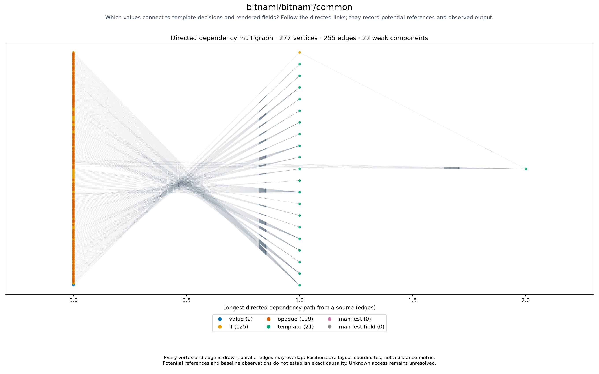

# bitnami/common

<!-- toc:start -->
**Table of contents**

- [bitnami/common](#bitnamicommon)
<!-- toc:end -->

[All chart topologies](../../README.md)

Status: **static-only**. Source: `third_party/bitnami-charts/bitnami/common`.
Potential references identify inputs to investigate for causal effects on output.
Baseline-unavailable graphs contain static evidence only.

[Vector graph](topology.svg) · Graph JSON (local run data) · DOT (local run data) · Coordinates (local run data) · Invariants (local run data)
