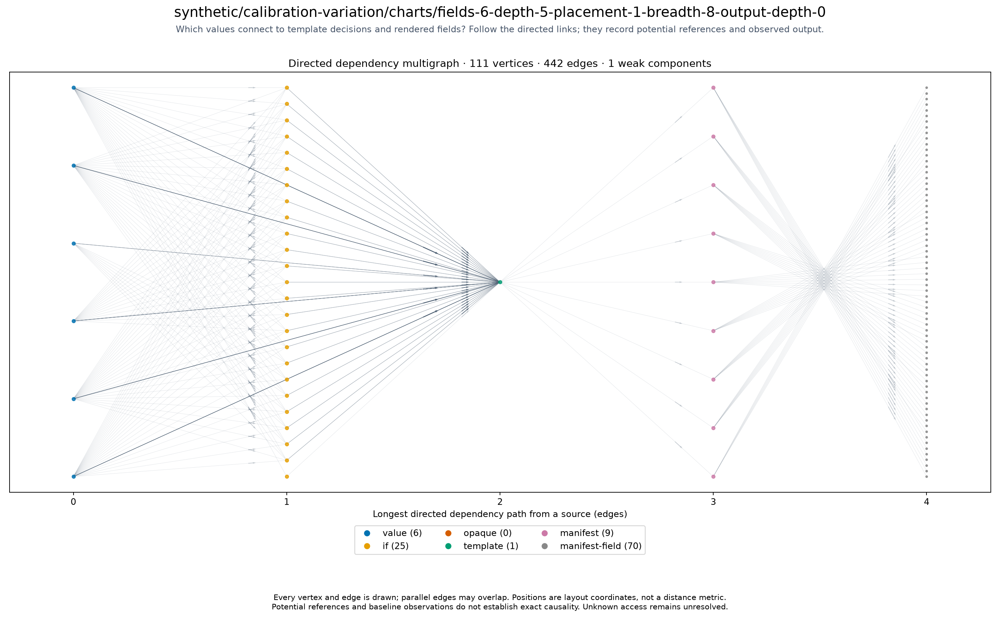

# synthetic/calibration-variation/charts/fields-6-depth-5-placement-1-breadth-8-output-depth-0

<!-- toc:start -->
**Table of contents**

- [synthetic/calibration-variation/charts/fields-6-depth-5-placement-1-breadth-8-output-depth-0](#syntheticcalibration-variationchartsfields-6-depth-5-placement-1-breadth-8-output-depth-0)
<!-- toc:end -->

[All chart topologies](../../../../README.md)

Status: **rendered**. Source: `.cache/refresh/refresh-1789617223/outputs/calibration-variation/cases/fields-6-depth-5-placement-1-breadth-8-output-depth-0.yaml`.
Potential references identify inputs to investigate for causal effects on output.
Baseline-unavailable graphs contain static evidence only.

[Vector graph](topology.svg) · Graph JSON (local run data) · DOT (local run data) · Coordinates (local run data) · Invariants (local run data)
