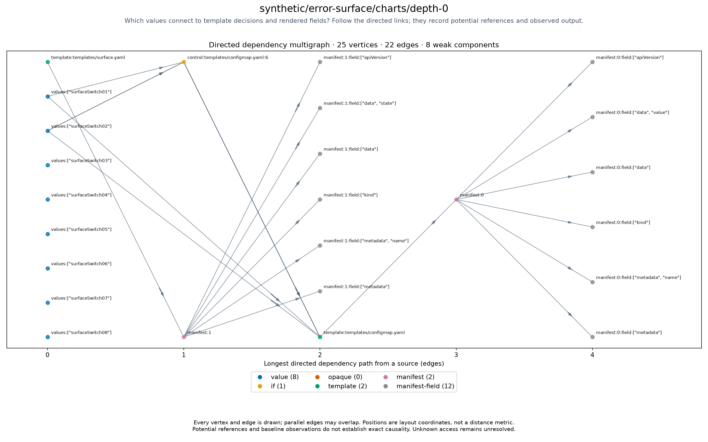

# synthetic/error-surface/charts/depth-0

<!-- toc:start -->
**Table of contents**

- [synthetic/error-surface/charts/depth-0](#syntheticerror-surfacechartsdepth-0)
<!-- toc:end -->

[All chart topologies](../../../../README.md)

Status: **rendered**. Source: `.cache/refresh/refresh-1789617223/outputs/error-surface/cases/depth-0.yaml`.
Potential references identify inputs to investigate for causal effects on output.
Baseline-unavailable graphs contain static evidence only.

[Vector graph](topology.svg) · Graph JSON (local run data) · DOT (local run data) · Coordinates (local run data) · Invariants (local run data)
