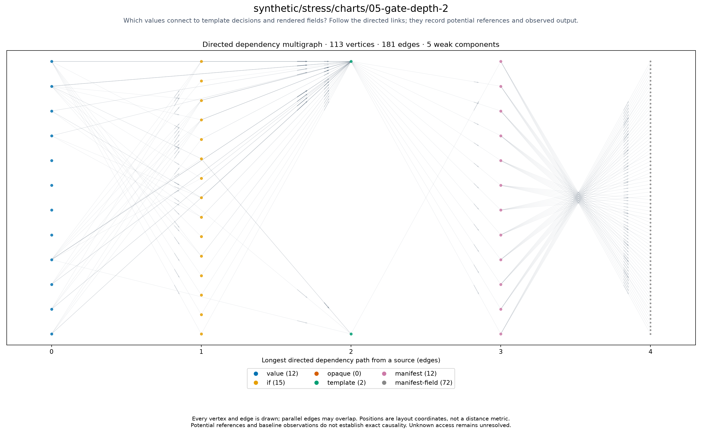

# synthetic/stress/charts/05-gate-depth-2

<!-- toc:start -->
**Table of contents**

- [synthetic/stress/charts/05-gate-depth-2](#syntheticstresscharts05-gate-depth-2)
<!-- toc:end -->

[All chart topologies](../../../../README.md)

Status: **rendered**. Source: `.cache/refresh/refresh-1789617223/outputs/stress/cases/05-gate-depth-2.yaml`.
Potential references identify inputs to investigate for causal effects on output.
Baseline-unavailable graphs contain static evidence only.

[Vector graph](topology.svg) · Graph JSON (local run data) · DOT (local run data) · Coordinates (local run data) · Invariants (local run data)
