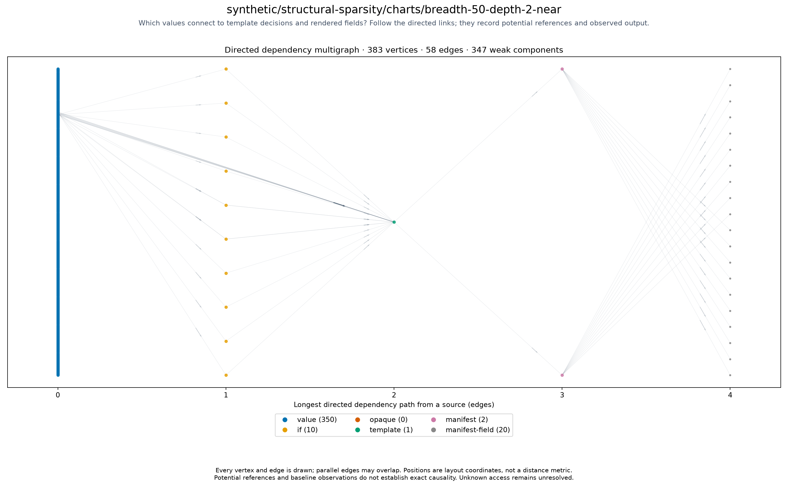

# synthetic/structural-sparsity/charts/breadth-50-depth-2-near

<!-- toc:start -->
**Table of contents**

- [synthetic/structural-sparsity/charts/breadth-50-depth-2-near](#syntheticstructural-sparsitychartsbreadth-50-depth-2-near)
<!-- toc:end -->

[All chart topologies](../../../../README.md)

Status: **rendered**. Source: `.cache/refresh/refresh-1789617223/outputs/structural-sparsity/cases/breadth-50-depth-2-near.yaml`.
Potential references identify inputs to investigate for causal effects on output.
Baseline-unavailable graphs contain static evidence only.

[Vector graph](topology.svg) · Graph JSON (local run data) · DOT (local run data) · Coordinates (local run data) · Invariants (local run data)
