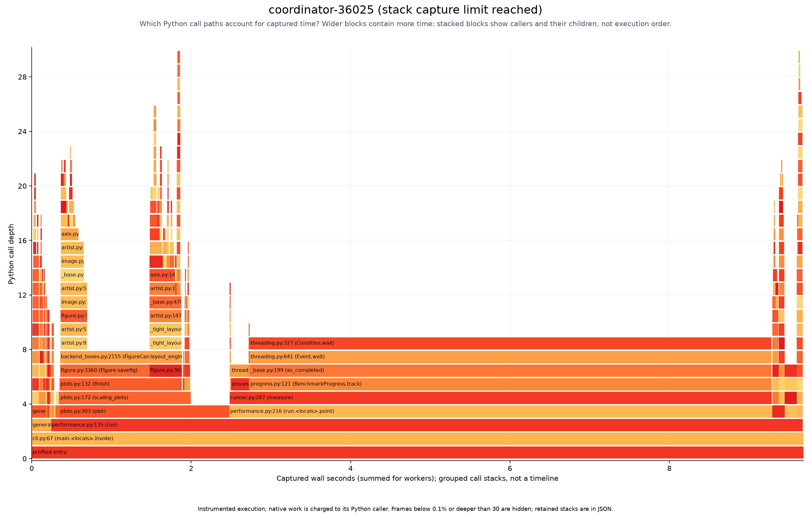
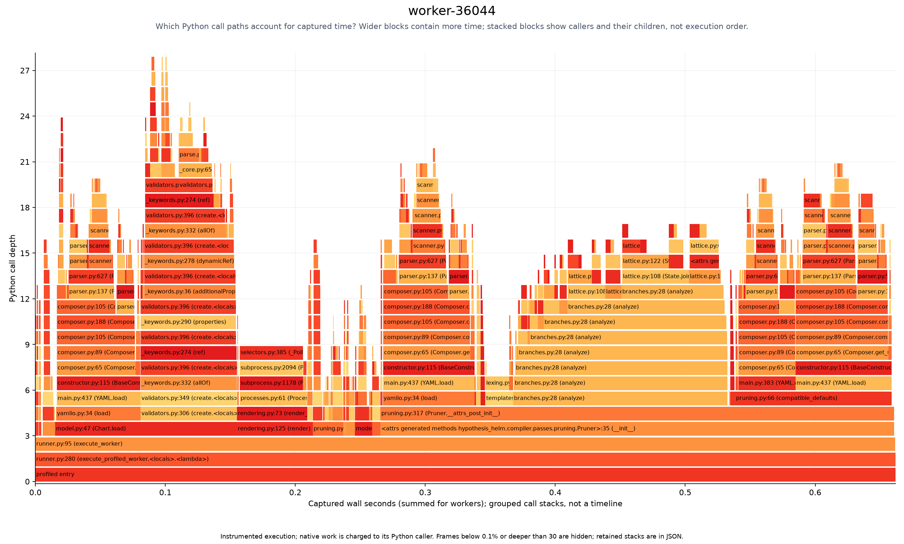
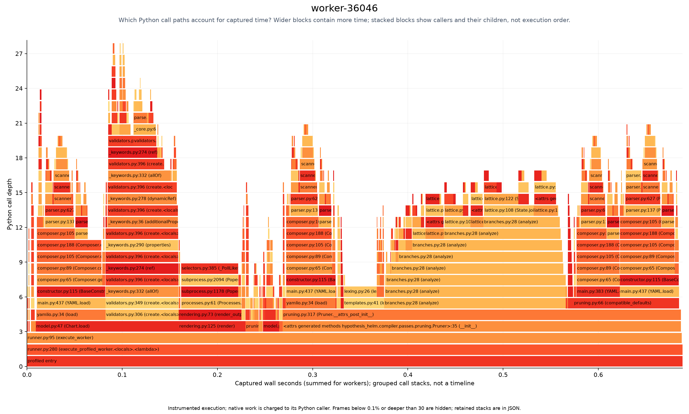
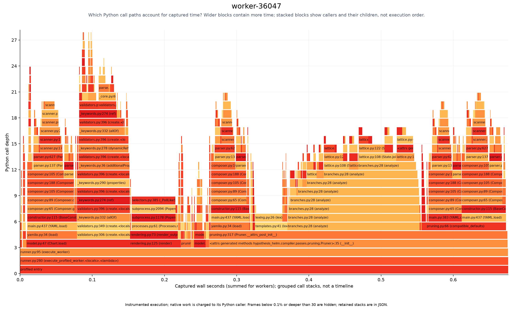
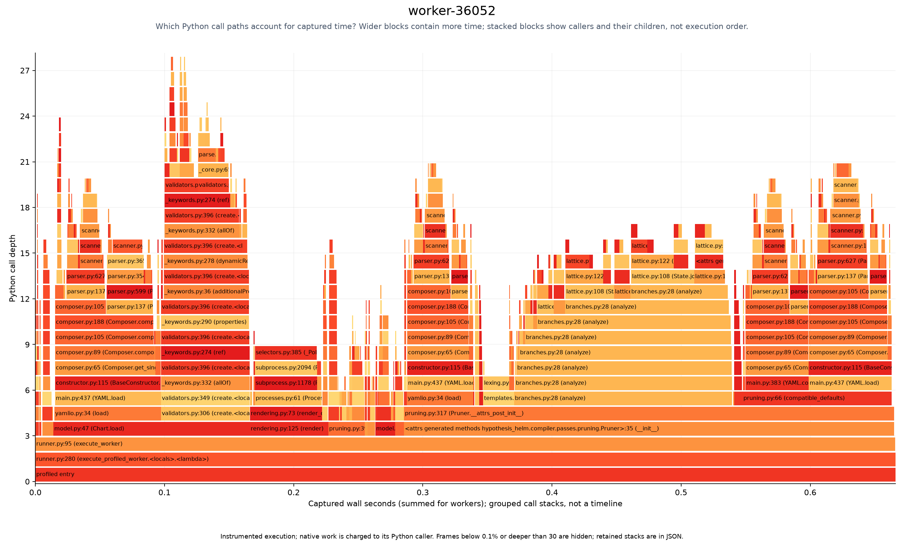
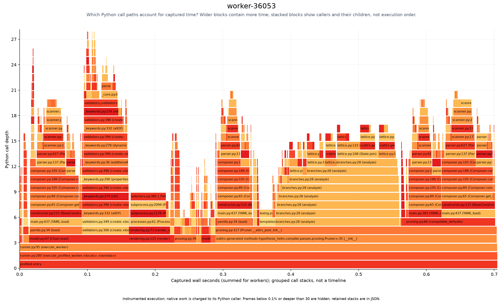
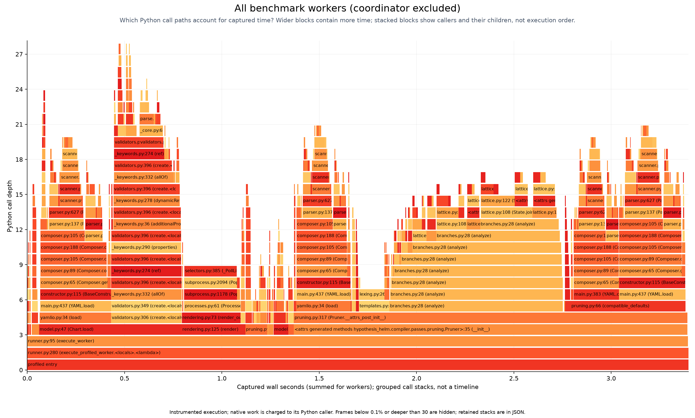

# Flame graphs

<!-- toc:start -->
**Table of contents**

- [coordinator-36025-ab7347375e8c7d1c603de5a78f29568b](#coordinator-36025-ab7347375e8c7d1c603de5a78f29568b)
- [worker-36044-badfc76279a0d2bdf15d475e44a225c3](#worker-36044-badfc76279a0d2bdf15d475e44a225c3)
- [worker-36046-7faf62365a98e1dfa9c593c7333b7075](#worker-36046-7faf62365a98e1dfa9c593c7333b7075)
- [worker-36047-23900f1861e6b1193d08dc5836c29638](#worker-36047-23900f1861e6b1193d08dc5836c29638)
- [worker-36052-01f54125d079f002a319a52b1f525bbc](#worker-36052-01f54125d079f002a319a52b1f525bbc)
- [worker-36053-12109a221eb87bdba518034b731fa12b](#worker-36053-12109a221eb87bdba518034b731fa12b)
- [workers-combined](#workers-combined)
<!-- toc:end -->

[Benchmarking](<../../docs/benchmarking/README.md#flame-graphs-across-worker-cores>)

Fresh captures from a separate scaling run with four cases and one or two workers.
Profiling adds overhead, so these captures do not contribute to the uninstrumented timing studies.

Wider boxes mean more time in a function and its children; stacked boxes show who called whom.
Combined workers sum overlapping process time. Helm waits appear under Python callers; Helm internals are not profiled.

Captured 6 profiles across 5 worker processes.
Recording limits and incomplete captures are reported in the capture index (local run data).
Raw captures (local run data) retain the measured stacks for redrawing.

## coordinator-36025-ab7347375e8c7d1c603de5a78f29568b

[Open zoomable SVG](coordinator-36025-ab7347375e8c7d1c603de5a78f29568b.svg)

## worker-36044-badfc76279a0d2bdf15d475e44a225c3

[Open zoomable SVG](worker-36044-badfc76279a0d2bdf15d475e44a225c3.svg)

## worker-36046-7faf62365a98e1dfa9c593c7333b7075

[Open zoomable SVG](worker-36046-7faf62365a98e1dfa9c593c7333b7075.svg)

## worker-36047-23900f1861e6b1193d08dc5836c29638

[Open zoomable SVG](worker-36047-23900f1861e6b1193d08dc5836c29638.svg)

## worker-36052-01f54125d079f002a319a52b1f525bbc

[Open zoomable SVG](worker-36052-01f54125d079f002a319a52b1f525bbc.svg)

## worker-36053-12109a221eb87bdba518034b731fa12b

[Open zoomable SVG](worker-36053-12109a221eb87bdba518034b731fa12b.svg)

## workers-combined

[Open zoomable SVG](workers-combined.svg)
