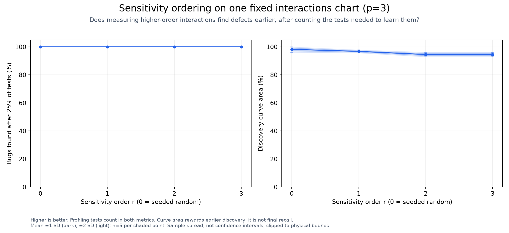
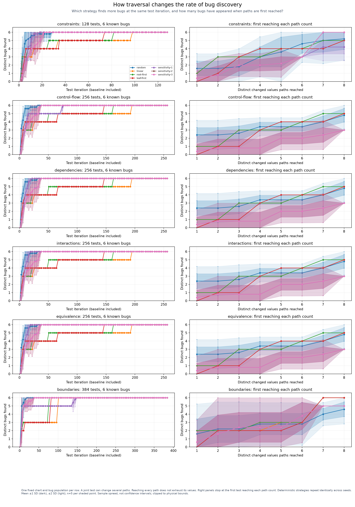
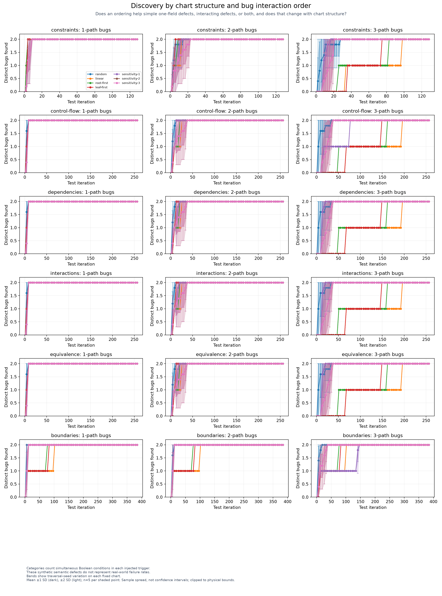

# Sensitivity ordering

<!-- toc:start -->
**Table of contents**

- [Sensitivity order on a fixed chart](#sensitivity-order-on-a-fixed-chart)
- [Discovery across chart structures](#discovery-across-chart-structures)
- [Bug interaction orders](#bug-interaction-orders)
- [Measurements](#measurements)
- [Method and limits](#method-and-limits)
- [Generate or redraw](#generate-or-redraw)
<!-- toc:end -->

Does prioritizing interacting values find bugs earlier? These comparisons change only execution order within each chart.

## Sensitivity order on a fixed chart

Here p=3 is the requested `--permutations` interaction strength. The sweep uses r=0..p:
r=0 means random traversal without profiling; r>0 uses the production sensitivity scheduler up to that interaction order.
The chart, bugs and selected configurations remain fixed. The normal small-space enumeration rule is enabled;
each fixture records its effective coverage strength, which may exceed p.



## Discovery across chart structures

Each row uses the shared benchmark chart with a different structural setting. Fields sit at depths one through three.
The left column counts joint configuration tests, including baseline and profiling tests. The right column shows bugs found
at the first test reaching each number of distinct changed paths. It is not a one-path-per-test executor.



## Bug interaction orders

A one-path bug needs one Boolean condition; a three-path bug needs three conditions simultaneously.
Bug placement is sampled independently of traversal priorities, then checked for reachability. The same bug population
is used by every strategy and seed on a chart. Structure can make some triggers unreachable, so chart rows can differ.



## Measurements

Values below are means ± one sample standard deviation across 5 paired traversal seeds.
Plot bands show one and two standard deviations, not confidence intervals or guarantees about other charts.
Higher discovery area means bugs were generally found earlier. Every completed traversal visits the same inputs exactly once.

| Chart | Traversal | Bugs found after 25% of tests | Discovery area |
| --- | --- | ---: | ---: |
| constraints | random | 100.0% ± 0.0 pp | 96.7% ± 2.4 pp |
| constraints | linear | 66.7% ± 0.0 pp | 81.0% ± 0.0 pp |
| constraints | root-first | 83.3% ± 0.0 pp | 84.6% ± 0.0 pp |
| constraints | leaf-first | 66.7% ± 0.0 pp | 84.4% ± 0.0 pp |
| constraints | sensitivity-1 | 100.0% ± 0.0 pp | 95.0% ± 0.7 pp |
| constraints | sensitivity-2 | 100.0% ± 0.0 pp | 93.1% ± 0.7 pp |
| constraints | sensitivity-3 | 100.0% ± 0.0 pp | 93.1% ± 0.7 pp |
| control-flow | random | 100.0% ± 0.0 pp | 98.2% ± 1.1 pp |
| control-flow | linear | 66.7% ± 0.0 pp | 81.1% ± 0.0 pp |
| control-flow | root-first | 83.3% ± 0.0 pp | 84.5% ± 0.0 pp |
| control-flow | leaf-first | 66.7% ± 0.0 pp | 84.9% ± 0.0 pp |
| control-flow | sensitivity-1 | 83.3% ± 0.0 pp | 92.7% ± 0.5 pp |
| control-flow | sensitivity-2 | 100.0% ± 0.0 pp | 94.5% ± 0.8 pp |
| control-flow | sensitivity-3 | 100.0% ± 0.0 pp | 94.5% ± 0.8 pp |
| dependencies | random | 100.0% ± 0.0 pp | 98.2% ± 1.1 pp |
| dependencies | linear | 66.7% ± 0.0 pp | 81.1% ± 0.0 pp |
| dependencies | root-first | 83.3% ± 0.0 pp | 84.5% ± 0.0 pp |
| dependencies | leaf-first | 66.7% ± 0.0 pp | 84.9% ± 0.0 pp |
| dependencies | sensitivity-1 | 100.0% ± 0.0 pp | 96.6% ± 0.4 pp |
| dependencies | sensitivity-2 | 100.0% ± 0.0 pp | 94.5% ± 0.8 pp |
| dependencies | sensitivity-3 | 100.0% ± 0.0 pp | 94.5% ± 0.8 pp |
| interactions | random | 100.0% ± 0.0 pp | 98.2% ± 1.1 pp |
| interactions | linear | 66.7% ± 0.0 pp | 81.1% ± 0.0 pp |
| interactions | root-first | 83.3% ± 0.0 pp | 84.5% ± 0.0 pp |
| interactions | leaf-first | 66.7% ± 0.0 pp | 84.9% ± 0.0 pp |
| interactions | sensitivity-1 | 100.0% ± 0.0 pp | 96.8% ± 0.5 pp |
| interactions | sensitivity-2 | 100.0% ± 0.0 pp | 94.5% ± 0.8 pp |
| interactions | sensitivity-3 | 100.0% ± 0.0 pp | 94.5% ± 0.8 pp |
| equivalence | random | 100.0% ± 0.0 pp | 98.2% ± 1.1 pp |
| equivalence | linear | 66.7% ± 0.0 pp | 81.1% ± 0.0 pp |
| equivalence | root-first | 83.3% ± 0.0 pp | 84.5% ± 0.0 pp |
| equivalence | leaf-first | 66.7% ± 0.0 pp | 84.9% ± 0.0 pp |
| equivalence | sensitivity-1 | 100.0% ± 0.0 pp | 96.8% ± 0.5 pp |
| equivalence | sensitivity-2 | 100.0% ± 0.0 pp | 94.5% ± 0.8 pp |
| equivalence | sensitivity-3 | 100.0% ± 0.0 pp | 94.5% ± 0.8 pp |
| boundaries | random | 100.0% ± 0.0 pp | 99.0% ± 0.5 pp |
| boundaries | linear | 50.0% ± 0.0 pp | 87.0% ± 0.0 pp |
| boundaries | root-first | 100.0% ± 0.0 pp | 90.1% ± 0.0 pp |
| boundaries | leaf-first | 100.0% ± 0.0 pp | 88.8% ± 0.0 pp |
| boundaries | sensitivity-1 | 83.3% ± 0.0 pp | 92.9% ± 0.5 pp |
| boundaries | sensitivity-2 | 100.0% ± 0.0 pp | 97.9% ± 0.8 pp |
| boundaries | sensitivity-3 | 100.0% ± 0.0 pp | 97.9% ± 0.8 pp |

## Method and limits

Each schema-valid candidate was actually rendered with Helm once, and its injected faults checked against an independent oracle.
Those recorded outputs are replayed through the production traversal functions. Sensitivity sees an output only when its test
is visited; a failing test supplies no ranking evidence, just as in the application. Missing references stay unknown.
Profiling inputs are real bug tests, not free setup. Baseline-only equivalent outputs do not authorize new pruning.

Filtering, sampling and failure expansion are disabled to isolate ordering. All strategies use serial scheduling here.
Recorded render times are individual reference measurements, not fresh end-to-end runtimes of each strategy.
These synthetic semantic defects exercise discovery; the experiment does not measure every type of Helm or Kubernetes error.

Raw traces: results.json (local run data). Summary: results.csv (local run data).
Each chart has a retained `cases/*.yaml` generator recipe, source snapshot and compressed observations.

## Generate or redraw

Run from the project root with benchmarking dependencies and Helm available. Use a fresh output directory for each measurement.
`--time-limit` bounds reference renders and ordering replay per chart.
An incomplete matrix is retained but not published as complete.

```bash
bash scripts/project-run.sh hypothesis-helm-benchmark sensitivity-ordering --inputs 8 --permutations 3 --repeats 5 --seed 2026 --bugs-per-order 2 --structures constraints control-flow dependencies interactions equivalence boundaries --time-limit 540.0s --output .cache/benchmarks/sensitivity-ordering
```

Redraw existing measurements without invoking Helm:

```bash
bash scripts/project-run.sh hypothesis-helm-benchmark sensitivity-ordering --plot-only --output .cache/benchmarks/sensitivity-ordering
```
