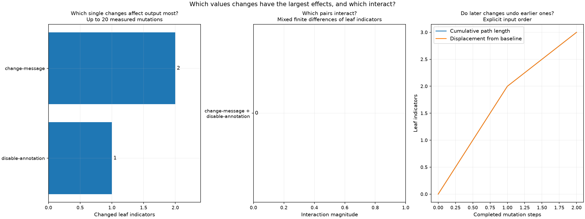

# Mutation sensitivity

Status: **complete**. Helm render attempts: **4**.

Distance counts added and removed JSON path/value indicators. A changed value counts twice.
Document and array order matter. These measurements do not prove equivalence or authorize pruning.
Distances assume deterministic rendering with fixed chart dependencies, release, namespace and Kubernetes version.

| Mutation | Values path | Replacement | Output distance | Status |
| --- | --- | --- | ---: | --- |
| &quot;change-message&quot; | [&quot;message&quot;] | &quot;world&quot; | 2 | rendered |
| &quot;disable-annotation&quot; | [&quot;enabled&quot;] | false | 1 | rendered |

## Parameter interactions

A nonzero mixed difference means the selected output features respond non-additively.
Pairs with order-dependent inputs are excluded from this measure. Render failures have no assigned distance.

| Mutations | Mixed difference | Status |
| --- | ---: | --- |
| [&quot;change-message&quot;, &quot;disable-annotation&quot;] | 0 | rendered |

The ordered sequence in results.json records both cumulative path length and displacement from the baseline.
They differ when later mutations reverse earlier changes. The sequence stops at its first invalid or failed step.

[Full measurements and render errors](results.json)

