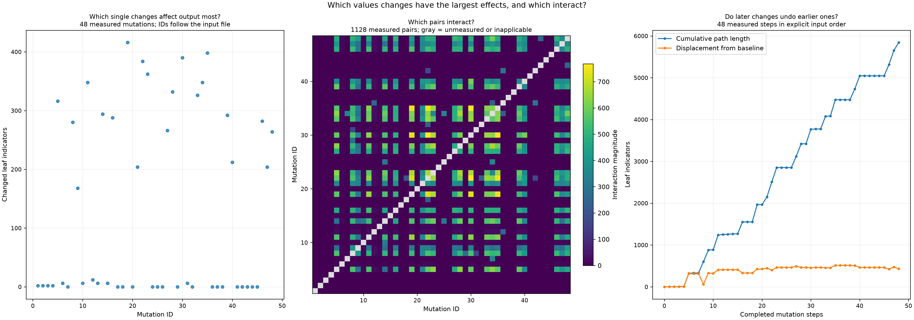

# Mutation sensitivity

Status: **complete**. Helm render attempts: **1223**.

Distance counts added and removed JSON path/value indicators. A changed value counts twice.
Document and array order matter. These measurements do not prove equivalence or authorize pruning.
Distances assume deterministic rendering with fixed chart dependencies, release, namespace and Kubernetes version.

| Mutation | Values path | Replacement | Output distance | Status |
| --- | --- | --- | ---: | --- |
| &quot;sharedTopologySignal15&quot; | [&quot;sharedTopologySignal15&quot;] | false | 416 | rendered |
| &quot;sharedTopologySignal31&quot; | [&quot;sharedTopologySignal31&quot;] | false | 398 | rendered |
| &quot;sharedTopologySignal26&quot; | [&quot;sharedTopologySignal26&quot;] | true | 390 | rendered |
| &quot;sharedTopologySignal18&quot; | [&quot;sharedTopologySignal18&quot;] | true | 384 | rendered |
| &quot;sharedTopologySignal19&quot; | [&quot;sharedTopologySignal19&quot;] | false | 362 | rendered |
| &quot;sharedTopologySignal07&quot; | [&quot;sharedTopologySignal07&quot;] | false | 348 | rendered |
| &quot;sharedTopologySignal30&quot; | [&quot;sharedTopologySignal30&quot;] | true | 348 | rendered |
| &quot;sharedTopologySignal24&quot; | [&quot;sharedTopologySignal24&quot;] | true | 332 | rendered |
| &quot;sharedTopologySignal29&quot; | [&quot;sharedTopologySignal29&quot;] | false | 326 | rendered |
| &quot;sharedTopologySignal01&quot; | [&quot;sharedTopologySignal01&quot;] | false | 316 | rendered |
| &quot;sharedTopologySignal10&quot; | [&quot;sharedTopologySignal10&quot;] | true | 294 | rendered |
| &quot;sharedTopologySignal35&quot; | [&quot;sharedTopologySignal35&quot;] | false | 292 | rendered |
| &quot;sharedTopologySignal12&quot; | [&quot;sharedTopologySignal12&quot;] | true | 288 | rendered |
| &quot;sharedTopologySignal42&quot; | [&quot;sharedTopologySignal42&quot;] | true | 282 | rendered |
| &quot;sharedTopologySignal04&quot; | [&quot;sharedTopologySignal04&quot;] | true | 280 | rendered |
| &quot;sharedTopologySignal23&quot; | [&quot;sharedTopologySignal23&quot;] | false | 266 | rendered |
| &quot;sharedTopologySignal44&quot; | [&quot;sharedTopologySignal44&quot;] | true | 264 | rendered |
| &quot;sharedTopologySignal36&quot; | [&quot;sharedTopologySignal36&quot;] | true | 212 | rendered |
| &quot;sharedTopologySignal17&quot; | [&quot;sharedTopologySignal17&quot;] | false | 204 | rendered |
| &quot;sharedTopologySignal43&quot; | [&quot;sharedTopologySignal43&quot;] | false | 204 | rendered |
| &quot;sharedTopologySignal05&quot; | [&quot;sharedTopologySignal05&quot;] | false | 168 | rendered |
| &quot;sharedTopologySignal08&quot; | [&quot;sharedTopologySignal08&quot;] | true | 12 | rendered |
| &quot;sharedTopologySignal02&quot; | [&quot;sharedTopologySignal02&quot;] | true | 6 | rendered |
| &quot;sharedTopologySignal06&quot; | [&quot;sharedTopologySignal06&quot;] | true | 6 | rendered |
| &quot;sharedTopologySignal09&quot; | [&quot;sharedTopologySignal09&quot;] | false | 6 | rendered |
| &quot;sharedTopologySignal11&quot; | [&quot;sharedTopologySignal11&quot;] | false | 6 | rendered |
| &quot;sharedTopologySignal27&quot; | [&quot;sharedTopologySignal27&quot;] | false | 6 | rendered |
| &quot;distributionBit01&quot; | [&quot;distributionBit01&quot;] | false | 2 | rendered |
| &quot;distributionBit02&quot; | [&quot;distributionBit02&quot;] | true | 2 | rendered |
| &quot;distributionBit03&quot; | [&quot;distributionBit03&quot;] | false | 2 | rendered |
| &quot;distributionBit04&quot; | [&quot;distributionBit04&quot;] | true | 2 | rendered |
| &quot;sharedTopologySignal03&quot; | [&quot;sharedTopologySignal03&quot;] | false | 0 | rendered |
| &quot;sharedTopologySignal13&quot; | [&quot;sharedTopologySignal13&quot;] | false | 0 | rendered |
| &quot;sharedTopologySignal14&quot; | [&quot;sharedTopologySignal14&quot;] | true | 0 | rendered |
| &quot;sharedTopologySignal16&quot; | [&quot;sharedTopologySignal16&quot;] | true | 0 | rendered |
| &quot;sharedTopologySignal20&quot; | [&quot;sharedTopologySignal20&quot;] | true | 0 | rendered |
| &quot;sharedTopologySignal21&quot; | [&quot;sharedTopologySignal21&quot;] | false | 0 | rendered |
| &quot;sharedTopologySignal22&quot; | [&quot;sharedTopologySignal22&quot;] | true | 0 | rendered |
| &quot;sharedTopologySignal25&quot; | [&quot;sharedTopologySignal25&quot;] | false | 0 | rendered |
| &quot;sharedTopologySignal28&quot; | [&quot;sharedTopologySignal28&quot;] | true | 0 | rendered |
| &quot;sharedTopologySignal32&quot; | [&quot;sharedTopologySignal32&quot;] | true | 0 | rendered |
| &quot;sharedTopologySignal33&quot; | [&quot;sharedTopologySignal33&quot;] | false | 0 | rendered |
| &quot;sharedTopologySignal34&quot; | [&quot;sharedTopologySignal34&quot;] | true | 0 | rendered |
| &quot;sharedTopologySignal37&quot; | [&quot;sharedTopologySignal37&quot;] | false | 0 | rendered |
| &quot;sharedTopologySignal38&quot; | [&quot;sharedTopologySignal38&quot;] | true | 0 | rendered |
| &quot;sharedTopologySignal39&quot; | [&quot;sharedTopologySignal39&quot;] | false | 0 | rendered |
| &quot;sharedTopologySignal40&quot; | [&quot;sharedTopologySignal40&quot;] | true | 0 | rendered |
| &quot;sharedTopologySignal41&quot; | [&quot;sharedTopologySignal41&quot;] | false | 0 | rendered |

## Parameter interactions

A nonzero mixed difference means the selected output features respond non-additively.
Pairs with order-dependent inputs are excluded from this measure. Render failures have no assigned distance.

| Mutations | Mixed difference | Status |
| --- | ---: | --- |
| [&quot;distributionBit01&quot;, &quot;distributionBit02&quot;] | 4 | rendered |
| [&quot;distributionBit01&quot;, &quot;distributionBit03&quot;] | 4 | rendered |
| [&quot;distributionBit01&quot;, &quot;distributionBit04&quot;] | 4 | rendered |
| [&quot;distributionBit01&quot;, &quot;sharedTopologySignal01&quot;] | 0 | rendered |
| [&quot;distributionBit01&quot;, &quot;sharedTopologySignal02&quot;] | 0 | rendered |
| [&quot;distributionBit01&quot;, &quot;sharedTopologySignal03&quot;] | 0 | rendered |
| [&quot;distributionBit01&quot;, &quot;sharedTopologySignal04&quot;] | 0 | rendered |
| [&quot;distributionBit01&quot;, &quot;sharedTopologySignal05&quot;] | 0 | rendered |
| [&quot;distributionBit01&quot;, &quot;sharedTopologySignal06&quot;] | 0 | rendered |
| [&quot;distributionBit01&quot;, &quot;sharedTopologySignal07&quot;] | 0 | rendered |
| [&quot;distributionBit01&quot;, &quot;sharedTopologySignal08&quot;] | 0 | rendered |
| [&quot;distributionBit01&quot;, &quot;sharedTopologySignal09&quot;] | 0 | rendered |
| [&quot;distributionBit01&quot;, &quot;sharedTopologySignal10&quot;] | 0 | rendered |
| [&quot;distributionBit01&quot;, &quot;sharedTopologySignal11&quot;] | 0 | rendered |
| [&quot;distributionBit01&quot;, &quot;sharedTopologySignal12&quot;] | 0 | rendered |
| [&quot;distributionBit01&quot;, &quot;sharedTopologySignal13&quot;] | 0 | rendered |
| [&quot;distributionBit01&quot;, &quot;sharedTopologySignal14&quot;] | 0 | rendered |
| [&quot;distributionBit01&quot;, &quot;sharedTopologySignal15&quot;] | 0 | rendered |
| [&quot;distributionBit01&quot;, &quot;sharedTopologySignal16&quot;] | 0 | rendered |
| [&quot;distributionBit01&quot;, &quot;sharedTopologySignal17&quot;] | 0 | rendered |
| [&quot;distributionBit01&quot;, &quot;sharedTopologySignal18&quot;] | 0 | rendered |
| [&quot;distributionBit01&quot;, &quot;sharedTopologySignal19&quot;] | 0 | rendered |
| [&quot;distributionBit01&quot;, &quot;sharedTopologySignal20&quot;] | 0 | rendered |
| [&quot;distributionBit01&quot;, &quot;sharedTopologySignal21&quot;] | 0 | rendered |
| [&quot;distributionBit01&quot;, &quot;sharedTopologySignal22&quot;] | 0 | rendered |
| [&quot;distributionBit01&quot;, &quot;sharedTopologySignal23&quot;] | 0 | rendered |
| [&quot;distributionBit01&quot;, &quot;sharedTopologySignal24&quot;] | 0 | rendered |
| [&quot;distributionBit01&quot;, &quot;sharedTopologySignal25&quot;] | 0 | rendered |
| [&quot;distributionBit01&quot;, &quot;sharedTopologySignal26&quot;] | 0 | rendered |
| [&quot;distributionBit01&quot;, &quot;sharedTopologySignal27&quot;] | 0 | rendered |
| [&quot;distributionBit01&quot;, &quot;sharedTopologySignal28&quot;] | 0 | rendered |
| [&quot;distributionBit01&quot;, &quot;sharedTopologySignal29&quot;] | 0 | rendered |
| [&quot;distributionBit01&quot;, &quot;sharedTopologySignal30&quot;] | 0 | rendered |
| [&quot;distributionBit01&quot;, &quot;sharedTopologySignal31&quot;] | 0 | rendered |
| [&quot;distributionBit01&quot;, &quot;sharedTopologySignal32&quot;] | 0 | rendered |
| [&quot;distributionBit01&quot;, &quot;sharedTopologySignal33&quot;] | 0 | rendered |
| [&quot;distributionBit01&quot;, &quot;sharedTopologySignal34&quot;] | 0 | rendered |
| [&quot;distributionBit01&quot;, &quot;sharedTopologySignal35&quot;] | 0 | rendered |
| [&quot;distributionBit01&quot;, &quot;sharedTopologySignal36&quot;] | 0 | rendered |
| [&quot;distributionBit01&quot;, &quot;sharedTopologySignal37&quot;] | 0 | rendered |
| [&quot;distributionBit01&quot;, &quot;sharedTopologySignal38&quot;] | 0 | rendered |
| [&quot;distributionBit01&quot;, &quot;sharedTopologySignal39&quot;] | 0 | rendered |
| [&quot;distributionBit01&quot;, &quot;sharedTopologySignal40&quot;] | 0 | rendered |
| [&quot;distributionBit01&quot;, &quot;sharedTopologySignal41&quot;] | 0 | rendered |
| [&quot;distributionBit01&quot;, &quot;sharedTopologySignal42&quot;] | 0 | rendered |
| [&quot;distributionBit01&quot;, &quot;sharedTopologySignal43&quot;] | 0 | rendered |
| [&quot;distributionBit01&quot;, &quot;sharedTopologySignal44&quot;] | 0 | rendered |
| [&quot;distributionBit02&quot;, &quot;distributionBit03&quot;] | 4 | rendered |
| [&quot;distributionBit02&quot;, &quot;distributionBit04&quot;] | 4 | rendered |
| [&quot;distributionBit02&quot;, &quot;sharedTopologySignal01&quot;] | 0 | rendered |
| [&quot;distributionBit02&quot;, &quot;sharedTopologySignal02&quot;] | 0 | rendered |
| [&quot;distributionBit02&quot;, &quot;sharedTopologySignal03&quot;] | 0 | rendered |
| [&quot;distributionBit02&quot;, &quot;sharedTopologySignal04&quot;] | 0 | rendered |
| [&quot;distributionBit02&quot;, &quot;sharedTopologySignal05&quot;] | 0 | rendered |
| [&quot;distributionBit02&quot;, &quot;sharedTopologySignal06&quot;] | 0 | rendered |
| [&quot;distributionBit02&quot;, &quot;sharedTopologySignal07&quot;] | 0 | rendered |
| [&quot;distributionBit02&quot;, &quot;sharedTopologySignal08&quot;] | 0 | rendered |
| [&quot;distributionBit02&quot;, &quot;sharedTopologySignal09&quot;] | 0 | rendered |
| [&quot;distributionBit02&quot;, &quot;sharedTopologySignal10&quot;] | 0 | rendered |
| [&quot;distributionBit02&quot;, &quot;sharedTopologySignal11&quot;] | 0 | rendered |
| [&quot;distributionBit02&quot;, &quot;sharedTopologySignal12&quot;] | 0 | rendered |
| [&quot;distributionBit02&quot;, &quot;sharedTopologySignal13&quot;] | 0 | rendered |
| [&quot;distributionBit02&quot;, &quot;sharedTopologySignal14&quot;] | 0 | rendered |
| [&quot;distributionBit02&quot;, &quot;sharedTopologySignal15&quot;] | 0 | rendered |
| [&quot;distributionBit02&quot;, &quot;sharedTopologySignal16&quot;] | 0 | rendered |
| [&quot;distributionBit02&quot;, &quot;sharedTopologySignal17&quot;] | 0 | rendered |
| [&quot;distributionBit02&quot;, &quot;sharedTopologySignal18&quot;] | 0 | rendered |
| [&quot;distributionBit02&quot;, &quot;sharedTopologySignal19&quot;] | 0 | rendered |
| [&quot;distributionBit02&quot;, &quot;sharedTopologySignal20&quot;] | 0 | rendered |
| [&quot;distributionBit02&quot;, &quot;sharedTopologySignal21&quot;] | 0 | rendered |
| [&quot;distributionBit02&quot;, &quot;sharedTopologySignal22&quot;] | 0 | rendered |
| [&quot;distributionBit02&quot;, &quot;sharedTopologySignal23&quot;] | 0 | rendered |
| [&quot;distributionBit02&quot;, &quot;sharedTopologySignal24&quot;] | 0 | rendered |
| [&quot;distributionBit02&quot;, &quot;sharedTopologySignal25&quot;] | 0 | rendered |
| [&quot;distributionBit02&quot;, &quot;sharedTopologySignal26&quot;] | 0 | rendered |
| [&quot;distributionBit02&quot;, &quot;sharedTopologySignal27&quot;] | 0 | rendered |
| [&quot;distributionBit02&quot;, &quot;sharedTopologySignal28&quot;] | 0 | rendered |
| [&quot;distributionBit02&quot;, &quot;sharedTopologySignal29&quot;] | 0 | rendered |
| [&quot;distributionBit02&quot;, &quot;sharedTopologySignal30&quot;] | 0 | rendered |
| [&quot;distributionBit02&quot;, &quot;sharedTopologySignal31&quot;] | 0 | rendered |
| [&quot;distributionBit02&quot;, &quot;sharedTopologySignal32&quot;] | 0 | rendered |
| [&quot;distributionBit02&quot;, &quot;sharedTopologySignal33&quot;] | 0 | rendered |
| [&quot;distributionBit02&quot;, &quot;sharedTopologySignal34&quot;] | 0 | rendered |
| [&quot;distributionBit02&quot;, &quot;sharedTopologySignal35&quot;] | 0 | rendered |
| [&quot;distributionBit02&quot;, &quot;sharedTopologySignal36&quot;] | 0 | rendered |
| [&quot;distributionBit02&quot;, &quot;sharedTopologySignal37&quot;] | 0 | rendered |
| [&quot;distributionBit02&quot;, &quot;sharedTopologySignal38&quot;] | 0 | rendered |
| [&quot;distributionBit02&quot;, &quot;sharedTopologySignal39&quot;] | 0 | rendered |
| [&quot;distributionBit02&quot;, &quot;sharedTopologySignal40&quot;] | 0 | rendered |
| [&quot;distributionBit02&quot;, &quot;sharedTopologySignal41&quot;] | 0 | rendered |
| [&quot;distributionBit02&quot;, &quot;sharedTopologySignal42&quot;] | 0 | rendered |
| [&quot;distributionBit02&quot;, &quot;sharedTopologySignal43&quot;] | 0 | rendered |
| [&quot;distributionBit02&quot;, &quot;sharedTopologySignal44&quot;] | 0 | rendered |
| [&quot;distributionBit03&quot;, &quot;distributionBit04&quot;] | 4 | rendered |
| [&quot;distributionBit03&quot;, &quot;sharedTopologySignal01&quot;] | 0 | rendered |
| [&quot;distributionBit03&quot;, &quot;sharedTopologySignal02&quot;] | 0 | rendered |
| [&quot;distributionBit03&quot;, &quot;sharedTopologySignal03&quot;] | 0 | rendered |
| [&quot;distributionBit03&quot;, &quot;sharedTopologySignal04&quot;] | 0 | rendered |
| [&quot;distributionBit03&quot;, &quot;sharedTopologySignal05&quot;] | 0 | rendered |
| [&quot;distributionBit03&quot;, &quot;sharedTopologySignal06&quot;] | 0 | rendered |
| [&quot;distributionBit03&quot;, &quot;sharedTopologySignal07&quot;] | 0 | rendered |
| [&quot;distributionBit03&quot;, &quot;sharedTopologySignal08&quot;] | 0 | rendered |
| [&quot;distributionBit03&quot;, &quot;sharedTopologySignal09&quot;] | 0 | rendered |
| [&quot;distributionBit03&quot;, &quot;sharedTopologySignal10&quot;] | 0 | rendered |
| [&quot;distributionBit03&quot;, &quot;sharedTopologySignal11&quot;] | 0 | rendered |
| [&quot;distributionBit03&quot;, &quot;sharedTopologySignal12&quot;] | 0 | rendered |
| [&quot;distributionBit03&quot;, &quot;sharedTopologySignal13&quot;] | 0 | rendered |
| [&quot;distributionBit03&quot;, &quot;sharedTopologySignal14&quot;] | 0 | rendered |
| [&quot;distributionBit03&quot;, &quot;sharedTopologySignal15&quot;] | 0 | rendered |
| [&quot;distributionBit03&quot;, &quot;sharedTopologySignal16&quot;] | 0 | rendered |
| [&quot;distributionBit03&quot;, &quot;sharedTopologySignal17&quot;] | 0 | rendered |
| [&quot;distributionBit03&quot;, &quot;sharedTopologySignal18&quot;] | 0 | rendered |
| [&quot;distributionBit03&quot;, &quot;sharedTopologySignal19&quot;] | 0 | rendered |
| [&quot;distributionBit03&quot;, &quot;sharedTopologySignal20&quot;] | 0 | rendered |
| [&quot;distributionBit03&quot;, &quot;sharedTopologySignal21&quot;] | 0 | rendered |
| [&quot;distributionBit03&quot;, &quot;sharedTopologySignal22&quot;] | 0 | rendered |
| [&quot;distributionBit03&quot;, &quot;sharedTopologySignal23&quot;] | 0 | rendered |
| [&quot;distributionBit03&quot;, &quot;sharedTopologySignal24&quot;] | 0 | rendered |
| [&quot;distributionBit03&quot;, &quot;sharedTopologySignal25&quot;] | 0 | rendered |
| [&quot;distributionBit03&quot;, &quot;sharedTopologySignal26&quot;] | 0 | rendered |
| [&quot;distributionBit03&quot;, &quot;sharedTopologySignal27&quot;] | 0 | rendered |
| [&quot;distributionBit03&quot;, &quot;sharedTopologySignal28&quot;] | 0 | rendered |
| [&quot;distributionBit03&quot;, &quot;sharedTopologySignal29&quot;] | 0 | rendered |
| [&quot;distributionBit03&quot;, &quot;sharedTopologySignal30&quot;] | 0 | rendered |
| [&quot;distributionBit03&quot;, &quot;sharedTopologySignal31&quot;] | 0 | rendered |
| [&quot;distributionBit03&quot;, &quot;sharedTopologySignal32&quot;] | 0 | rendered |
| [&quot;distributionBit03&quot;, &quot;sharedTopologySignal33&quot;] | 0 | rendered |
| [&quot;distributionBit03&quot;, &quot;sharedTopologySignal34&quot;] | 0 | rendered |
| [&quot;distributionBit03&quot;, &quot;sharedTopologySignal35&quot;] | 0 | rendered |
| [&quot;distributionBit03&quot;, &quot;sharedTopologySignal36&quot;] | 0 | rendered |
| [&quot;distributionBit03&quot;, &quot;sharedTopologySignal37&quot;] | 0 | rendered |
| [&quot;distributionBit03&quot;, &quot;sharedTopologySignal38&quot;] | 0 | rendered |
| [&quot;distributionBit03&quot;, &quot;sharedTopologySignal39&quot;] | 0 | rendered |
| [&quot;distributionBit03&quot;, &quot;sharedTopologySignal40&quot;] | 0 | rendered |
| [&quot;distributionBit03&quot;, &quot;sharedTopologySignal41&quot;] | 0 | rendered |
| [&quot;distributionBit03&quot;, &quot;sharedTopologySignal42&quot;] | 0 | rendered |
| [&quot;distributionBit03&quot;, &quot;sharedTopologySignal43&quot;] | 0 | rendered |
| [&quot;distributionBit03&quot;, &quot;sharedTopologySignal44&quot;] | 0 | rendered |
| [&quot;distributionBit04&quot;, &quot;sharedTopologySignal01&quot;] | 0 | rendered |
| [&quot;distributionBit04&quot;, &quot;sharedTopologySignal02&quot;] | 0 | rendered |
| [&quot;distributionBit04&quot;, &quot;sharedTopologySignal03&quot;] | 0 | rendered |
| [&quot;distributionBit04&quot;, &quot;sharedTopologySignal04&quot;] | 0 | rendered |
| [&quot;distributionBit04&quot;, &quot;sharedTopologySignal05&quot;] | 0 | rendered |
| [&quot;distributionBit04&quot;, &quot;sharedTopologySignal06&quot;] | 0 | rendered |
| [&quot;distributionBit04&quot;, &quot;sharedTopologySignal07&quot;] | 0 | rendered |
| [&quot;distributionBit04&quot;, &quot;sharedTopologySignal08&quot;] | 0 | rendered |
| [&quot;distributionBit04&quot;, &quot;sharedTopologySignal09&quot;] | 0 | rendered |
| [&quot;distributionBit04&quot;, &quot;sharedTopologySignal10&quot;] | 0 | rendered |
| [&quot;distributionBit04&quot;, &quot;sharedTopologySignal11&quot;] | 0 | rendered |
| [&quot;distributionBit04&quot;, &quot;sharedTopologySignal12&quot;] | 0 | rendered |
| [&quot;distributionBit04&quot;, &quot;sharedTopologySignal13&quot;] | 0 | rendered |
| [&quot;distributionBit04&quot;, &quot;sharedTopologySignal14&quot;] | 0 | rendered |
| [&quot;distributionBit04&quot;, &quot;sharedTopologySignal15&quot;] | 0 | rendered |
| [&quot;distributionBit04&quot;, &quot;sharedTopologySignal16&quot;] | 0 | rendered |
| [&quot;distributionBit04&quot;, &quot;sharedTopologySignal17&quot;] | 0 | rendered |
| [&quot;distributionBit04&quot;, &quot;sharedTopologySignal18&quot;] | 0 | rendered |
| [&quot;distributionBit04&quot;, &quot;sharedTopologySignal19&quot;] | 0 | rendered |
| [&quot;distributionBit04&quot;, &quot;sharedTopologySignal20&quot;] | 0 | rendered |
| [&quot;distributionBit04&quot;, &quot;sharedTopologySignal21&quot;] | 0 | rendered |
| [&quot;distributionBit04&quot;, &quot;sharedTopologySignal22&quot;] | 0 | rendered |
| [&quot;distributionBit04&quot;, &quot;sharedTopologySignal23&quot;] | 0 | rendered |
| [&quot;distributionBit04&quot;, &quot;sharedTopologySignal24&quot;] | 0 | rendered |
| [&quot;distributionBit04&quot;, &quot;sharedTopologySignal25&quot;] | 0 | rendered |
| [&quot;distributionBit04&quot;, &quot;sharedTopologySignal26&quot;] | 0 | rendered |
| [&quot;distributionBit04&quot;, &quot;sharedTopologySignal27&quot;] | 0 | rendered |
| [&quot;distributionBit04&quot;, &quot;sharedTopologySignal28&quot;] | 0 | rendered |
| [&quot;distributionBit04&quot;, &quot;sharedTopologySignal29&quot;] | 0 | rendered |
| [&quot;distributionBit04&quot;, &quot;sharedTopologySignal30&quot;] | 0 | rendered |
| [&quot;distributionBit04&quot;, &quot;sharedTopologySignal31&quot;] | 0 | rendered |
| [&quot;distributionBit04&quot;, &quot;sharedTopologySignal32&quot;] | 0 | rendered |
| [&quot;distributionBit04&quot;, &quot;sharedTopologySignal33&quot;] | 0 | rendered |
| [&quot;distributionBit04&quot;, &quot;sharedTopologySignal34&quot;] | 0 | rendered |
| [&quot;distributionBit04&quot;, &quot;sharedTopologySignal35&quot;] | 0 | rendered |
| [&quot;distributionBit04&quot;, &quot;sharedTopologySignal36&quot;] | 0 | rendered |
| [&quot;distributionBit04&quot;, &quot;sharedTopologySignal37&quot;] | 0 | rendered |
| [&quot;distributionBit04&quot;, &quot;sharedTopologySignal38&quot;] | 0 | rendered |
| [&quot;distributionBit04&quot;, &quot;sharedTopologySignal39&quot;] | 0 | rendered |
| [&quot;distributionBit04&quot;, &quot;sharedTopologySignal40&quot;] | 0 | rendered |
| [&quot;distributionBit04&quot;, &quot;sharedTopologySignal41&quot;] | 0 | rendered |
| [&quot;distributionBit04&quot;, &quot;sharedTopologySignal42&quot;] | 0 | rendered |
| [&quot;distributionBit04&quot;, &quot;sharedTopologySignal43&quot;] | 0 | rendered |
| [&quot;distributionBit04&quot;, &quot;sharedTopologySignal44&quot;] | 0 | rendered |
| [&quot;sharedTopologySignal01&quot;, &quot;sharedTopologySignal02&quot;] | 12 | rendered |
| [&quot;sharedTopologySignal01&quot;, &quot;sharedTopologySignal03&quot;] | 0 | rendered |
| [&quot;sharedTopologySignal01&quot;, &quot;sharedTopologySignal04&quot;] | 550 | rendered |
| [&quot;sharedTopologySignal01&quot;, &quot;sharedTopologySignal05&quot;] | 282 | rendered |
| [&quot;sharedTopologySignal01&quot;, &quot;sharedTopologySignal06&quot;] | 12 | rendered |
| [&quot;sharedTopologySignal01&quot;, &quot;sharedTopologySignal07&quot;] | 554 | rendered |
| [&quot;sharedTopologySignal01&quot;, &quot;sharedTopologySignal08&quot;] | 24 | rendered |
| [&quot;sharedTopologySignal01&quot;, &quot;sharedTopologySignal09&quot;] | 12 | rendered |
| [&quot;sharedTopologySignal01&quot;, &quot;sharedTopologySignal10&quot;] | 288 | rendered |
| [&quot;sharedTopologySignal01&quot;, &quot;sharedTopologySignal11&quot;] | 12 | rendered |
| [&quot;sharedTopologySignal01&quot;, &quot;sharedTopologySignal12&quot;] | 468 | rendered |
| [&quot;sharedTopologySignal01&quot;, &quot;sharedTopologySignal13&quot;] | 0 | rendered |
| [&quot;sharedTopologySignal01&quot;, &quot;sharedTopologySignal14&quot;] | 0 | rendered |
| [&quot;sharedTopologySignal01&quot;, &quot;sharedTopologySignal15&quot;] | 574 | rendered |
| [&quot;sharedTopologySignal01&quot;, &quot;sharedTopologySignal16&quot;] | 0 | rendered |
| [&quot;sharedTopologySignal01&quot;, &quot;sharedTopologySignal17&quot;] | 352 | rendered |
| [&quot;sharedTopologySignal01&quot;, &quot;sharedTopologySignal18&quot;] | 582 | rendered |
| [&quot;sharedTopologySignal01&quot;, &quot;sharedTopologySignal19&quot;] | 632 | rendered |
| [&quot;sharedTopologySignal01&quot;, &quot;sharedTopologySignal20&quot;] | 0 | rendered |
| [&quot;sharedTopologySignal01&quot;, &quot;sharedTopologySignal21&quot;] | 0 | rendered |
| [&quot;sharedTopologySignal01&quot;, &quot;sharedTopologySignal22&quot;] | 0 | rendered |
| [&quot;sharedTopologySignal01&quot;, &quot;sharedTopologySignal23&quot;] | 474 | rendered |
| [&quot;sharedTopologySignal01&quot;, &quot;sharedTopologySignal24&quot;] | 632 | rendered |
| [&quot;sharedTopologySignal01&quot;, &quot;sharedTopologySignal25&quot;] | 0 | rendered |
| [&quot;sharedTopologySignal01&quot;, &quot;sharedTopologySignal26&quot;] | 582 | rendered |
| [&quot;sharedTopologySignal01&quot;, &quot;sharedTopologySignal27&quot;] | 12 | rendered |
| [&quot;sharedTopologySignal01&quot;, &quot;sharedTopologySignal28&quot;] | 0 | rendered |
| [&quot;sharedTopologySignal01&quot;, &quot;sharedTopologySignal29&quot;] | 568 | rendered |
| [&quot;sharedTopologySignal01&quot;, &quot;sharedTopologySignal30&quot;] | 632 | rendered |
| [&quot;sharedTopologySignal01&quot;, &quot;sharedTopologySignal31&quot;] | 564 | rendered |
| [&quot;sharedTopologySignal01&quot;, &quot;sharedTopologySignal32&quot;] | 0 | rendered |
| [&quot;sharedTopologySignal01&quot;, &quot;sharedTopologySignal33&quot;] | 0 | rendered |
| [&quot;sharedTopologySignal01&quot;, &quot;sharedTopologySignal34&quot;] | 0 | rendered |
| [&quot;sharedTopologySignal01&quot;, &quot;sharedTopologySignal35&quot;] | 584 | rendered |
| [&quot;sharedTopologySignal01&quot;, &quot;sharedTopologySignal36&quot;] | 366 | rendered |
| [&quot;sharedTopologySignal01&quot;, &quot;sharedTopologySignal37&quot;] | 0 | rendered |
| [&quot;sharedTopologySignal01&quot;, &quot;sharedTopologySignal38&quot;] | 0 | rendered |
| [&quot;sharedTopologySignal01&quot;, &quot;sharedTopologySignal39&quot;] | 0 | rendered |
| [&quot;sharedTopologySignal01&quot;, &quot;sharedTopologySignal40&quot;] | 0 | rendered |
| [&quot;sharedTopologySignal01&quot;, &quot;sharedTopologySignal41&quot;] | 0 | rendered |
| [&quot;sharedTopologySignal01&quot;, &quot;sharedTopologySignal42&quot;] | 488 | rendered |
| [&quot;sharedTopologySignal01&quot;, &quot;sharedTopologySignal43&quot;] | 408 | rendered |
| [&quot;sharedTopologySignal01&quot;, &quot;sharedTopologySignal44&quot;] | 472 | rendered |
| [&quot;sharedTopologySignal02&quot;, &quot;sharedTopologySignal03&quot;] | 0 | rendered |
| [&quot;sharedTopologySignal02&quot;, &quot;sharedTopologySignal04&quot;] | 12 | rendered |
| [&quot;sharedTopologySignal02&quot;, &quot;sharedTopologySignal05&quot;] | 12 | rendered |
| [&quot;sharedTopologySignal02&quot;, &quot;sharedTopologySignal06&quot;] | 0 | rendered |
| [&quot;sharedTopologySignal02&quot;, &quot;sharedTopologySignal07&quot;] | 12 | rendered |
| [&quot;sharedTopologySignal02&quot;, &quot;sharedTopologySignal08&quot;] | 0 | rendered |
| [&quot;sharedTopologySignal02&quot;, &quot;sharedTopologySignal09&quot;] | 0 | rendered |
| [&quot;sharedTopologySignal02&quot;, &quot;sharedTopologySignal10&quot;] | 12 | rendered |
| [&quot;sharedTopologySignal02&quot;, &quot;sharedTopologySignal11&quot;] | 0 | rendered |
| [&quot;sharedTopologySignal02&quot;, &quot;sharedTopologySignal12&quot;] | 12 | rendered |
| [&quot;sharedTopologySignal02&quot;, &quot;sharedTopologySignal13&quot;] | 0 | rendered |
| [&quot;sharedTopologySignal02&quot;, &quot;sharedTopologySignal14&quot;] | 0 | rendered |
| [&quot;sharedTopologySignal02&quot;, &quot;sharedTopologySignal15&quot;] | 12 | rendered |
| [&quot;sharedTopologySignal02&quot;, &quot;sharedTopologySignal16&quot;] | 0 | rendered |
| [&quot;sharedTopologySignal02&quot;, &quot;sharedTopologySignal17&quot;] | 12 | rendered |
| [&quot;sharedTopologySignal02&quot;, &quot;sharedTopologySignal18&quot;] | 12 | rendered |
| [&quot;sharedTopologySignal02&quot;, &quot;sharedTopologySignal19&quot;] | 12 | rendered |
| [&quot;sharedTopologySignal02&quot;, &quot;sharedTopologySignal20&quot;] | 0 | rendered |
| [&quot;sharedTopologySignal02&quot;, &quot;sharedTopologySignal21&quot;] | 0 | rendered |
| [&quot;sharedTopologySignal02&quot;, &quot;sharedTopologySignal22&quot;] | 0 | rendered |
| [&quot;sharedTopologySignal02&quot;, &quot;sharedTopologySignal23&quot;] | 12 | rendered |
| [&quot;sharedTopologySignal02&quot;, &quot;sharedTopologySignal24&quot;] | 12 | rendered |
| [&quot;sharedTopologySignal02&quot;, &quot;sharedTopologySignal25&quot;] | 0 | rendered |
| [&quot;sharedTopologySignal02&quot;, &quot;sharedTopologySignal26&quot;] | 12 | rendered |
| [&quot;sharedTopologySignal02&quot;, &quot;sharedTopologySignal27&quot;] | 0 | rendered |
| [&quot;sharedTopologySignal02&quot;, &quot;sharedTopologySignal28&quot;] | 0 | rendered |
| [&quot;sharedTopologySignal02&quot;, &quot;sharedTopologySignal29&quot;] | 12 | rendered |
| [&quot;sharedTopologySignal02&quot;, &quot;sharedTopologySignal30&quot;] | 12 | rendered |
| [&quot;sharedTopologySignal02&quot;, &quot;sharedTopologySignal31&quot;] | 12 | rendered |
| [&quot;sharedTopologySignal02&quot;, &quot;sharedTopologySignal32&quot;] | 0 | rendered |
| [&quot;sharedTopologySignal02&quot;, &quot;sharedTopologySignal33&quot;] | 0 | rendered |
| [&quot;sharedTopologySignal02&quot;, &quot;sharedTopologySignal34&quot;] | 0 | rendered |
| [&quot;sharedTopologySignal02&quot;, &quot;sharedTopologySignal35&quot;] | 12 | rendered |
| [&quot;sharedTopologySignal02&quot;, &quot;sharedTopologySignal36&quot;] | 12 | rendered |
| [&quot;sharedTopologySignal02&quot;, &quot;sharedTopologySignal37&quot;] | 0 | rendered |
| [&quot;sharedTopologySignal02&quot;, &quot;sharedTopologySignal38&quot;] | 0 | rendered |
| [&quot;sharedTopologySignal02&quot;, &quot;sharedTopologySignal39&quot;] | 0 | rendered |
| [&quot;sharedTopologySignal02&quot;, &quot;sharedTopologySignal40&quot;] | 0 | rendered |
| [&quot;sharedTopologySignal02&quot;, &quot;sharedTopologySignal41&quot;] | 0 | rendered |
| [&quot;sharedTopologySignal02&quot;, &quot;sharedTopologySignal42&quot;] | 12 | rendered |
| [&quot;sharedTopologySignal02&quot;, &quot;sharedTopologySignal43&quot;] | 12 | rendered |
| [&quot;sharedTopologySignal02&quot;, &quot;sharedTopologySignal44&quot;] | 12 | rendered |
| [&quot;sharedTopologySignal03&quot;, &quot;sharedTopologySignal04&quot;] | 0 | rendered |
| [&quot;sharedTopologySignal03&quot;, &quot;sharedTopologySignal05&quot;] | 0 | rendered |
| [&quot;sharedTopologySignal03&quot;, &quot;sharedTopologySignal06&quot;] | 0 | rendered |
| [&quot;sharedTopologySignal03&quot;, &quot;sharedTopologySignal07&quot;] | 0 | rendered |
| [&quot;sharedTopologySignal03&quot;, &quot;sharedTopologySignal08&quot;] | 0 | rendered |
| [&quot;sharedTopologySignal03&quot;, &quot;sharedTopologySignal09&quot;] | 0 | rendered |
| [&quot;sharedTopologySignal03&quot;, &quot;sharedTopologySignal10&quot;] | 0 | rendered |
| [&quot;sharedTopologySignal03&quot;, &quot;sharedTopologySignal11&quot;] | 0 | rendered |
| [&quot;sharedTopologySignal03&quot;, &quot;sharedTopologySignal12&quot;] | 0 | rendered |
| [&quot;sharedTopologySignal03&quot;, &quot;sharedTopologySignal13&quot;] | 0 | rendered |
| [&quot;sharedTopologySignal03&quot;, &quot;sharedTopologySignal14&quot;] | 0 | rendered |
| [&quot;sharedTopologySignal03&quot;, &quot;sharedTopologySignal15&quot;] | 0 | rendered |
| [&quot;sharedTopologySignal03&quot;, &quot;sharedTopologySignal16&quot;] | 0 | rendered |
| [&quot;sharedTopologySignal03&quot;, &quot;sharedTopologySignal17&quot;] | 0 | rendered |
| [&quot;sharedTopologySignal03&quot;, &quot;sharedTopologySignal18&quot;] | 0 | rendered |
| [&quot;sharedTopologySignal03&quot;, &quot;sharedTopologySignal19&quot;] | 0 | rendered |
| [&quot;sharedTopologySignal03&quot;, &quot;sharedTopologySignal20&quot;] | 0 | rendered |
| [&quot;sharedTopologySignal03&quot;, &quot;sharedTopologySignal21&quot;] | 0 | rendered |
| [&quot;sharedTopologySignal03&quot;, &quot;sharedTopologySignal22&quot;] | 0 | rendered |
| [&quot;sharedTopologySignal03&quot;, &quot;sharedTopologySignal23&quot;] | 0 | rendered |
| [&quot;sharedTopologySignal03&quot;, &quot;sharedTopologySignal24&quot;] | 0 | rendered |
| [&quot;sharedTopologySignal03&quot;, &quot;sharedTopologySignal25&quot;] | 0 | rendered |
| [&quot;sharedTopologySignal03&quot;, &quot;sharedTopologySignal26&quot;] | 0 | rendered |
| [&quot;sharedTopologySignal03&quot;, &quot;sharedTopologySignal27&quot;] | 0 | rendered |
| [&quot;sharedTopologySignal03&quot;, &quot;sharedTopologySignal28&quot;] | 0 | rendered |
| [&quot;sharedTopologySignal03&quot;, &quot;sharedTopologySignal29&quot;] | 0 | rendered |
| [&quot;sharedTopologySignal03&quot;, &quot;sharedTopologySignal30&quot;] | 342 | rendered |
| [&quot;sharedTopologySignal03&quot;, &quot;sharedTopologySignal31&quot;] | 0 | rendered |
| [&quot;sharedTopologySignal03&quot;, &quot;sharedTopologySignal32&quot;] | 0 | rendered |
| [&quot;sharedTopologySignal03&quot;, &quot;sharedTopologySignal33&quot;] | 0 | rendered |
| [&quot;sharedTopologySignal03&quot;, &quot;sharedTopologySignal34&quot;] | 0 | rendered |
| [&quot;sharedTopologySignal03&quot;, &quot;sharedTopologySignal35&quot;] | 0 | rendered |
| [&quot;sharedTopologySignal03&quot;, &quot;sharedTopologySignal36&quot;] | 0 | rendered |
| [&quot;sharedTopologySignal03&quot;, &quot;sharedTopologySignal37&quot;] | 0 | rendered |
| [&quot;sharedTopologySignal03&quot;, &quot;sharedTopologySignal38&quot;] | 0 | rendered |
| [&quot;sharedTopologySignal03&quot;, &quot;sharedTopologySignal39&quot;] | 0 | rendered |
| [&quot;sharedTopologySignal03&quot;, &quot;sharedTopologySignal40&quot;] | 0 | rendered |
| [&quot;sharedTopologySignal03&quot;, &quot;sharedTopologySignal41&quot;] | 0 | rendered |
| [&quot;sharedTopologySignal03&quot;, &quot;sharedTopologySignal42&quot;] | 0 | rendered |
| [&quot;sharedTopologySignal03&quot;, &quot;sharedTopologySignal43&quot;] | 0 | rendered |
| [&quot;sharedTopologySignal03&quot;, &quot;sharedTopologySignal44&quot;] | 0 | rendered |
| [&quot;sharedTopologySignal04&quot;, &quot;sharedTopologySignal05&quot;] | 404 | rendered |
| [&quot;sharedTopologySignal04&quot;, &quot;sharedTopologySignal06&quot;] | 12 | rendered |
| [&quot;sharedTopologySignal04&quot;, &quot;sharedTopologySignal07&quot;] | 494 | rendered |
| [&quot;sharedTopologySignal04&quot;, &quot;sharedTopologySignal08&quot;] | 24 | rendered |
| [&quot;sharedTopologySignal04&quot;, &quot;sharedTopologySignal09&quot;] | 12 | rendered |
| [&quot;sharedTopologySignal04&quot;, &quot;sharedTopologySignal10&quot;] | 508 | rendered |
| [&quot;sharedTopologySignal04&quot;, &quot;sharedTopologySignal11&quot;] | 12 | rendered |
| [&quot;sharedTopologySignal04&quot;, &quot;sharedTopologySignal12&quot;] | 500 | rendered |
| [&quot;sharedTopologySignal04&quot;, &quot;sharedTopologySignal13&quot;] | 0 | rendered |
| [&quot;sharedTopologySignal04&quot;, &quot;sharedTopologySignal14&quot;] | 0 | rendered |
| [&quot;sharedTopologySignal04&quot;, &quot;sharedTopologySignal15&quot;] | 522 | rendered |
| [&quot;sharedTopologySignal04&quot;, &quot;sharedTopologySignal16&quot;] | 0 | rendered |
| [&quot;sharedTopologySignal04&quot;, &quot;sharedTopologySignal17&quot;] | 368 | rendered |
| [&quot;sharedTopologySignal04&quot;, &quot;sharedTopologySignal18&quot;] | 546 | rendered |
| [&quot;sharedTopologySignal04&quot;, &quot;sharedTopologySignal19&quot;] | 508 | rendered |
| [&quot;sharedTopologySignal04&quot;, &quot;sharedTopologySignal20&quot;] | 0 | rendered |
| [&quot;sharedTopologySignal04&quot;, &quot;sharedTopologySignal21&quot;] | 0 | rendered |
| [&quot;sharedTopologySignal04&quot;, &quot;sharedTopologySignal22&quot;] | 0 | rendered |
| [&quot;sharedTopologySignal04&quot;, &quot;sharedTopologySignal23&quot;] | 386 | rendered |
| [&quot;sharedTopologySignal04&quot;, &quot;sharedTopologySignal24&quot;] | 508 | rendered |
| [&quot;sharedTopologySignal04&quot;, &quot;sharedTopologySignal25&quot;] | 274 | rendered |
| [&quot;sharedTopologySignal04&quot;, &quot;sharedTopologySignal26&quot;] | 546 | rendered |
| [&quot;sharedTopologySignal04&quot;, &quot;sharedTopologySignal27&quot;] | 166 | rendered |
| [&quot;sharedTopologySignal04&quot;, &quot;sharedTopologySignal28&quot;] | 0 | rendered |
| [&quot;sharedTopologySignal04&quot;, &quot;sharedTopologySignal29&quot;] | 546 | rendered |
| [&quot;sharedTopologySignal04&quot;, &quot;sharedTopologySignal30&quot;] | 508 | rendered |
| [&quot;sharedTopologySignal04&quot;, &quot;sharedTopologySignal31&quot;] | 522 | rendered |
| [&quot;sharedTopologySignal04&quot;, &quot;sharedTopologySignal32&quot;] | 0 | rendered |
| [&quot;sharedTopologySignal04&quot;, &quot;sharedTopologySignal33&quot;] | 0 | rendered |
| [&quot;sharedTopologySignal04&quot;, &quot;sharedTopologySignal34&quot;] | 0 | rendered |
| [&quot;sharedTopologySignal04&quot;, &quot;sharedTopologySignal35&quot;] | 508 | rendered |
| [&quot;sharedTopologySignal04&quot;, &quot;sharedTopologySignal36&quot;] | 422 | rendered |
| [&quot;sharedTopologySignal04&quot;, &quot;sharedTopologySignal37&quot;] | 0 | rendered |
| [&quot;sharedTopologySignal04&quot;, &quot;sharedTopologySignal38&quot;] | 0 | rendered |
| [&quot;sharedTopologySignal04&quot;, &quot;sharedTopologySignal39&quot;] | 0 | rendered |
| [&quot;sharedTopologySignal04&quot;, &quot;sharedTopologySignal40&quot;] | 0 | rendered |
| [&quot;sharedTopologySignal04&quot;, &quot;sharedTopologySignal41&quot;] | 0 | rendered |
| [&quot;sharedTopologySignal04&quot;, &quot;sharedTopologySignal42&quot;] | 516 | rendered |
| [&quot;sharedTopologySignal04&quot;, &quot;sharedTopologySignal43&quot;] | 376 | rendered |
| [&quot;sharedTopologySignal04&quot;, &quot;sharedTopologySignal44&quot;] | 492 | rendered |
| [&quot;sharedTopologySignal05&quot;, &quot;sharedTopologySignal06&quot;] | 12 | rendered |
| [&quot;sharedTopologySignal05&quot;, &quot;sharedTopologySignal07&quot;] | 300 | rendered |
| [&quot;sharedTopologySignal05&quot;, &quot;sharedTopologySignal08&quot;] | 24 | rendered |
| [&quot;sharedTopologySignal05&quot;, &quot;sharedTopologySignal09&quot;] | 12 | rendered |
| [&quot;sharedTopologySignal05&quot;, &quot;sharedTopologySignal10&quot;] | 282 | rendered |
| [&quot;sharedTopologySignal05&quot;, &quot;sharedTopologySignal11&quot;] | 12 | rendered |
| [&quot;sharedTopologySignal05&quot;, &quot;sharedTopologySignal12&quot;] | 324 | rendered |
| [&quot;sharedTopologySignal05&quot;, &quot;sharedTopologySignal13&quot;] | 0 | rendered |
| [&quot;sharedTopologySignal05&quot;, &quot;sharedTopologySignal14&quot;] | 0 | rendered |
| [&quot;sharedTopologySignal05&quot;, &quot;sharedTopologySignal15&quot;] | 312 | rendered |
| [&quot;sharedTopologySignal05&quot;, &quot;sharedTopologySignal16&quot;] | 0 | rendered |
| [&quot;sharedTopologySignal05&quot;, &quot;sharedTopologySignal17&quot;] | 336 | rendered |
| [&quot;sharedTopologySignal05&quot;, &quot;sharedTopologySignal18&quot;] | 336 | rendered |
| [&quot;sharedTopologySignal05&quot;, &quot;sharedTopologySignal19&quot;] | 282 | rendered |
| [&quot;sharedTopologySignal05&quot;, &quot;sharedTopologySignal20&quot;] | 0 | rendered |
| [&quot;sharedTopologySignal05&quot;, &quot;sharedTopologySignal21&quot;] | 0 | rendered |
| [&quot;sharedTopologySignal05&quot;, &quot;sharedTopologySignal22&quot;] | 0 | rendered |
| [&quot;sharedTopologySignal05&quot;, &quot;sharedTopologySignal23&quot;] | 300 | rendered |
| [&quot;sharedTopologySignal05&quot;, &quot;sharedTopologySignal24&quot;] | 282 | rendered |
| [&quot;sharedTopologySignal05&quot;, &quot;sharedTopologySignal25&quot;] | 0 | rendered |
| [&quot;sharedTopologySignal05&quot;, &quot;sharedTopologySignal26&quot;] | 336 | rendered |
| [&quot;sharedTopologySignal05&quot;, &quot;sharedTopologySignal27&quot;] | 12 | rendered |
| [&quot;sharedTopologySignal05&quot;, &quot;sharedTopologySignal28&quot;] | 0 | rendered |
| [&quot;sharedTopologySignal05&quot;, &quot;sharedTopologySignal29&quot;] | 336 | rendered |
| [&quot;sharedTopologySignal05&quot;, &quot;sharedTopologySignal30&quot;] | 282 | rendered |
| [&quot;sharedTopologySignal05&quot;, &quot;sharedTopologySignal31&quot;] | 312 | rendered |
| [&quot;sharedTopologySignal05&quot;, &quot;sharedTopologySignal32&quot;] | 0 | rendered |
| [&quot;sharedTopologySignal05&quot;, &quot;sharedTopologySignal33&quot;] | 0 | rendered |
| [&quot;sharedTopologySignal05&quot;, &quot;sharedTopologySignal34&quot;] | 0 | rendered |
| [&quot;sharedTopologySignal05&quot;, &quot;sharedTopologySignal35&quot;] | 282 | rendered |
| [&quot;sharedTopologySignal05&quot;, &quot;sharedTopologySignal36&quot;] | 336 | rendered |
| [&quot;sharedTopologySignal05&quot;, &quot;sharedTopologySignal37&quot;] | 0 | rendered |
| [&quot;sharedTopologySignal05&quot;, &quot;sharedTopologySignal38&quot;] | 0 | rendered |
| [&quot;sharedTopologySignal05&quot;, &quot;sharedTopologySignal39&quot;] | 0 | rendered |
| [&quot;sharedTopologySignal05&quot;, &quot;sharedTopologySignal40&quot;] | 0 | rendered |
| [&quot;sharedTopologySignal05&quot;, &quot;sharedTopologySignal41&quot;] | 0 | rendered |
| [&quot;sharedTopologySignal05&quot;, &quot;sharedTopologySignal42&quot;] | 300 | rendered |
| [&quot;sharedTopologySignal05&quot;, &quot;sharedTopologySignal43&quot;] | 282 | rendered |
| [&quot;sharedTopologySignal05&quot;, &quot;sharedTopologySignal44&quot;] | 428 | rendered |
| [&quot;sharedTopologySignal06&quot;, &quot;sharedTopologySignal07&quot;] | 12 | rendered |
| [&quot;sharedTopologySignal06&quot;, &quot;sharedTopologySignal08&quot;] | 0 | rendered |
| [&quot;sharedTopologySignal06&quot;, &quot;sharedTopologySignal09&quot;] | 0 | rendered |
| [&quot;sharedTopologySignal06&quot;, &quot;sharedTopologySignal10&quot;] | 326 | rendered |
| [&quot;sharedTopologySignal06&quot;, &quot;sharedTopologySignal11&quot;] | 0 | rendered |
| [&quot;sharedTopologySignal06&quot;, &quot;sharedTopologySignal12&quot;] | 12 | rendered |
| [&quot;sharedTopologySignal06&quot;, &quot;sharedTopologySignal13&quot;] | 0 | rendered |
| [&quot;sharedTopologySignal06&quot;, &quot;sharedTopologySignal14&quot;] | 0 | rendered |
| [&quot;sharedTopologySignal06&quot;, &quot;sharedTopologySignal15&quot;] | 12 | rendered |
| [&quot;sharedTopologySignal06&quot;, &quot;sharedTopologySignal16&quot;] | 0 | rendered |
| [&quot;sharedTopologySignal06&quot;, &quot;sharedTopologySignal17&quot;] | 12 | rendered |
| [&quot;sharedTopologySignal06&quot;, &quot;sharedTopologySignal18&quot;] | 12 | rendered |
| [&quot;sharedTopologySignal06&quot;, &quot;sharedTopologySignal19&quot;] | 12 | rendered |
| [&quot;sharedTopologySignal06&quot;, &quot;sharedTopologySignal20&quot;] | 0 | rendered |
| [&quot;sharedTopologySignal06&quot;, &quot;sharedTopologySignal21&quot;] | 0 | rendered |
| [&quot;sharedTopologySignal06&quot;, &quot;sharedTopologySignal22&quot;] | 0 | rendered |
| [&quot;sharedTopologySignal06&quot;, &quot;sharedTopologySignal23&quot;] | 12 | rendered |
| [&quot;sharedTopologySignal06&quot;, &quot;sharedTopologySignal24&quot;] | 12 | rendered |
| [&quot;sharedTopologySignal06&quot;, &quot;sharedTopologySignal25&quot;] | 0 | rendered |
| [&quot;sharedTopologySignal06&quot;, &quot;sharedTopologySignal26&quot;] | 12 | rendered |
| [&quot;sharedTopologySignal06&quot;, &quot;sharedTopologySignal27&quot;] | 0 | rendered |
| [&quot;sharedTopologySignal06&quot;, &quot;sharedTopologySignal28&quot;] | 0 | rendered |
| [&quot;sharedTopologySignal06&quot;, &quot;sharedTopologySignal29&quot;] | 12 | rendered |
| [&quot;sharedTopologySignal06&quot;, &quot;sharedTopologySignal30&quot;] | 12 | rendered |
| [&quot;sharedTopologySignal06&quot;, &quot;sharedTopologySignal31&quot;] | 12 | rendered |
| [&quot;sharedTopologySignal06&quot;, &quot;sharedTopologySignal32&quot;] | 0 | rendered |
| [&quot;sharedTopologySignal06&quot;, &quot;sharedTopologySignal33&quot;] | 0 | rendered |
| [&quot;sharedTopologySignal06&quot;, &quot;sharedTopologySignal34&quot;] | 0 | rendered |
| [&quot;sharedTopologySignal06&quot;, &quot;sharedTopologySignal35&quot;] | 12 | rendered |
| [&quot;sharedTopologySignal06&quot;, &quot;sharedTopologySignal36&quot;] | 12 | rendered |
| [&quot;sharedTopologySignal06&quot;, &quot;sharedTopologySignal37&quot;] | 0 | rendered |
| [&quot;sharedTopologySignal06&quot;, &quot;sharedTopologySignal38&quot;] | 0 | rendered |
| [&quot;sharedTopologySignal06&quot;, &quot;sharedTopologySignal39&quot;] | 0 | rendered |
| [&quot;sharedTopologySignal06&quot;, &quot;sharedTopologySignal40&quot;] | 0 | rendered |
| [&quot;sharedTopologySignal06&quot;, &quot;sharedTopologySignal41&quot;] | 0 | rendered |
| [&quot;sharedTopologySignal06&quot;, &quot;sharedTopologySignal42&quot;] | 12 | rendered |
| [&quot;sharedTopologySignal06&quot;, &quot;sharedTopologySignal43&quot;] | 12 | rendered |
| [&quot;sharedTopologySignal06&quot;, &quot;sharedTopologySignal44&quot;] | 12 | rendered |
| [&quot;sharedTopologySignal07&quot;, &quot;sharedTopologySignal08&quot;] | 24 | rendered |
| [&quot;sharedTopologySignal07&quot;, &quot;sharedTopologySignal09&quot;] | 12 | rendered |
| [&quot;sharedTopologySignal07&quot;, &quot;sharedTopologySignal10&quot;] | 522 | rendered |
| [&quot;sharedTopologySignal07&quot;, &quot;sharedTopologySignal11&quot;] | 12 | rendered |
| [&quot;sharedTopologySignal07&quot;, &quot;sharedTopologySignal12&quot;] | 530 | rendered |
| [&quot;sharedTopologySignal07&quot;, &quot;sharedTopologySignal13&quot;] | 0 | rendered |
| [&quot;sharedTopologySignal07&quot;, &quot;sharedTopologySignal14&quot;] | 0 | rendered |
| [&quot;sharedTopologySignal07&quot;, &quot;sharedTopologySignal15&quot;] | 648 | rendered |
| [&quot;sharedTopologySignal07&quot;, &quot;sharedTopologySignal16&quot;] | 0 | rendered |
| [&quot;sharedTopologySignal07&quot;, &quot;sharedTopologySignal17&quot;] | 354 | rendered |
| [&quot;sharedTopologySignal07&quot;, &quot;sharedTopologySignal18&quot;] | 634 | rendered |
| [&quot;sharedTopologySignal07&quot;, &quot;sharedTopologySignal19&quot;] | 572 | rendered |
| [&quot;sharedTopologySignal07&quot;, &quot;sharedTopologySignal20&quot;] | 0 | rendered |
| [&quot;sharedTopologySignal07&quot;, &quot;sharedTopologySignal21&quot;] | 0 | rendered |
| [&quot;sharedTopologySignal07&quot;, &quot;sharedTopologySignal22&quot;] | 0 | rendered |
| [&quot;sharedTopologySignal07&quot;, &quot;sharedTopologySignal23&quot;] | 474 | rendered |
| [&quot;sharedTopologySignal07&quot;, &quot;sharedTopologySignal24&quot;] | 572 | rendered |
| [&quot;sharedTopologySignal07&quot;, &quot;sharedTopologySignal25&quot;] | 0 | rendered |
| [&quot;sharedTopologySignal07&quot;, &quot;sharedTopologySignal26&quot;] | 634 | rendered |
| [&quot;sharedTopologySignal07&quot;, &quot;sharedTopologySignal27&quot;] | 12 | rendered |
| [&quot;sharedTopologySignal07&quot;, &quot;sharedTopologySignal28&quot;] | 0 | rendered |
| [&quot;sharedTopologySignal07&quot;, &quot;sharedTopologySignal29&quot;] | 598 | rendered |
| [&quot;sharedTopologySignal07&quot;, &quot;sharedTopologySignal30&quot;] | 584 | rendered |
| [&quot;sharedTopologySignal07&quot;, &quot;sharedTopologySignal31&quot;] | 622 | rendered |
| [&quot;sharedTopologySignal07&quot;, &quot;sharedTopologySignal32&quot;] | 0 | rendered |
| [&quot;sharedTopologySignal07&quot;, &quot;sharedTopologySignal33&quot;] | 0 | rendered |
| [&quot;sharedTopologySignal07&quot;, &quot;sharedTopologySignal34&quot;] | 0 | rendered |
| [&quot;sharedTopologySignal07&quot;, &quot;sharedTopologySignal35&quot;] | 506 | rendered |
| [&quot;sharedTopologySignal07&quot;, &quot;sharedTopologySignal36&quot;] | 370 | rendered |
| [&quot;sharedTopologySignal07&quot;, &quot;sharedTopologySignal37&quot;] | 0 | rendered |
| [&quot;sharedTopologySignal07&quot;, &quot;sharedTopologySignal38&quot;] | 0 | rendered |
| [&quot;sharedTopologySignal07&quot;, &quot;sharedTopologySignal39&quot;] | 0 | rendered |
| [&quot;sharedTopologySignal07&quot;, &quot;sharedTopologySignal40&quot;] | 0 | rendered |
| [&quot;sharedTopologySignal07&quot;, &quot;sharedTopologySignal41&quot;] | 0 | rendered |
| [&quot;sharedTopologySignal07&quot;, &quot;sharedTopologySignal42&quot;] | 532 | rendered |
| [&quot;sharedTopologySignal07&quot;, &quot;sharedTopologySignal43&quot;] | 340 | rendered |
| [&quot;sharedTopologySignal07&quot;, &quot;sharedTopologySignal44&quot;] | 464 | rendered |
| [&quot;sharedTopologySignal08&quot;, &quot;sharedTopologySignal09&quot;] | 0 | rendered |
| [&quot;sharedTopologySignal08&quot;, &quot;sharedTopologySignal10&quot;] | 24 | rendered |
| [&quot;sharedTopologySignal08&quot;, &quot;sharedTopologySignal11&quot;] | 0 | rendered |
| [&quot;sharedTopologySignal08&quot;, &quot;sharedTopologySignal12&quot;] | 24 | rendered |
| [&quot;sharedTopologySignal08&quot;, &quot;sharedTopologySignal13&quot;] | 0 | rendered |
| [&quot;sharedTopologySignal08&quot;, &quot;sharedTopologySignal14&quot;] | 0 | rendered |
| [&quot;sharedTopologySignal08&quot;, &quot;sharedTopologySignal15&quot;] | 24 | rendered |
| [&quot;sharedTopologySignal08&quot;, &quot;sharedTopologySignal16&quot;] | 0 | rendered |
| [&quot;sharedTopologySignal08&quot;, &quot;sharedTopologySignal17&quot;] | 24 | rendered |
| [&quot;sharedTopologySignal08&quot;, &quot;sharedTopologySignal18&quot;] | 24 | rendered |
| [&quot;sharedTopologySignal08&quot;, &quot;sharedTopologySignal19&quot;] | 24 | rendered |
| [&quot;sharedTopologySignal08&quot;, &quot;sharedTopologySignal20&quot;] | 0 | rendered |
| [&quot;sharedTopologySignal08&quot;, &quot;sharedTopologySignal21&quot;] | 0 | rendered |
| [&quot;sharedTopologySignal08&quot;, &quot;sharedTopologySignal22&quot;] | 0 | rendered |
| [&quot;sharedTopologySignal08&quot;, &quot;sharedTopologySignal23&quot;] | 24 | rendered |
| [&quot;sharedTopologySignal08&quot;, &quot;sharedTopologySignal24&quot;] | 24 | rendered |
| [&quot;sharedTopologySignal08&quot;, &quot;sharedTopologySignal25&quot;] | 0 | rendered |
| [&quot;sharedTopologySignal08&quot;, &quot;sharedTopologySignal26&quot;] | 24 | rendered |
| [&quot;sharedTopologySignal08&quot;, &quot;sharedTopologySignal27&quot;] | 0 | rendered |
| [&quot;sharedTopologySignal08&quot;, &quot;sharedTopologySignal28&quot;] | 0 | rendered |
| [&quot;sharedTopologySignal08&quot;, &quot;sharedTopologySignal29&quot;] | 24 | rendered |
| [&quot;sharedTopologySignal08&quot;, &quot;sharedTopologySignal30&quot;] | 24 | rendered |
| [&quot;sharedTopologySignal08&quot;, &quot;sharedTopologySignal31&quot;] | 24 | rendered |
| [&quot;sharedTopologySignal08&quot;, &quot;sharedTopologySignal32&quot;] | 252 | rendered |
| [&quot;sharedTopologySignal08&quot;, &quot;sharedTopologySignal33&quot;] | 0 | rendered |
| [&quot;sharedTopologySignal08&quot;, &quot;sharedTopologySignal34&quot;] | 0 | rendered |
| [&quot;sharedTopologySignal08&quot;, &quot;sharedTopologySignal35&quot;] | 24 | rendered |
| [&quot;sharedTopologySignal08&quot;, &quot;sharedTopologySignal36&quot;] | 24 | rendered |
| [&quot;sharedTopologySignal08&quot;, &quot;sharedTopologySignal37&quot;] | 0 | rendered |
| [&quot;sharedTopologySignal08&quot;, &quot;sharedTopologySignal38&quot;] | 0 | rendered |
| [&quot;sharedTopologySignal08&quot;, &quot;sharedTopologySignal39&quot;] | 0 | rendered |
| [&quot;sharedTopologySignal08&quot;, &quot;sharedTopologySignal40&quot;] | 0 | rendered |
| [&quot;sharedTopologySignal08&quot;, &quot;sharedTopologySignal41&quot;] | 0 | rendered |
| [&quot;sharedTopologySignal08&quot;, &quot;sharedTopologySignal42&quot;] | 24 | rendered |
| [&quot;sharedTopologySignal08&quot;, &quot;sharedTopologySignal43&quot;] | 24 | rendered |
| [&quot;sharedTopologySignal08&quot;, &quot;sharedTopologySignal44&quot;] | 24 | rendered |
| [&quot;sharedTopologySignal09&quot;, &quot;sharedTopologySignal10&quot;] | 12 | rendered |
| [&quot;sharedTopologySignal09&quot;, &quot;sharedTopologySignal11&quot;] | 0 | rendered |
| [&quot;sharedTopologySignal09&quot;, &quot;sharedTopologySignal12&quot;] | 12 | rendered |
| [&quot;sharedTopologySignal09&quot;, &quot;sharedTopologySignal13&quot;] | 0 | rendered |
| [&quot;sharedTopologySignal09&quot;, &quot;sharedTopologySignal14&quot;] | 0 | rendered |
| [&quot;sharedTopologySignal09&quot;, &quot;sharedTopologySignal15&quot;] | 12 | rendered |
| [&quot;sharedTopologySignal09&quot;, &quot;sharedTopologySignal16&quot;] | 0 | rendered |
| [&quot;sharedTopologySignal09&quot;, &quot;sharedTopologySignal17&quot;] | 12 | rendered |
| [&quot;sharedTopologySignal09&quot;, &quot;sharedTopologySignal18&quot;] | 12 | rendered |
| [&quot;sharedTopologySignal09&quot;, &quot;sharedTopologySignal19&quot;] | 12 | rendered |
| [&quot;sharedTopologySignal09&quot;, &quot;sharedTopologySignal20&quot;] | 0 | rendered |
| [&quot;sharedTopologySignal09&quot;, &quot;sharedTopologySignal21&quot;] | 0 | rendered |
| [&quot;sharedTopologySignal09&quot;, &quot;sharedTopologySignal22&quot;] | 0 | rendered |
| [&quot;sharedTopologySignal09&quot;, &quot;sharedTopologySignal23&quot;] | 12 | rendered |
| [&quot;sharedTopologySignal09&quot;, &quot;sharedTopologySignal24&quot;] | 12 | rendered |
| [&quot;sharedTopologySignal09&quot;, &quot;sharedTopologySignal25&quot;] | 0 | rendered |
| [&quot;sharedTopologySignal09&quot;, &quot;sharedTopologySignal26&quot;] | 12 | rendered |
| [&quot;sharedTopologySignal09&quot;, &quot;sharedTopologySignal27&quot;] | 0 | rendered |
| [&quot;sharedTopologySignal09&quot;, &quot;sharedTopologySignal28&quot;] | 0 | rendered |
| [&quot;sharedTopologySignal09&quot;, &quot;sharedTopologySignal29&quot;] | 12 | rendered |
| [&quot;sharedTopologySignal09&quot;, &quot;sharedTopologySignal30&quot;] | 12 | rendered |
| [&quot;sharedTopologySignal09&quot;, &quot;sharedTopologySignal31&quot;] | 12 | rendered |
| [&quot;sharedTopologySignal09&quot;, &quot;sharedTopologySignal32&quot;] | 0 | rendered |
| [&quot;sharedTopologySignal09&quot;, &quot;sharedTopologySignal33&quot;] | 0 | rendered |
| [&quot;sharedTopologySignal09&quot;, &quot;sharedTopologySignal34&quot;] | 0 | rendered |
| [&quot;sharedTopologySignal09&quot;, &quot;sharedTopologySignal35&quot;] | 12 | rendered |
| [&quot;sharedTopologySignal09&quot;, &quot;sharedTopologySignal36&quot;] | 12 | rendered |
| [&quot;sharedTopologySignal09&quot;, &quot;sharedTopologySignal37&quot;] | 0 | rendered |
| [&quot;sharedTopologySignal09&quot;, &quot;sharedTopologySignal38&quot;] | 0 | rendered |
| [&quot;sharedTopologySignal09&quot;, &quot;sharedTopologySignal39&quot;] | 0 | rendered |
| [&quot;sharedTopologySignal09&quot;, &quot;sharedTopologySignal40&quot;] | 0 | rendered |
| [&quot;sharedTopologySignal09&quot;, &quot;sharedTopologySignal41&quot;] | 0 | rendered |
| [&quot;sharedTopologySignal09&quot;, &quot;sharedTopologySignal42&quot;] | 12 | rendered |
| [&quot;sharedTopologySignal09&quot;, &quot;sharedTopologySignal43&quot;] | 12 | rendered |
| [&quot;sharedTopologySignal09&quot;, &quot;sharedTopologySignal44&quot;] | 12 | rendered |
| [&quot;sharedTopologySignal10&quot;, &quot;sharedTopologySignal11&quot;] | 12 | rendered |
| [&quot;sharedTopologySignal10&quot;, &quot;sharedTopologySignal12&quot;] | 456 | rendered |
| [&quot;sharedTopologySignal10&quot;, &quot;sharedTopologySignal13&quot;] | 0 | rendered |
| [&quot;sharedTopologySignal10&quot;, &quot;sharedTopologySignal14&quot;] | 0 | rendered |
| [&quot;sharedTopologySignal10&quot;, &quot;sharedTopologySignal15&quot;] | 554 | rendered |
| [&quot;sharedTopologySignal10&quot;, &quot;sharedTopologySignal16&quot;] | 0 | rendered |
| [&quot;sharedTopologySignal10&quot;, &quot;sharedTopologySignal17&quot;] | 352 | rendered |
| [&quot;sharedTopologySignal10&quot;, &quot;sharedTopologySignal18&quot;] | 550 | rendered |
| [&quot;sharedTopologySignal10&quot;, &quot;sharedTopologySignal19&quot;] | 588 | rendered |
| [&quot;sharedTopologySignal10&quot;, &quot;sharedTopologySignal20&quot;] | 0 | rendered |
| [&quot;sharedTopologySignal10&quot;, &quot;sharedTopologySignal21&quot;] | 300 | rendered |
| [&quot;sharedTopologySignal10&quot;, &quot;sharedTopologySignal22&quot;] | 0 | rendered |
| [&quot;sharedTopologySignal10&quot;, &quot;sharedTopologySignal23&quot;] | 462 | rendered |
| [&quot;sharedTopologySignal10&quot;, &quot;sharedTopologySignal24&quot;] | 588 | rendered |
| [&quot;sharedTopologySignal10&quot;, &quot;sharedTopologySignal25&quot;] | 0 | rendered |
| [&quot;sharedTopologySignal10&quot;, &quot;sharedTopologySignal26&quot;] | 550 | rendered |
| [&quot;sharedTopologySignal10&quot;, &quot;sharedTopologySignal27&quot;] | 12 | rendered |
| [&quot;sharedTopologySignal10&quot;, &quot;sharedTopologySignal28&quot;] | 0 | rendered |
| [&quot;sharedTopologySignal10&quot;, &quot;sharedTopologySignal29&quot;] | 550 | rendered |
| [&quot;sharedTopologySignal10&quot;, &quot;sharedTopologySignal30&quot;] | 588 | rendered |
| [&quot;sharedTopologySignal10&quot;, &quot;sharedTopologySignal31&quot;] | 532 | rendered |
| [&quot;sharedTopologySignal10&quot;, &quot;sharedTopologySignal32&quot;] | 0 | rendered |
| [&quot;sharedTopologySignal10&quot;, &quot;sharedTopologySignal33&quot;] | 0 | rendered |
| [&quot;sharedTopologySignal10&quot;, &quot;sharedTopologySignal34&quot;] | 0 | rendered |
| [&quot;sharedTopologySignal10&quot;, &quot;sharedTopologySignal35&quot;] | 572 | rendered |
| [&quot;sharedTopologySignal10&quot;, &quot;sharedTopologySignal36&quot;] | 366 | rendered |
| [&quot;sharedTopologySignal10&quot;, &quot;sharedTopologySignal37&quot;] | 0 | rendered |
| [&quot;sharedTopologySignal10&quot;, &quot;sharedTopologySignal38&quot;] | 0 | rendered |
| [&quot;sharedTopologySignal10&quot;, &quot;sharedTopologySignal39&quot;] | 0 | rendered |
| [&quot;sharedTopologySignal10&quot;, &quot;sharedTopologySignal40&quot;] | 0 | rendered |
| [&quot;sharedTopologySignal10&quot;, &quot;sharedTopologySignal41&quot;] | 0 | rendered |
| [&quot;sharedTopologySignal10&quot;, &quot;sharedTopologySignal42&quot;] | 500 | rendered |
| [&quot;sharedTopologySignal10&quot;, &quot;sharedTopologySignal43&quot;] | 288 | rendered |
| [&quot;sharedTopologySignal10&quot;, &quot;sharedTopologySignal44&quot;] | 460 | rendered |
| [&quot;sharedTopologySignal11&quot;, &quot;sharedTopologySignal12&quot;] | 12 | rendered |
| [&quot;sharedTopologySignal11&quot;, &quot;sharedTopologySignal13&quot;] | 0 | rendered |
| [&quot;sharedTopologySignal11&quot;, &quot;sharedTopologySignal14&quot;] | 0 | rendered |
| [&quot;sharedTopologySignal11&quot;, &quot;sharedTopologySignal15&quot;] | 12 | rendered |
| [&quot;sharedTopologySignal11&quot;, &quot;sharedTopologySignal16&quot;] | 0 | rendered |
| [&quot;sharedTopologySignal11&quot;, &quot;sharedTopologySignal17&quot;] | 12 | rendered |
| [&quot;sharedTopologySignal11&quot;, &quot;sharedTopologySignal18&quot;] | 12 | rendered |
| [&quot;sharedTopologySignal11&quot;, &quot;sharedTopologySignal19&quot;] | 12 | rendered |
| [&quot;sharedTopologySignal11&quot;, &quot;sharedTopologySignal20&quot;] | 0 | rendered |
| [&quot;sharedTopologySignal11&quot;, &quot;sharedTopologySignal21&quot;] | 0 | rendered |
| [&quot;sharedTopologySignal11&quot;, &quot;sharedTopologySignal22&quot;] | 0 | rendered |
| [&quot;sharedTopologySignal11&quot;, &quot;sharedTopologySignal23&quot;] | 12 | rendered |
| [&quot;sharedTopologySignal11&quot;, &quot;sharedTopologySignal24&quot;] | 12 | rendered |
| [&quot;sharedTopologySignal11&quot;, &quot;sharedTopologySignal25&quot;] | 0 | rendered |
| [&quot;sharedTopologySignal11&quot;, &quot;sharedTopologySignal26&quot;] | 12 | rendered |
| [&quot;sharedTopologySignal11&quot;, &quot;sharedTopologySignal27&quot;] | 0 | rendered |
| [&quot;sharedTopologySignal11&quot;, &quot;sharedTopologySignal28&quot;] | 0 | rendered |
| [&quot;sharedTopologySignal11&quot;, &quot;sharedTopologySignal29&quot;] | 12 | rendered |
| [&quot;sharedTopologySignal11&quot;, &quot;sharedTopologySignal30&quot;] | 12 | rendered |
| [&quot;sharedTopologySignal11&quot;, &quot;sharedTopologySignal31&quot;] | 12 | rendered |
| [&quot;sharedTopologySignal11&quot;, &quot;sharedTopologySignal32&quot;] | 0 | rendered |
| [&quot;sharedTopologySignal11&quot;, &quot;sharedTopologySignal33&quot;] | 0 | rendered |
| [&quot;sharedTopologySignal11&quot;, &quot;sharedTopologySignal34&quot;] | 0 | rendered |
| [&quot;sharedTopologySignal11&quot;, &quot;sharedTopologySignal35&quot;] | 12 | rendered |
| [&quot;sharedTopologySignal11&quot;, &quot;sharedTopologySignal36&quot;] | 12 | rendered |
| [&quot;sharedTopologySignal11&quot;, &quot;sharedTopologySignal37&quot;] | 0 | rendered |
| [&quot;sharedTopologySignal11&quot;, &quot;sharedTopologySignal38&quot;] | 0 | rendered |
| [&quot;sharedTopologySignal11&quot;, &quot;sharedTopologySignal39&quot;] | 0 | rendered |
| [&quot;sharedTopologySignal11&quot;, &quot;sharedTopologySignal40&quot;] | 0 | rendered |
| [&quot;sharedTopologySignal11&quot;, &quot;sharedTopologySignal41&quot;] | 0 | rendered |
| [&quot;sharedTopologySignal11&quot;, &quot;sharedTopologySignal42&quot;] | 12 | rendered |
| [&quot;sharedTopologySignal11&quot;, &quot;sharedTopologySignal43&quot;] | 12 | rendered |
| [&quot;sharedTopologySignal11&quot;, &quot;sharedTopologySignal44&quot;] | 12 | rendered |
| [&quot;sharedTopologySignal12&quot;, &quot;sharedTopologySignal13&quot;] | 0 | rendered |
| [&quot;sharedTopologySignal12&quot;, &quot;sharedTopologySignal14&quot;] | 0 | rendered |
| [&quot;sharedTopologySignal12&quot;, &quot;sharedTopologySignal15&quot;] | 506 | rendered |
| [&quot;sharedTopologySignal12&quot;, &quot;sharedTopologySignal16&quot;] | 0 | rendered |
| [&quot;sharedTopologySignal12&quot;, &quot;sharedTopologySignal17&quot;] | 392 | rendered |
| [&quot;sharedTopologySignal12&quot;, &quot;sharedTopologySignal18&quot;] | 494 | rendered |
| [&quot;sharedTopologySignal12&quot;, &quot;sharedTopologySignal19&quot;] | 468 | rendered |
| [&quot;sharedTopologySignal12&quot;, &quot;sharedTopologySignal20&quot;] | 0 | rendered |
| [&quot;sharedTopologySignal12&quot;, &quot;sharedTopologySignal21&quot;] | 0 | rendered |
| [&quot;sharedTopologySignal12&quot;, &quot;sharedTopologySignal22&quot;] | 0 | rendered |
| [&quot;sharedTopologySignal12&quot;, &quot;sharedTopologySignal23&quot;] | 492 | rendered |
| [&quot;sharedTopologySignal12&quot;, &quot;sharedTopologySignal24&quot;] | 468 | rendered |
| [&quot;sharedTopologySignal12&quot;, &quot;sharedTopologySignal25&quot;] | 0 | rendered |
| [&quot;sharedTopologySignal12&quot;, &quot;sharedTopologySignal26&quot;] | 494 | rendered |
| [&quot;sharedTopologySignal12&quot;, &quot;sharedTopologySignal27&quot;] | 12 | rendered |
| [&quot;sharedTopologySignal12&quot;, &quot;sharedTopologySignal28&quot;] | 0 | rendered |
| [&quot;sharedTopologySignal12&quot;, &quot;sharedTopologySignal29&quot;] | 494 | rendered |
| [&quot;sharedTopologySignal12&quot;, &quot;sharedTopologySignal30&quot;] | 480 | rendered |
| [&quot;sharedTopologySignal12&quot;, &quot;sharedTopologySignal31&quot;] | 482 | rendered |
| [&quot;sharedTopologySignal12&quot;, &quot;sharedTopologySignal32&quot;] | 0 | rendered |
| [&quot;sharedTopologySignal12&quot;, &quot;sharedTopologySignal33&quot;] | 0 | rendered |
| [&quot;sharedTopologySignal12&quot;, &quot;sharedTopologySignal34&quot;] | 0 | rendered |
| [&quot;sharedTopologySignal12&quot;, &quot;sharedTopologySignal35&quot;] | 468 | rendered |
| [&quot;sharedTopologySignal12&quot;, &quot;sharedTopologySignal36&quot;] | 400 | rendered |
| [&quot;sharedTopologySignal12&quot;, &quot;sharedTopologySignal37&quot;] | 0 | rendered |
| [&quot;sharedTopologySignal12&quot;, &quot;sharedTopologySignal38&quot;] | 0 | rendered |
| [&quot;sharedTopologySignal12&quot;, &quot;sharedTopologySignal39&quot;] | 0 | rendered |
| [&quot;sharedTopologySignal12&quot;, &quot;sharedTopologySignal40&quot;] | 0 | rendered |
| [&quot;sharedTopologySignal12&quot;, &quot;sharedTopologySignal41&quot;] | 0 | rendered |
| [&quot;sharedTopologySignal12&quot;, &quot;sharedTopologySignal42&quot;] | 492 | rendered |
| [&quot;sharedTopologySignal12&quot;, &quot;sharedTopologySignal43&quot;] | 382 | rendered |
| [&quot;sharedTopologySignal12&quot;, &quot;sharedTopologySignal44&quot;] | 498 | rendered |
| [&quot;sharedTopologySignal13&quot;, &quot;sharedTopologySignal14&quot;] | 0 | rendered |
| [&quot;sharedTopologySignal13&quot;, &quot;sharedTopologySignal15&quot;] | 0 | rendered |
| [&quot;sharedTopologySignal13&quot;, &quot;sharedTopologySignal16&quot;] | 0 | rendered |
| [&quot;sharedTopologySignal13&quot;, &quot;sharedTopologySignal17&quot;] | 0 | rendered |
| [&quot;sharedTopologySignal13&quot;, &quot;sharedTopologySignal18&quot;] | 0 | rendered |
| [&quot;sharedTopologySignal13&quot;, &quot;sharedTopologySignal19&quot;] | 0 | rendered |
| [&quot;sharedTopologySignal13&quot;, &quot;sharedTopologySignal20&quot;] | 0 | rendered |
| [&quot;sharedTopologySignal13&quot;, &quot;sharedTopologySignal21&quot;] | 0 | rendered |
| [&quot;sharedTopologySignal13&quot;, &quot;sharedTopologySignal22&quot;] | 0 | rendered |
| [&quot;sharedTopologySignal13&quot;, &quot;sharedTopologySignal23&quot;] | 0 | rendered |
| [&quot;sharedTopologySignal13&quot;, &quot;sharedTopologySignal24&quot;] | 0 | rendered |
| [&quot;sharedTopologySignal13&quot;, &quot;sharedTopologySignal25&quot;] | 0 | rendered |
| [&quot;sharedTopologySignal13&quot;, &quot;sharedTopologySignal26&quot;] | 0 | rendered |
| [&quot;sharedTopologySignal13&quot;, &quot;sharedTopologySignal27&quot;] | 0 | rendered |
| [&quot;sharedTopologySignal13&quot;, &quot;sharedTopologySignal28&quot;] | 0 | rendered |
| [&quot;sharedTopologySignal13&quot;, &quot;sharedTopologySignal29&quot;] | 0 | rendered |
| [&quot;sharedTopologySignal13&quot;, &quot;sharedTopologySignal30&quot;] | 0 | rendered |
| [&quot;sharedTopologySignal13&quot;, &quot;sharedTopologySignal31&quot;] | 0 | rendered |
| [&quot;sharedTopologySignal13&quot;, &quot;sharedTopologySignal32&quot;] | 0 | rendered |
| [&quot;sharedTopologySignal13&quot;, &quot;sharedTopologySignal33&quot;] | 0 | rendered |
| [&quot;sharedTopologySignal13&quot;, &quot;sharedTopologySignal34&quot;] | 0 | rendered |
| [&quot;sharedTopologySignal13&quot;, &quot;sharedTopologySignal35&quot;] | 0 | rendered |
| [&quot;sharedTopologySignal13&quot;, &quot;sharedTopologySignal36&quot;] | 0 | rendered |
| [&quot;sharedTopologySignal13&quot;, &quot;sharedTopologySignal37&quot;] | 0 | rendered |
| [&quot;sharedTopologySignal13&quot;, &quot;sharedTopologySignal38&quot;] | 0 | rendered |
| [&quot;sharedTopologySignal13&quot;, &quot;sharedTopologySignal39&quot;] | 0 | rendered |
| [&quot;sharedTopologySignal13&quot;, &quot;sharedTopologySignal40&quot;] | 0 | rendered |
| [&quot;sharedTopologySignal13&quot;, &quot;sharedTopologySignal41&quot;] | 0 | rendered |
| [&quot;sharedTopologySignal13&quot;, &quot;sharedTopologySignal42&quot;] | 0 | rendered |
| [&quot;sharedTopologySignal13&quot;, &quot;sharedTopologySignal43&quot;] | 0 | rendered |
| [&quot;sharedTopologySignal13&quot;, &quot;sharedTopologySignal44&quot;] | 0 | rendered |
| [&quot;sharedTopologySignal14&quot;, &quot;sharedTopologySignal15&quot;] | 0 | rendered |
| [&quot;sharedTopologySignal14&quot;, &quot;sharedTopologySignal16&quot;] | 0 | rendered |
| [&quot;sharedTopologySignal14&quot;, &quot;sharedTopologySignal17&quot;] | 0 | rendered |
| [&quot;sharedTopologySignal14&quot;, &quot;sharedTopologySignal18&quot;] | 208 | rendered |
| [&quot;sharedTopologySignal14&quot;, &quot;sharedTopologySignal19&quot;] | 0 | rendered |
| [&quot;sharedTopologySignal14&quot;, &quot;sharedTopologySignal20&quot;] | 0 | rendered |
| [&quot;sharedTopologySignal14&quot;, &quot;sharedTopologySignal21&quot;] | 0 | rendered |
| [&quot;sharedTopologySignal14&quot;, &quot;sharedTopologySignal22&quot;] | 0 | rendered |
| [&quot;sharedTopologySignal14&quot;, &quot;sharedTopologySignal23&quot;] | 0 | rendered |
| [&quot;sharedTopologySignal14&quot;, &quot;sharedTopologySignal24&quot;] | 0 | rendered |
| [&quot;sharedTopologySignal14&quot;, &quot;sharedTopologySignal25&quot;] | 0 | rendered |
| [&quot;sharedTopologySignal14&quot;, &quot;sharedTopologySignal26&quot;] | 0 | rendered |
| [&quot;sharedTopologySignal14&quot;, &quot;sharedTopologySignal27&quot;] | 0 | rendered |
| [&quot;sharedTopologySignal14&quot;, &quot;sharedTopologySignal28&quot;] | 0 | rendered |
| [&quot;sharedTopologySignal14&quot;, &quot;sharedTopologySignal29&quot;] | 0 | rendered |
| [&quot;sharedTopologySignal14&quot;, &quot;sharedTopologySignal30&quot;] | 0 | rendered |
| [&quot;sharedTopologySignal14&quot;, &quot;sharedTopologySignal31&quot;] | 0 | rendered |
| [&quot;sharedTopologySignal14&quot;, &quot;sharedTopologySignal32&quot;] | 0 | rendered |
| [&quot;sharedTopologySignal14&quot;, &quot;sharedTopologySignal33&quot;] | 0 | rendered |
| [&quot;sharedTopologySignal14&quot;, &quot;sharedTopologySignal34&quot;] | 0 | rendered |
| [&quot;sharedTopologySignal14&quot;, &quot;sharedTopologySignal35&quot;] | 0 | rendered |
| [&quot;sharedTopologySignal14&quot;, &quot;sharedTopologySignal36&quot;] | 0 | rendered |
| [&quot;sharedTopologySignal14&quot;, &quot;sharedTopologySignal37&quot;] | 0 | rendered |
| [&quot;sharedTopologySignal14&quot;, &quot;sharedTopologySignal38&quot;] | 0 | rendered |
| [&quot;sharedTopologySignal14&quot;, &quot;sharedTopologySignal39&quot;] | 0 | rendered |
| [&quot;sharedTopologySignal14&quot;, &quot;sharedTopologySignal40&quot;] | 0 | rendered |
| [&quot;sharedTopologySignal14&quot;, &quot;sharedTopologySignal41&quot;] | 0 | rendered |
| [&quot;sharedTopologySignal14&quot;, &quot;sharedTopologySignal42&quot;] | 0 | rendered |
| [&quot;sharedTopologySignal14&quot;, &quot;sharedTopologySignal43&quot;] | 0 | rendered |
| [&quot;sharedTopologySignal14&quot;, &quot;sharedTopologySignal44&quot;] | 0 | rendered |
| [&quot;sharedTopologySignal15&quot;, &quot;sharedTopologySignal16&quot;] | 0 | rendered |
| [&quot;sharedTopologySignal15&quot;, &quot;sharedTopologySignal17&quot;] | 378 | rendered |
| [&quot;sharedTopologySignal15&quot;, &quot;sharedTopologySignal18&quot;] | 722 | rendered |
| [&quot;sharedTopologySignal15&quot;, &quot;sharedTopologySignal19&quot;] | 666 | rendered |
| [&quot;sharedTopologySignal15&quot;, &quot;sharedTopologySignal20&quot;] | 0 | rendered |
| [&quot;sharedTopologySignal15&quot;, &quot;sharedTopologySignal21&quot;] | 0 | rendered |
| [&quot;sharedTopologySignal15&quot;, &quot;sharedTopologySignal22&quot;] | 0 | rendered |
| [&quot;sharedTopologySignal15&quot;, &quot;sharedTopologySignal23&quot;] | 480 | rendered |
| [&quot;sharedTopologySignal15&quot;, &quot;sharedTopologySignal24&quot;] | 606 | rendered |
| [&quot;sharedTopologySignal15&quot;, &quot;sharedTopologySignal25&quot;] | 0 | rendered |
| [&quot;sharedTopologySignal15&quot;, &quot;sharedTopologySignal26&quot;] | 734 | rendered |
| [&quot;sharedTopologySignal15&quot;, &quot;sharedTopologySignal27&quot;] | 12 | rendered |
| [&quot;sharedTopologySignal15&quot;, &quot;sharedTopologySignal28&quot;] | 0 | rendered |
| [&quot;sharedTopologySignal15&quot;, &quot;sharedTopologySignal29&quot;] | 606 | rendered |
| [&quot;sharedTopologySignal15&quot;, &quot;sharedTopologySignal30&quot;] | 620 | rendered |
| [&quot;sharedTopologySignal15&quot;, &quot;sharedTopologySignal31&quot;] | 742 | rendered |
| [&quot;sharedTopologySignal15&quot;, &quot;sharedTopologySignal32&quot;] | 0 | rendered |
| [&quot;sharedTopologySignal15&quot;, &quot;sharedTopologySignal33&quot;] | 0 | rendered |
| [&quot;sharedTopologySignal15&quot;, &quot;sharedTopologySignal34&quot;] | 0 | rendered |
| [&quot;sharedTopologySignal15&quot;, &quot;sharedTopologySignal35&quot;] | 526 | rendered |
| [&quot;sharedTopologySignal15&quot;, &quot;sharedTopologySignal36&quot;] | 388 | rendered |
| [&quot;sharedTopologySignal15&quot;, &quot;sharedTopologySignal37&quot;] | 0 | rendered |
| [&quot;sharedTopologySignal15&quot;, &quot;sharedTopologySignal38&quot;] | 0 | rendered |
| [&quot;sharedTopologySignal15&quot;, &quot;sharedTopologySignal39&quot;] | 0 | rendered |
| [&quot;sharedTopologySignal15&quot;, &quot;sharedTopologySignal40&quot;] | 0 | rendered |
| [&quot;sharedTopologySignal15&quot;, &quot;sharedTopologySignal41&quot;] | 0 | rendered |
| [&quot;sharedTopologySignal15&quot;, &quot;sharedTopologySignal42&quot;] | 546 | rendered |
| [&quot;sharedTopologySignal15&quot;, &quot;sharedTopologySignal43&quot;] | 364 | rendered |
| [&quot;sharedTopologySignal15&quot;, &quot;sharedTopologySignal44&quot;] | 416 | rendered |
| [&quot;sharedTopologySignal16&quot;, &quot;sharedTopologySignal17&quot;] | 0 | rendered |
| [&quot;sharedTopologySignal16&quot;, &quot;sharedTopologySignal18&quot;] | 0 | rendered |
| [&quot;sharedTopologySignal16&quot;, &quot;sharedTopologySignal19&quot;] | 0 | rendered |
| [&quot;sharedTopologySignal16&quot;, &quot;sharedTopologySignal20&quot;] | 0 | rendered |
| [&quot;sharedTopologySignal16&quot;, &quot;sharedTopologySignal21&quot;] | 0 | rendered |
| [&quot;sharedTopologySignal16&quot;, &quot;sharedTopologySignal22&quot;] | 0 | rendered |
| [&quot;sharedTopologySignal16&quot;, &quot;sharedTopologySignal23&quot;] | 0 | rendered |
| [&quot;sharedTopologySignal16&quot;, &quot;sharedTopologySignal24&quot;] | 0 | rendered |
| [&quot;sharedTopologySignal16&quot;, &quot;sharedTopologySignal25&quot;] | 0 | rendered |
| [&quot;sharedTopologySignal16&quot;, &quot;sharedTopologySignal26&quot;] | 0 | rendered |
| [&quot;sharedTopologySignal16&quot;, &quot;sharedTopologySignal27&quot;] | 0 | rendered |
| [&quot;sharedTopologySignal16&quot;, &quot;sharedTopologySignal28&quot;] | 0 | rendered |
| [&quot;sharedTopologySignal16&quot;, &quot;sharedTopologySignal29&quot;] | 0 | rendered |
| [&quot;sharedTopologySignal16&quot;, &quot;sharedTopologySignal30&quot;] | 0 | rendered |
| [&quot;sharedTopologySignal16&quot;, &quot;sharedTopologySignal31&quot;] | 0 | rendered |
| [&quot;sharedTopologySignal16&quot;, &quot;sharedTopologySignal32&quot;] | 0 | rendered |
| [&quot;sharedTopologySignal16&quot;, &quot;sharedTopologySignal33&quot;] | 0 | rendered |
| [&quot;sharedTopologySignal16&quot;, &quot;sharedTopologySignal34&quot;] | 0 | rendered |
| [&quot;sharedTopologySignal16&quot;, &quot;sharedTopologySignal35&quot;] | 0 | rendered |
| [&quot;sharedTopologySignal16&quot;, &quot;sharedTopologySignal36&quot;] | 0 | rendered |
| [&quot;sharedTopologySignal16&quot;, &quot;sharedTopologySignal37&quot;] | 0 | rendered |
| [&quot;sharedTopologySignal16&quot;, &quot;sharedTopologySignal38&quot;] | 0 | rendered |
| [&quot;sharedTopologySignal16&quot;, &quot;sharedTopologySignal39&quot;] | 0 | rendered |
| [&quot;sharedTopologySignal16&quot;, &quot;sharedTopologySignal40&quot;] | 0 | rendered |
| [&quot;sharedTopologySignal16&quot;, &quot;sharedTopologySignal41&quot;] | 0 | rendered |
| [&quot;sharedTopologySignal16&quot;, &quot;sharedTopologySignal42&quot;] | 0 | rendered |
| [&quot;sharedTopologySignal16&quot;, &quot;sharedTopologySignal43&quot;] | 0 | rendered |
| [&quot;sharedTopologySignal16&quot;, &quot;sharedTopologySignal44&quot;] | 0 | rendered |
| [&quot;sharedTopologySignal17&quot;, &quot;sharedTopologySignal18&quot;] | 408 | rendered |
| [&quot;sharedTopologySignal17&quot;, &quot;sharedTopologySignal19&quot;] | 352 | rendered |
| [&quot;sharedTopologySignal17&quot;, &quot;sharedTopologySignal20&quot;] | 0 | rendered |
| [&quot;sharedTopologySignal17&quot;, &quot;sharedTopologySignal21&quot;] | 0 | rendered |
| [&quot;sharedTopologySignal17&quot;, &quot;sharedTopologySignal22&quot;] | 0 | rendered |
| [&quot;sharedTopologySignal17&quot;, &quot;sharedTopologySignal23&quot;] | 370 | rendered |
| [&quot;sharedTopologySignal17&quot;, &quot;sharedTopologySignal24&quot;] | 352 | rendered |
| [&quot;sharedTopologySignal17&quot;, &quot;sharedTopologySignal25&quot;] | 0 | rendered |
| [&quot;sharedTopologySignal17&quot;, &quot;sharedTopologySignal26&quot;] | 408 | rendered |
| [&quot;sharedTopologySignal17&quot;, &quot;sharedTopologySignal27&quot;] | 12 | rendered |
| [&quot;sharedTopologySignal17&quot;, &quot;sharedTopologySignal28&quot;] | 0 | rendered |
| [&quot;sharedTopologySignal17&quot;, &quot;sharedTopologySignal29&quot;] | 408 | rendered |
| [&quot;sharedTopologySignal17&quot;, &quot;sharedTopologySignal30&quot;] | 352 | rendered |
| [&quot;sharedTopologySignal17&quot;, &quot;sharedTopologySignal31&quot;] | 384 | rendered |
| [&quot;sharedTopologySignal17&quot;, &quot;sharedTopologySignal32&quot;] | 0 | rendered |
| [&quot;sharedTopologySignal17&quot;, &quot;sharedTopologySignal33&quot;] | 0 | rendered |
| [&quot;sharedTopologySignal17&quot;, &quot;sharedTopologySignal34&quot;] | 0 | rendered |
| [&quot;sharedTopologySignal17&quot;, &quot;sharedTopologySignal35&quot;] | 352 | rendered |
| [&quot;sharedTopologySignal17&quot;, &quot;sharedTopologySignal36&quot;] | 408 | rendered |
| [&quot;sharedTopologySignal17&quot;, &quot;sharedTopologySignal37&quot;] | 0 | rendered |
| [&quot;sharedTopologySignal17&quot;, &quot;sharedTopologySignal38&quot;] | 0 | rendered |
| [&quot;sharedTopologySignal17&quot;, &quot;sharedTopologySignal39&quot;] | 0 | rendered |
| [&quot;sharedTopologySignal17&quot;, &quot;sharedTopologySignal40&quot;] | 0 | rendered |
| [&quot;sharedTopologySignal17&quot;, &quot;sharedTopologySignal41&quot;] | 0 | rendered |
| [&quot;sharedTopologySignal17&quot;, &quot;sharedTopologySignal42&quot;] | 376 | rendered |
| [&quot;sharedTopologySignal17&quot;, &quot;sharedTopologySignal43&quot;] | 352 | rendered |
| [&quot;sharedTopologySignal17&quot;, &quot;sharedTopologySignal44&quot;] | 376 | rendered |
| [&quot;sharedTopologySignal18&quot;, &quot;sharedTopologySignal19&quot;] | 668 | rendered |
| [&quot;sharedTopologySignal18&quot;, &quot;sharedTopologySignal20&quot;] | 0 | rendered |
| [&quot;sharedTopologySignal18&quot;, &quot;sharedTopologySignal21&quot;] | 0 | rendered |
| [&quot;sharedTopologySignal18&quot;, &quot;sharedTopologySignal22&quot;] | 0 | rendered |
| [&quot;sharedTopologySignal18&quot;, &quot;sharedTopologySignal23&quot;] | 490 | rendered |
| [&quot;sharedTopologySignal18&quot;, &quot;sharedTopologySignal24&quot;] | 614 | rendered |
| [&quot;sharedTopologySignal18&quot;, &quot;sharedTopologySignal25&quot;] | 0 | rendered |
| [&quot;sharedTopologySignal18&quot;, &quot;sharedTopologySignal26&quot;] | 768 | rendered |
| [&quot;sharedTopologySignal18&quot;, &quot;sharedTopologySignal27&quot;] | 12 | rendered |
| [&quot;sharedTopologySignal18&quot;, &quot;sharedTopologySignal28&quot;] | 238 | rendered |
| [&quot;sharedTopologySignal18&quot;, &quot;sharedTopologySignal29&quot;] | 652 | rendered |
| [&quot;sharedTopologySignal18&quot;, &quot;sharedTopologySignal30&quot;] | 634 | rendered |
| [&quot;sharedTopologySignal18&quot;, &quot;sharedTopologySignal31&quot;] | 744 | rendered |
| [&quot;sharedTopologySignal18&quot;, &quot;sharedTopologySignal32&quot;] | 0 | rendered |
| [&quot;sharedTopologySignal18&quot;, &quot;sharedTopologySignal33&quot;] | 0 | rendered |
| [&quot;sharedTopologySignal18&quot;, &quot;sharedTopologySignal34&quot;] | 0 | rendered |
| [&quot;sharedTopologySignal18&quot;, &quot;sharedTopologySignal35&quot;] | 534 | rendered |
| [&quot;sharedTopologySignal18&quot;, &quot;sharedTopologySignal36&quot;] | 424 | rendered |
| [&quot;sharedTopologySignal18&quot;, &quot;sharedTopologySignal37&quot;] | 0 | rendered |
| [&quot;sharedTopologySignal18&quot;, &quot;sharedTopologySignal38&quot;] | 174 | rendered |
| [&quot;sharedTopologySignal18&quot;, &quot;sharedTopologySignal39&quot;] | 0 | rendered |
| [&quot;sharedTopologySignal18&quot;, &quot;sharedTopologySignal40&quot;] | 0 | rendered |
| [&quot;sharedTopologySignal18&quot;, &quot;sharedTopologySignal41&quot;] | 0 | rendered |
| [&quot;sharedTopologySignal18&quot;, &quot;sharedTopologySignal42&quot;] | 526 | rendered |
| [&quot;sharedTopologySignal18&quot;, &quot;sharedTopologySignal43&quot;] | 368 | rendered |
| [&quot;sharedTopologySignal18&quot;, &quot;sharedTopologySignal44&quot;] | 480 | rendered |
| [&quot;sharedTopologySignal19&quot;, &quot;sharedTopologySignal20&quot;] | 0 | rendered |
| [&quot;sharedTopologySignal19&quot;, &quot;sharedTopologySignal21&quot;] | 0 | rendered |
| [&quot;sharedTopologySignal19&quot;, &quot;sharedTopologySignal22&quot;] | 0 | rendered |
| [&quot;sharedTopologySignal19&quot;, &quot;sharedTopologySignal23&quot;] | 474 | rendered |
| [&quot;sharedTopologySignal19&quot;, &quot;sharedTopologySignal24&quot;] | 664 | rendered |
| [&quot;sharedTopologySignal19&quot;, &quot;sharedTopologySignal25&quot;] | 0 | rendered |
| [&quot;sharedTopologySignal19&quot;, &quot;sharedTopologySignal26&quot;] | 674 | rendered |
| [&quot;sharedTopologySignal19&quot;, &quot;sharedTopologySignal27&quot;] | 12 | rendered |
| [&quot;sharedTopologySignal19&quot;, &quot;sharedTopologySignal28&quot;] | 0 | rendered |
| [&quot;sharedTopologySignal19&quot;, &quot;sharedTopologySignal29&quot;] | 568 | rendered |
| [&quot;sharedTopologySignal19&quot;, &quot;sharedTopologySignal30&quot;] | 354 | rendered |
| [&quot;sharedTopologySignal19&quot;, &quot;sharedTopologySignal31&quot;] | 656 | rendered |
| [&quot;sharedTopologySignal19&quot;, &quot;sharedTopologySignal32&quot;] | 0 | rendered |
| [&quot;sharedTopologySignal19&quot;, &quot;sharedTopologySignal33&quot;] | 0 | rendered |
| [&quot;sharedTopologySignal19&quot;, &quot;sharedTopologySignal34&quot;] | 0 | rendered |
| [&quot;sharedTopologySignal19&quot;, &quot;sharedTopologySignal35&quot;] | 584 | rendered |
| [&quot;sharedTopologySignal19&quot;, &quot;sharedTopologySignal36&quot;] | 366 | rendered |
| [&quot;sharedTopologySignal19&quot;, &quot;sharedTopologySignal37&quot;] | 0 | rendered |
| [&quot;sharedTopologySignal19&quot;, &quot;sharedTopologySignal38&quot;] | 0 | rendered |
| [&quot;sharedTopologySignal19&quot;, &quot;sharedTopologySignal39&quot;] | 0 | rendered |
| [&quot;sharedTopologySignal19&quot;, &quot;sharedTopologySignal40&quot;] | 0 | rendered |
| [&quot;sharedTopologySignal19&quot;, &quot;sharedTopologySignal41&quot;] | 0 | rendered |
| [&quot;sharedTopologySignal19&quot;, &quot;sharedTopologySignal42&quot;] | 488 | rendered |
| [&quot;sharedTopologySignal19&quot;, &quot;sharedTopologySignal43&quot;] | 408 | rendered |
| [&quot;sharedTopologySignal19&quot;, &quot;sharedTopologySignal44&quot;] | 472 | rendered |
| [&quot;sharedTopologySignal20&quot;, &quot;sharedTopologySignal21&quot;] | 0 | rendered |
| [&quot;sharedTopologySignal20&quot;, &quot;sharedTopologySignal22&quot;] | 0 | rendered |
| [&quot;sharedTopologySignal20&quot;, &quot;sharedTopologySignal23&quot;] | 0 | rendered |
| [&quot;sharedTopologySignal20&quot;, &quot;sharedTopologySignal24&quot;] | 0 | rendered |
| [&quot;sharedTopologySignal20&quot;, &quot;sharedTopologySignal25&quot;] | 0 | rendered |
| [&quot;sharedTopologySignal20&quot;, &quot;sharedTopologySignal26&quot;] | 0 | rendered |
| [&quot;sharedTopologySignal20&quot;, &quot;sharedTopologySignal27&quot;] | 0 | rendered |
| [&quot;sharedTopologySignal20&quot;, &quot;sharedTopologySignal28&quot;] | 0 | rendered |
| [&quot;sharedTopologySignal20&quot;, &quot;sharedTopologySignal29&quot;] | 0 | rendered |
| [&quot;sharedTopologySignal20&quot;, &quot;sharedTopologySignal30&quot;] | 0 | rendered |
| [&quot;sharedTopologySignal20&quot;, &quot;sharedTopologySignal31&quot;] | 0 | rendered |
| [&quot;sharedTopologySignal20&quot;, &quot;sharedTopologySignal32&quot;] | 0 | rendered |
| [&quot;sharedTopologySignal20&quot;, &quot;sharedTopologySignal33&quot;] | 0 | rendered |
| [&quot;sharedTopologySignal20&quot;, &quot;sharedTopologySignal34&quot;] | 0 | rendered |
| [&quot;sharedTopologySignal20&quot;, &quot;sharedTopologySignal35&quot;] | 0 | rendered |
| [&quot;sharedTopologySignal20&quot;, &quot;sharedTopologySignal36&quot;] | 0 | rendered |
| [&quot;sharedTopologySignal20&quot;, &quot;sharedTopologySignal37&quot;] | 0 | rendered |
| [&quot;sharedTopologySignal20&quot;, &quot;sharedTopologySignal38&quot;] | 0 | rendered |
| [&quot;sharedTopologySignal20&quot;, &quot;sharedTopologySignal39&quot;] | 0 | rendered |
| [&quot;sharedTopologySignal20&quot;, &quot;sharedTopologySignal40&quot;] | 0 | rendered |
| [&quot;sharedTopologySignal20&quot;, &quot;sharedTopologySignal41&quot;] | 0 | rendered |
| [&quot;sharedTopologySignal20&quot;, &quot;sharedTopologySignal42&quot;] | 0 | rendered |
| [&quot;sharedTopologySignal20&quot;, &quot;sharedTopologySignal43&quot;] | 0 | rendered |
| [&quot;sharedTopologySignal20&quot;, &quot;sharedTopologySignal44&quot;] | 0 | rendered |
| [&quot;sharedTopologySignal21&quot;, &quot;sharedTopologySignal22&quot;] | 0 | rendered |
| [&quot;sharedTopologySignal21&quot;, &quot;sharedTopologySignal23&quot;] | 0 | rendered |
| [&quot;sharedTopologySignal21&quot;, &quot;sharedTopologySignal24&quot;] | 0 | rendered |
| [&quot;sharedTopologySignal21&quot;, &quot;sharedTopologySignal25&quot;] | 0 | rendered |
| [&quot;sharedTopologySignal21&quot;, &quot;sharedTopologySignal26&quot;] | 0 | rendered |
| [&quot;sharedTopologySignal21&quot;, &quot;sharedTopologySignal27&quot;] | 0 | rendered |
| [&quot;sharedTopologySignal21&quot;, &quot;sharedTopologySignal28&quot;] | 0 | rendered |
| [&quot;sharedTopologySignal21&quot;, &quot;sharedTopologySignal29&quot;] | 0 | rendered |
| [&quot;sharedTopologySignal21&quot;, &quot;sharedTopologySignal30&quot;] | 342 | rendered |
| [&quot;sharedTopologySignal21&quot;, &quot;sharedTopologySignal31&quot;] | 0 | rendered |
| [&quot;sharedTopologySignal21&quot;, &quot;sharedTopologySignal32&quot;] | 0 | rendered |
| [&quot;sharedTopologySignal21&quot;, &quot;sharedTopologySignal33&quot;] | 0 | rendered |
| [&quot;sharedTopologySignal21&quot;, &quot;sharedTopologySignal34&quot;] | 0 | rendered |
| [&quot;sharedTopologySignal21&quot;, &quot;sharedTopologySignal35&quot;] | 0 | rendered |
| [&quot;sharedTopologySignal21&quot;, &quot;sharedTopologySignal36&quot;] | 0 | rendered |
| [&quot;sharedTopologySignal21&quot;, &quot;sharedTopologySignal37&quot;] | 0 | rendered |
| [&quot;sharedTopologySignal21&quot;, &quot;sharedTopologySignal38&quot;] | 0 | rendered |
| [&quot;sharedTopologySignal21&quot;, &quot;sharedTopologySignal39&quot;] | 0 | rendered |
| [&quot;sharedTopologySignal21&quot;, &quot;sharedTopologySignal40&quot;] | 0 | rendered |
| [&quot;sharedTopologySignal21&quot;, &quot;sharedTopologySignal41&quot;] | 0 | rendered |
| [&quot;sharedTopologySignal21&quot;, &quot;sharedTopologySignal42&quot;] | 0 | rendered |
| [&quot;sharedTopologySignal21&quot;, &quot;sharedTopologySignal43&quot;] | 0 | rendered |
| [&quot;sharedTopologySignal21&quot;, &quot;sharedTopologySignal44&quot;] | 0 | rendered |
| [&quot;sharedTopologySignal22&quot;, &quot;sharedTopologySignal23&quot;] | 0 | rendered |
| [&quot;sharedTopologySignal22&quot;, &quot;sharedTopologySignal24&quot;] | 0 | rendered |
| [&quot;sharedTopologySignal22&quot;, &quot;sharedTopologySignal25&quot;] | 0 | rendered |
| [&quot;sharedTopologySignal22&quot;, &quot;sharedTopologySignal26&quot;] | 0 | rendered |
| [&quot;sharedTopologySignal22&quot;, &quot;sharedTopologySignal27&quot;] | 0 | rendered |
| [&quot;sharedTopologySignal22&quot;, &quot;sharedTopologySignal28&quot;] | 0 | rendered |
| [&quot;sharedTopologySignal22&quot;, &quot;sharedTopologySignal29&quot;] | 0 | rendered |
| [&quot;sharedTopologySignal22&quot;, &quot;sharedTopologySignal30&quot;] | 0 | rendered |
| [&quot;sharedTopologySignal22&quot;, &quot;sharedTopologySignal31&quot;] | 0 | rendered |
| [&quot;sharedTopologySignal22&quot;, &quot;sharedTopologySignal32&quot;] | 0 | rendered |
| [&quot;sharedTopologySignal22&quot;, &quot;sharedTopologySignal33&quot;] | 0 | rendered |
| [&quot;sharedTopologySignal22&quot;, &quot;sharedTopologySignal34&quot;] | 0 | rendered |
| [&quot;sharedTopologySignal22&quot;, &quot;sharedTopologySignal35&quot;] | 0 | rendered |
| [&quot;sharedTopologySignal22&quot;, &quot;sharedTopologySignal36&quot;] | 0 | rendered |
| [&quot;sharedTopologySignal22&quot;, &quot;sharedTopologySignal37&quot;] | 0 | rendered |
| [&quot;sharedTopologySignal22&quot;, &quot;sharedTopologySignal38&quot;] | 0 | rendered |
| [&quot;sharedTopologySignal22&quot;, &quot;sharedTopologySignal39&quot;] | 0 | rendered |
| [&quot;sharedTopologySignal22&quot;, &quot;sharedTopologySignal40&quot;] | 0 | rendered |
| [&quot;sharedTopologySignal22&quot;, &quot;sharedTopologySignal41&quot;] | 0 | rendered |
| [&quot;sharedTopologySignal22&quot;, &quot;sharedTopologySignal42&quot;] | 0 | rendered |
| [&quot;sharedTopologySignal22&quot;, &quot;sharedTopologySignal43&quot;] | 0 | rendered |
| [&quot;sharedTopologySignal22&quot;, &quot;sharedTopologySignal44&quot;] | 0 | rendered |
| [&quot;sharedTopologySignal23&quot;, &quot;sharedTopologySignal24&quot;] | 474 | rendered |
| [&quot;sharedTopologySignal23&quot;, &quot;sharedTopologySignal25&quot;] | 0 | rendered |
| [&quot;sharedTopologySignal23&quot;, &quot;sharedTopologySignal26&quot;] | 490 | rendered |
| [&quot;sharedTopologySignal23&quot;, &quot;sharedTopologySignal27&quot;] | 12 | rendered |
| [&quot;sharedTopologySignal23&quot;, &quot;sharedTopologySignal28&quot;] | 0 | rendered |
| [&quot;sharedTopologySignal23&quot;, &quot;sharedTopologySignal29&quot;] | 490 | rendered |
| [&quot;sharedTopologySignal23&quot;, &quot;sharedTopologySignal30&quot;] | 486 | rendered |
| [&quot;sharedTopologySignal23&quot;, &quot;sharedTopologySignal31&quot;] | 478 | rendered |
| [&quot;sharedTopologySignal23&quot;, &quot;sharedTopologySignal32&quot;] | 0 | rendered |
| [&quot;sharedTopologySignal23&quot;, &quot;sharedTopologySignal33&quot;] | 0 | rendered |
| [&quot;sharedTopologySignal23&quot;, &quot;sharedTopologySignal34&quot;] | 0 | rendered |
| [&quot;sharedTopologySignal23&quot;, &quot;sharedTopologySignal35&quot;] | 474 | rendered |
| [&quot;sharedTopologySignal23&quot;, &quot;sharedTopologySignal36&quot;] | 386 | rendered |
| [&quot;sharedTopologySignal23&quot;, &quot;sharedTopologySignal37&quot;] | 0 | rendered |
| [&quot;sharedTopologySignal23&quot;, &quot;sharedTopologySignal38&quot;] | 0 | rendered |
| [&quot;sharedTopologySignal23&quot;, &quot;sharedTopologySignal39&quot;] | 0 | rendered |
| [&quot;sharedTopologySignal23&quot;, &quot;sharedTopologySignal40&quot;] | 0 | rendered |
| [&quot;sharedTopologySignal23&quot;, &quot;sharedTopologySignal41&quot;] | 0 | rendered |
| [&quot;sharedTopologySignal23&quot;, &quot;sharedTopologySignal42&quot;] | 494 | rendered |
| [&quot;sharedTopologySignal23&quot;, &quot;sharedTopologySignal43&quot;] | 370 | rendered |
| [&quot;sharedTopologySignal23&quot;, &quot;sharedTopologySignal44&quot;] | 512 | rendered |
| [&quot;sharedTopologySignal24&quot;, &quot;sharedTopologySignal25&quot;] | 0 | rendered |
| [&quot;sharedTopologySignal24&quot;, &quot;sharedTopologySignal26&quot;] | 614 | rendered |
| [&quot;sharedTopologySignal24&quot;, &quot;sharedTopologySignal27&quot;] | 12 | rendered |
| [&quot;sharedTopologySignal24&quot;, &quot;sharedTopologySignal28&quot;] | 0 | rendered |
| [&quot;sharedTopologySignal24&quot;, &quot;sharedTopologySignal29&quot;] | 568 | rendered |
| [&quot;sharedTopologySignal24&quot;, &quot;sharedTopologySignal30&quot;] | 664 | rendered |
| [&quot;sharedTopologySignal24&quot;, &quot;sharedTopologySignal31&quot;] | 596 | rendered |
| [&quot;sharedTopologySignal24&quot;, &quot;sharedTopologySignal32&quot;] | 0 | rendered |
| [&quot;sharedTopologySignal24&quot;, &quot;sharedTopologySignal33&quot;] | 0 | rendered |
| [&quot;sharedTopologySignal24&quot;, &quot;sharedTopologySignal34&quot;] | 0 | rendered |
| [&quot;sharedTopologySignal24&quot;, &quot;sharedTopologySignal35&quot;] | 584 | rendered |
| [&quot;sharedTopologySignal24&quot;, &quot;sharedTopologySignal36&quot;] | 366 | rendered |
| [&quot;sharedTopologySignal24&quot;, &quot;sharedTopologySignal37&quot;] | 0 | rendered |
| [&quot;sharedTopologySignal24&quot;, &quot;sharedTopologySignal38&quot;] | 0 | rendered |
| [&quot;sharedTopologySignal24&quot;, &quot;sharedTopologySignal39&quot;] | 0 | rendered |
| [&quot;sharedTopologySignal24&quot;, &quot;sharedTopologySignal40&quot;] | 0 | rendered |
| [&quot;sharedTopologySignal24&quot;, &quot;sharedTopologySignal41&quot;] | 0 | rendered |
| [&quot;sharedTopologySignal24&quot;, &quot;sharedTopologySignal42&quot;] | 488 | rendered |
| [&quot;sharedTopologySignal24&quot;, &quot;sharedTopologySignal43&quot;] | 408 | rendered |
| [&quot;sharedTopologySignal24&quot;, &quot;sharedTopologySignal44&quot;] | 472 | rendered |
| [&quot;sharedTopologySignal25&quot;, &quot;sharedTopologySignal26&quot;] | 0 | rendered |
| [&quot;sharedTopologySignal25&quot;, &quot;sharedTopologySignal27&quot;] | 0 | rendered |
| [&quot;sharedTopologySignal25&quot;, &quot;sharedTopologySignal28&quot;] | 0 | rendered |
| [&quot;sharedTopologySignal25&quot;, &quot;sharedTopologySignal29&quot;] | 0 | rendered |
| [&quot;sharedTopologySignal25&quot;, &quot;sharedTopologySignal30&quot;] | 0 | rendered |
| [&quot;sharedTopologySignal25&quot;, &quot;sharedTopologySignal31&quot;] | 0 | rendered |
| [&quot;sharedTopologySignal25&quot;, &quot;sharedTopologySignal32&quot;] | 0 | rendered |
| [&quot;sharedTopologySignal25&quot;, &quot;sharedTopologySignal33&quot;] | 0 | rendered |
| [&quot;sharedTopologySignal25&quot;, &quot;sharedTopologySignal34&quot;] | 0 | rendered |
| [&quot;sharedTopologySignal25&quot;, &quot;sharedTopologySignal35&quot;] | 0 | rendered |
| [&quot;sharedTopologySignal25&quot;, &quot;sharedTopologySignal36&quot;] | 0 | rendered |
| [&quot;sharedTopologySignal25&quot;, &quot;sharedTopologySignal37&quot;] | 0 | rendered |
| [&quot;sharedTopologySignal25&quot;, &quot;sharedTopologySignal38&quot;] | 0 | rendered |
| [&quot;sharedTopologySignal25&quot;, &quot;sharedTopologySignal39&quot;] | 0 | rendered |
| [&quot;sharedTopologySignal25&quot;, &quot;sharedTopologySignal40&quot;] | 0 | rendered |
| [&quot;sharedTopologySignal25&quot;, &quot;sharedTopologySignal41&quot;] | 0 | rendered |
| [&quot;sharedTopologySignal25&quot;, &quot;sharedTopologySignal42&quot;] | 0 | rendered |
| [&quot;sharedTopologySignal25&quot;, &quot;sharedTopologySignal43&quot;] | 0 | rendered |
| [&quot;sharedTopologySignal25&quot;, &quot;sharedTopologySignal44&quot;] | 0 | rendered |
| [&quot;sharedTopologySignal26&quot;, &quot;sharedTopologySignal27&quot;] | 12 | rendered |
| [&quot;sharedTopologySignal26&quot;, &quot;sharedTopologySignal28&quot;] | 0 | rendered |
| [&quot;sharedTopologySignal26&quot;, &quot;sharedTopologySignal29&quot;] | 652 | rendered |
| [&quot;sharedTopologySignal26&quot;, &quot;sharedTopologySignal30&quot;] | 634 | rendered |
| [&quot;sharedTopologySignal26&quot;, &quot;sharedTopologySignal31&quot;] | 756 | rendered |
| [&quot;sharedTopologySignal26&quot;, &quot;sharedTopologySignal32&quot;] | 0 | rendered |
| [&quot;sharedTopologySignal26&quot;, &quot;sharedTopologySignal33&quot;] | 0 | rendered |
| [&quot;sharedTopologySignal26&quot;, &quot;sharedTopologySignal34&quot;] | 0 | rendered |
| [&quot;sharedTopologySignal26&quot;, &quot;sharedTopologySignal35&quot;] | 534 | rendered |
| [&quot;sharedTopologySignal26&quot;, &quot;sharedTopologySignal36&quot;] | 604 | rendered |
| [&quot;sharedTopologySignal26&quot;, &quot;sharedTopologySignal37&quot;] | 0 | rendered |
| [&quot;sharedTopologySignal26&quot;, &quot;sharedTopologySignal38&quot;] | 0 | rendered |
| [&quot;sharedTopologySignal26&quot;, &quot;sharedTopologySignal39&quot;] | 0 | rendered |
| [&quot;sharedTopologySignal26&quot;, &quot;sharedTopologySignal40&quot;] | 0 | rendered |
| [&quot;sharedTopologySignal26&quot;, &quot;sharedTopologySignal41&quot;] | 0 | rendered |
| [&quot;sharedTopologySignal26&quot;, &quot;sharedTopologySignal42&quot;] | 526 | rendered |
| [&quot;sharedTopologySignal26&quot;, &quot;sharedTopologySignal43&quot;] | 368 | rendered |
| [&quot;sharedTopologySignal26&quot;, &quot;sharedTopologySignal44&quot;] | 480 | rendered |
| [&quot;sharedTopologySignal27&quot;, &quot;sharedTopologySignal28&quot;] | 0 | rendered |
| [&quot;sharedTopologySignal27&quot;, &quot;sharedTopologySignal29&quot;] | 12 | rendered |
| [&quot;sharedTopologySignal27&quot;, &quot;sharedTopologySignal30&quot;] | 12 | rendered |
| [&quot;sharedTopologySignal27&quot;, &quot;sharedTopologySignal31&quot;] | 12 | rendered |
| [&quot;sharedTopologySignal27&quot;, &quot;sharedTopologySignal32&quot;] | 0 | rendered |
| [&quot;sharedTopologySignal27&quot;, &quot;sharedTopologySignal33&quot;] | 0 | rendered |
| [&quot;sharedTopologySignal27&quot;, &quot;sharedTopologySignal34&quot;] | 0 | rendered |
| [&quot;sharedTopologySignal27&quot;, &quot;sharedTopologySignal35&quot;] | 12 | rendered |
| [&quot;sharedTopologySignal27&quot;, &quot;sharedTopologySignal36&quot;] | 12 | rendered |
| [&quot;sharedTopologySignal27&quot;, &quot;sharedTopologySignal37&quot;] | 0 | rendered |
| [&quot;sharedTopologySignal27&quot;, &quot;sharedTopologySignal38&quot;] | 0 | rendered |
| [&quot;sharedTopologySignal27&quot;, &quot;sharedTopologySignal39&quot;] | 0 | rendered |
| [&quot;sharedTopologySignal27&quot;, &quot;sharedTopologySignal40&quot;] | 0 | rendered |
| [&quot;sharedTopologySignal27&quot;, &quot;sharedTopologySignal41&quot;] | 0 | rendered |
| [&quot;sharedTopologySignal27&quot;, &quot;sharedTopologySignal42&quot;] | 12 | rendered |
| [&quot;sharedTopologySignal27&quot;, &quot;sharedTopologySignal43&quot;] | 12 | rendered |
| [&quot;sharedTopologySignal27&quot;, &quot;sharedTopologySignal44&quot;] | 12 | rendered |
| [&quot;sharedTopologySignal28&quot;, &quot;sharedTopologySignal29&quot;] | 0 | rendered |
| [&quot;sharedTopologySignal28&quot;, &quot;sharedTopologySignal30&quot;] | 0 | rendered |
| [&quot;sharedTopologySignal28&quot;, &quot;sharedTopologySignal31&quot;] | 0 | rendered |
| [&quot;sharedTopologySignal28&quot;, &quot;sharedTopologySignal32&quot;] | 0 | rendered |
| [&quot;sharedTopologySignal28&quot;, &quot;sharedTopologySignal33&quot;] | 0 | rendered |
| [&quot;sharedTopologySignal28&quot;, &quot;sharedTopologySignal34&quot;] | 0 | rendered |
| [&quot;sharedTopologySignal28&quot;, &quot;sharedTopologySignal35&quot;] | 0 | rendered |
| [&quot;sharedTopologySignal28&quot;, &quot;sharedTopologySignal36&quot;] | 0 | rendered |
| [&quot;sharedTopologySignal28&quot;, &quot;sharedTopologySignal37&quot;] | 0 | rendered |
| [&quot;sharedTopologySignal28&quot;, &quot;sharedTopologySignal38&quot;] | 0 | rendered |
| [&quot;sharedTopologySignal28&quot;, &quot;sharedTopologySignal39&quot;] | 0 | rendered |
| [&quot;sharedTopologySignal28&quot;, &quot;sharedTopologySignal40&quot;] | 0 | rendered |
| [&quot;sharedTopologySignal28&quot;, &quot;sharedTopologySignal41&quot;] | 0 | rendered |
| [&quot;sharedTopologySignal28&quot;, &quot;sharedTopologySignal42&quot;] | 0 | rendered |
| [&quot;sharedTopologySignal28&quot;, &quot;sharedTopologySignal43&quot;] | 0 | rendered |
| [&quot;sharedTopologySignal28&quot;, &quot;sharedTopologySignal44&quot;] | 0 | rendered |
| [&quot;sharedTopologySignal29&quot;, &quot;sharedTopologySignal30&quot;] | 568 | rendered |
| [&quot;sharedTopologySignal29&quot;, &quot;sharedTopologySignal31&quot;] | 628 | rendered |
| [&quot;sharedTopologySignal29&quot;, &quot;sharedTopologySignal32&quot;] | 0 | rendered |
| [&quot;sharedTopologySignal29&quot;, &quot;sharedTopologySignal33&quot;] | 0 | rendered |
| [&quot;sharedTopologySignal29&quot;, &quot;sharedTopologySignal34&quot;] | 0 | rendered |
| [&quot;sharedTopologySignal29&quot;, &quot;sharedTopologySignal35&quot;] | 534 | rendered |
| [&quot;sharedTopologySignal29&quot;, &quot;sharedTopologySignal36&quot;] | 424 | rendered |
| [&quot;sharedTopologySignal29&quot;, &quot;sharedTopologySignal37&quot;] | 0 | rendered |
| [&quot;sharedTopologySignal29&quot;, &quot;sharedTopologySignal38&quot;] | 0 | rendered |
| [&quot;sharedTopologySignal29&quot;, &quot;sharedTopologySignal39&quot;] | 0 | rendered |
| [&quot;sharedTopologySignal29&quot;, &quot;sharedTopologySignal40&quot;] | 0 | rendered |
| [&quot;sharedTopologySignal29&quot;, &quot;sharedTopologySignal41&quot;] | 0 | rendered |
| [&quot;sharedTopologySignal29&quot;, &quot;sharedTopologySignal42&quot;] | 526 | rendered |
| [&quot;sharedTopologySignal29&quot;, &quot;sharedTopologySignal43&quot;] | 368 | rendered |
| [&quot;sharedTopologySignal29&quot;, &quot;sharedTopologySignal44&quot;] | 480 | rendered |
| [&quot;sharedTopologySignal30&quot;, &quot;sharedTopologySignal31&quot;] | 628 | rendered |
| [&quot;sharedTopologySignal30&quot;, &quot;sharedTopologySignal32&quot;] | 226 | rendered |
| [&quot;sharedTopologySignal30&quot;, &quot;sharedTopologySignal33&quot;] | 0 | rendered |
| [&quot;sharedTopologySignal30&quot;, &quot;sharedTopologySignal34&quot;] | 0 | rendered |
| [&quot;sharedTopologySignal30&quot;, &quot;sharedTopologySignal35&quot;] | 584 | rendered |
| [&quot;sharedTopologySignal30&quot;, &quot;sharedTopologySignal36&quot;] | 366 | rendered |
| [&quot;sharedTopologySignal30&quot;, &quot;sharedTopologySignal37&quot;] | 0 | rendered |
| [&quot;sharedTopologySignal30&quot;, &quot;sharedTopologySignal38&quot;] | 0 | rendered |
| [&quot;sharedTopologySignal30&quot;, &quot;sharedTopologySignal39&quot;] | 0 | rendered |
| [&quot;sharedTopologySignal30&quot;, &quot;sharedTopologySignal40&quot;] | 0 | rendered |
| [&quot;sharedTopologySignal30&quot;, &quot;sharedTopologySignal41&quot;] | 0 | rendered |
| [&quot;sharedTopologySignal30&quot;, &quot;sharedTopologySignal42&quot;] | 482 | rendered |
| [&quot;sharedTopologySignal30&quot;, &quot;sharedTopologySignal43&quot;] | 408 | rendered |
| [&quot;sharedTopologySignal30&quot;, &quot;sharedTopologySignal44&quot;] | 600 | rendered |
| [&quot;sharedTopologySignal31&quot;, &quot;sharedTopologySignal32&quot;] | 0 | rendered |
| [&quot;sharedTopologySignal31&quot;, &quot;sharedTopologySignal33&quot;] | 0 | rendered |
| [&quot;sharedTopologySignal31&quot;, &quot;sharedTopologySignal34&quot;] | 0 | rendered |
| [&quot;sharedTopologySignal31&quot;, &quot;sharedTopologySignal35&quot;] | 516 | rendered |
| [&quot;sharedTopologySignal31&quot;, &quot;sharedTopologySignal36&quot;] | 400 | rendered |
| [&quot;sharedTopologySignal31&quot;, &quot;sharedTopologySignal37&quot;] | 0 | rendered |
| [&quot;sharedTopologySignal31&quot;, &quot;sharedTopologySignal38&quot;] | 0 | rendered |
| [&quot;sharedTopologySignal31&quot;, &quot;sharedTopologySignal39&quot;] | 0 | rendered |
| [&quot;sharedTopologySignal31&quot;, &quot;sharedTopologySignal40&quot;] | 0 | rendered |
| [&quot;sharedTopologySignal31&quot;, &quot;sharedTopologySignal41&quot;] | 0 | rendered |
| [&quot;sharedTopologySignal31&quot;, &quot;sharedTopologySignal42&quot;] | 508 | rendered |
| [&quot;sharedTopologySignal31&quot;, &quot;sharedTopologySignal43&quot;] | 350 | rendered |
| [&quot;sharedTopologySignal31&quot;, &quot;sharedTopologySignal44&quot;] | 468 | rendered |
| [&quot;sharedTopologySignal32&quot;, &quot;sharedTopologySignal33&quot;] | 0 | rendered |
| [&quot;sharedTopologySignal32&quot;, &quot;sharedTopologySignal34&quot;] | 0 | rendered |
| [&quot;sharedTopologySignal32&quot;, &quot;sharedTopologySignal35&quot;] | 0 | rendered |
| [&quot;sharedTopologySignal32&quot;, &quot;sharedTopologySignal36&quot;] | 0 | rendered |
| [&quot;sharedTopologySignal32&quot;, &quot;sharedTopologySignal37&quot;] | 0 | rendered |
| [&quot;sharedTopologySignal32&quot;, &quot;sharedTopologySignal38&quot;] | 296 | rendered |
| [&quot;sharedTopologySignal32&quot;, &quot;sharedTopologySignal39&quot;] | 0 | rendered |
| [&quot;sharedTopologySignal32&quot;, &quot;sharedTopologySignal40&quot;] | 0 | rendered |
| [&quot;sharedTopologySignal32&quot;, &quot;sharedTopologySignal41&quot;] | 0 | rendered |
| [&quot;sharedTopologySignal32&quot;, &quot;sharedTopologySignal42&quot;] | 0 | rendered |
| [&quot;sharedTopologySignal32&quot;, &quot;sharedTopologySignal43&quot;] | 0 | rendered |
| [&quot;sharedTopologySignal32&quot;, &quot;sharedTopologySignal44&quot;] | 0 | rendered |
| [&quot;sharedTopologySignal33&quot;, &quot;sharedTopologySignal34&quot;] | 0 | rendered |
| [&quot;sharedTopologySignal33&quot;, &quot;sharedTopologySignal35&quot;] | 0 | rendered |
| [&quot;sharedTopologySignal33&quot;, &quot;sharedTopologySignal36&quot;] | 0 | rendered |
| [&quot;sharedTopologySignal33&quot;, &quot;sharedTopologySignal37&quot;] | 0 | rendered |
| [&quot;sharedTopologySignal33&quot;, &quot;sharedTopologySignal38&quot;] | 0 | rendered |
| [&quot;sharedTopologySignal33&quot;, &quot;sharedTopologySignal39&quot;] | 0 | rendered |
| [&quot;sharedTopologySignal33&quot;, &quot;sharedTopologySignal40&quot;] | 0 | rendered |
| [&quot;sharedTopologySignal33&quot;, &quot;sharedTopologySignal41&quot;] | 0 | rendered |
| [&quot;sharedTopologySignal33&quot;, &quot;sharedTopologySignal42&quot;] | 0 | rendered |
| [&quot;sharedTopologySignal33&quot;, &quot;sharedTopologySignal43&quot;] | 0 | rendered |
| [&quot;sharedTopologySignal33&quot;, &quot;sharedTopologySignal44&quot;] | 0 | rendered |
| [&quot;sharedTopologySignal34&quot;, &quot;sharedTopologySignal35&quot;] | 0 | rendered |
| [&quot;sharedTopologySignal34&quot;, &quot;sharedTopologySignal36&quot;] | 0 | rendered |
| [&quot;sharedTopologySignal34&quot;, &quot;sharedTopologySignal37&quot;] | 0 | rendered |
| [&quot;sharedTopologySignal34&quot;, &quot;sharedTopologySignal38&quot;] | 0 | rendered |
| [&quot;sharedTopologySignal34&quot;, &quot;sharedTopologySignal39&quot;] | 0 | rendered |
| [&quot;sharedTopologySignal34&quot;, &quot;sharedTopologySignal40&quot;] | 0 | rendered |
| [&quot;sharedTopologySignal34&quot;, &quot;sharedTopologySignal41&quot;] | 0 | rendered |
| [&quot;sharedTopologySignal34&quot;, &quot;sharedTopologySignal42&quot;] | 0 | rendered |
| [&quot;sharedTopologySignal34&quot;, &quot;sharedTopologySignal43&quot;] | 0 | rendered |
| [&quot;sharedTopologySignal34&quot;, &quot;sharedTopologySignal44&quot;] | 0 | rendered |
| [&quot;sharedTopologySignal35&quot;, &quot;sharedTopologySignal36&quot;] | 366 | rendered |
| [&quot;sharedTopologySignal35&quot;, &quot;sharedTopologySignal37&quot;] | 0 | rendered |
| [&quot;sharedTopologySignal35&quot;, &quot;sharedTopologySignal38&quot;] | 0 | rendered |
| [&quot;sharedTopologySignal35&quot;, &quot;sharedTopologySignal39&quot;] | 0 | rendered |
| [&quot;sharedTopologySignal35&quot;, &quot;sharedTopologySignal40&quot;] | 0 | rendered |
| [&quot;sharedTopologySignal35&quot;, &quot;sharedTopologySignal41&quot;] | 0 | rendered |
| [&quot;sharedTopologySignal35&quot;, &quot;sharedTopologySignal42&quot;] | 488 | rendered |
| [&quot;sharedTopologySignal35&quot;, &quot;sharedTopologySignal43&quot;] | 408 | rendered |
| [&quot;sharedTopologySignal35&quot;, &quot;sharedTopologySignal44&quot;] | 472 | rendered |
| [&quot;sharedTopologySignal36&quot;, &quot;sharedTopologySignal37&quot;] | 0 | rendered |
| [&quot;sharedTopologySignal36&quot;, &quot;sharedTopologySignal38&quot;] | 0 | rendered |
| [&quot;sharedTopologySignal36&quot;, &quot;sharedTopologySignal39&quot;] | 0 | rendered |
| [&quot;sharedTopologySignal36&quot;, &quot;sharedTopologySignal40&quot;] | 0 | rendered |
| [&quot;sharedTopologySignal36&quot;, &quot;sharedTopologySignal41&quot;] | 0 | rendered |
| [&quot;sharedTopologySignal36&quot;, &quot;sharedTopologySignal42&quot;] | 392 | rendered |
| [&quot;sharedTopologySignal36&quot;, &quot;sharedTopologySignal43&quot;] | 366 | rendered |
| [&quot;sharedTopologySignal36&quot;, &quot;sharedTopologySignal44&quot;] | 392 | rendered |
| [&quot;sharedTopologySignal37&quot;, &quot;sharedTopologySignal38&quot;] | 0 | rendered |
| [&quot;sharedTopologySignal37&quot;, &quot;sharedTopologySignal39&quot;] | 0 | rendered |
| [&quot;sharedTopologySignal37&quot;, &quot;sharedTopologySignal40&quot;] | 0 | rendered |
| [&quot;sharedTopologySignal37&quot;, &quot;sharedTopologySignal41&quot;] | 0 | rendered |
| [&quot;sharedTopologySignal37&quot;, &quot;sharedTopologySignal42&quot;] | 0 | rendered |
| [&quot;sharedTopologySignal37&quot;, &quot;sharedTopologySignal43&quot;] | 0 | rendered |
| [&quot;sharedTopologySignal37&quot;, &quot;sharedTopologySignal44&quot;] | 0 | rendered |
| [&quot;sharedTopologySignal38&quot;, &quot;sharedTopologySignal39&quot;] | 0 | rendered |
| [&quot;sharedTopologySignal38&quot;, &quot;sharedTopologySignal40&quot;] | 0 | rendered |
| [&quot;sharedTopologySignal38&quot;, &quot;sharedTopologySignal41&quot;] | 0 | rendered |
| [&quot;sharedTopologySignal38&quot;, &quot;sharedTopologySignal42&quot;] | 0 | rendered |
| [&quot;sharedTopologySignal38&quot;, &quot;sharedTopologySignal43&quot;] | 0 | rendered |
| [&quot;sharedTopologySignal38&quot;, &quot;sharedTopologySignal44&quot;] | 0 | rendered |
| [&quot;sharedTopologySignal39&quot;, &quot;sharedTopologySignal40&quot;] | 0 | rendered |
| [&quot;sharedTopologySignal39&quot;, &quot;sharedTopologySignal41&quot;] | 0 | rendered |
| [&quot;sharedTopologySignal39&quot;, &quot;sharedTopologySignal42&quot;] | 0 | rendered |
| [&quot;sharedTopologySignal39&quot;, &quot;sharedTopologySignal43&quot;] | 0 | rendered |
| [&quot;sharedTopologySignal39&quot;, &quot;sharedTopologySignal44&quot;] | 256 | rendered |
| [&quot;sharedTopologySignal40&quot;, &quot;sharedTopologySignal41&quot;] | 0 | rendered |
| [&quot;sharedTopologySignal40&quot;, &quot;sharedTopologySignal42&quot;] | 0 | rendered |
| [&quot;sharedTopologySignal40&quot;, &quot;sharedTopologySignal43&quot;] | 0 | rendered |
| [&quot;sharedTopologySignal40&quot;, &quot;sharedTopologySignal44&quot;] | 0 | rendered |
| [&quot;sharedTopologySignal41&quot;, &quot;sharedTopologySignal42&quot;] | 0 | rendered |
| [&quot;sharedTopologySignal41&quot;, &quot;sharedTopologySignal43&quot;] | 0 | rendered |
| [&quot;sharedTopologySignal41&quot;, &quot;sharedTopologySignal44&quot;] | 0 | rendered |
| [&quot;sharedTopologySignal42&quot;, &quot;sharedTopologySignal43&quot;] | 360 | rendered |
| [&quot;sharedTopologySignal42&quot;, &quot;sharedTopologySignal44&quot;] | 486 | rendered |
| [&quot;sharedTopologySignal43&quot;, &quot;sharedTopologySignal44&quot;] | 376 | rendered |

The ordered sequence in results.json records both cumulative path length and displacement from the baseline.
They differ when later mutations reverse earlier changes. The sequence stops at its first invalid or failed step.

[Full measurements and render errors](results.json)



## Reproduce this study

Shared benchmark chart: 48 Boolean inputs, 64 structural components, seed 2026. The baseline alternates true and false; each mutation flips one distinct path. This measures one baseline, not the entire configuration space.

Exact chart sources are retained in [chart-inputs.json](chart-inputs.json).

```bash
bash scripts/project-run.sh hypothesis-helm-benchmark sensitivity --inputs 48 --components 64 --seed 2026 --time-limit 540
```
