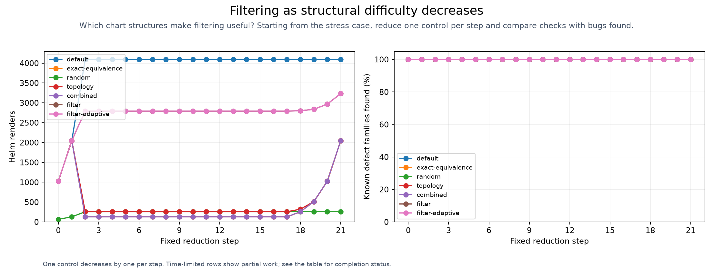

# Topology stress progression

<!-- toc:start -->
**Table of contents**

- [Topology stress progression](#topology-stress-progression)
<!-- toc:end -->

One parameter decreases by one at each step; seeds and defect triggers remain fixed.

| Step | Parameter change | Strategy | Renders | Defects found / total | Erroneous inputs evaluated / total | Status |
| --- | --- | --- | ---: | ---: | ---: | --- |
| 0 | 00-worst-case | default | 1024 | 6 / 6 | 736 / 736 | passed |
| 0 | 00-worst-case | exact-equivalence | 1024 | 6 / 6 | 736 / 736 | passed |
| 0 | 00-worst-case | random | 65 | 6 / 6 | 45 / 736 | passed |
| 0 | 00-worst-case | topology | 1024 | 6 / 6 | 736 / 736 | passed |
| 0 | 00-worst-case | combined | 1024 | 6 / 6 | 736 / 736 | passed |
| 0 | 00-worst-case | filter | 1024 | 6 / 6 | 736 / 736 | passed |
| 0 | 00-worst-case | filter-adaptive | 1024 | 6 / 6 | 736 / 736 | passed |
| 1 | 01-coupled-pairs-1 | default | 2048 | 6 / 6 | 1472 / 1472 | passed |
| 1 | 01-coupled-pairs-1 | exact-equivalence | 2048 | 6 / 6 | 1472 / 1472 | passed |
| 1 | 01-coupled-pairs-1 | random | 129 | 6 / 6 | 87 / 1472 | passed |
| 1 | 01-coupled-pairs-1 | topology | 2048 | 6 / 6 | 1472 / 1472 | passed |
| 1 | 01-coupled-pairs-1 | combined | 2048 | 6 / 6 | 1472 / 1472 | passed |
| 1 | 01-coupled-pairs-1 | filter | 2048 | 6 / 6 | 1472 / 1472 | passed |
| 1 | 01-coupled-pairs-1 | filter-adaptive | 2048 | 6 / 6 | 1472 / 1472 | passed |
| 2 | 02-coupled-pairs-0 | default | 4096 | 6 / 6 | 2704 / 2704 | passed |
| 2 | 02-coupled-pairs-0 | exact-equivalence | 128 | 6 / 6 | 2704 / 2704 | passed |
| 2 | 02-coupled-pairs-0 | random | 257 | 6 / 6 | 161 / 2704 | passed |
| 2 | 02-coupled-pairs-0 | topology | 257 | 6 / 6 | 169 / 2704 | passed |
| 2 | 02-coupled-pairs-0 | combined | 129 | 6 / 6 | 95 / 2704 | passed |
| 2 | 02-coupled-pairs-0 | filter | 2792 | 6 / 6 | 2704 / 2704 | passed |
| 2 | 02-coupled-pairs-0 | filter-adaptive | 2792 | 6 / 6 | 2704 / 2704 | passed |
| 3 | 03-gate-depth-4 | default | 4096 | 6 / 6 | 2704 / 2704 | passed |
| 3 | 03-gate-depth-4 | exact-equivalence | 128 | 6 / 6 | 2704 / 2704 | passed |
| 3 | 03-gate-depth-4 | random | 257 | 6 / 6 | 161 / 2704 | passed |
| 3 | 03-gate-depth-4 | topology | 257 | 6 / 6 | 169 / 2704 | passed |
| 3 | 03-gate-depth-4 | combined | 129 | 6 / 6 | 95 / 2704 | passed |
| 3 | 03-gate-depth-4 | filter | 2792 | 6 / 6 | 2704 / 2704 | passed |
| 3 | 03-gate-depth-4 | filter-adaptive | 2792 | 6 / 6 | 2704 / 2704 | passed |
| 4 | 04-gate-depth-3 | default | 4096 | 6 / 6 | 2704 / 2704 | passed |
| 4 | 04-gate-depth-3 | exact-equivalence | 128 | 6 / 6 | 2704 / 2704 | passed |
| 4 | 04-gate-depth-3 | random | 257 | 6 / 6 | 161 / 2704 | passed |
| 4 | 04-gate-depth-3 | topology | 257 | 6 / 6 | 169 / 2704 | passed |
| 4 | 04-gate-depth-3 | combined | 129 | 6 / 6 | 95 / 2704 | passed |
| 4 | 04-gate-depth-3 | filter | 2792 | 6 / 6 | 2704 / 2704 | passed |
| 4 | 04-gate-depth-3 | filter-adaptive | 2792 | 6 / 6 | 2704 / 2704 | passed |
| 5 | 05-gate-depth-2 | default | 4096 | 6 / 6 | 2704 / 2704 | passed |
| 5 | 05-gate-depth-2 | exact-equivalence | 128 | 6 / 6 | 2704 / 2704 | passed |
| 5 | 05-gate-depth-2 | random | 257 | 6 / 6 | 161 / 2704 | passed |
| 5 | 05-gate-depth-2 | topology | 257 | 6 / 6 | 169 / 2704 | passed |
| 5 | 05-gate-depth-2 | combined | 129 | 6 / 6 | 95 / 2704 | passed |
| 5 | 05-gate-depth-2 | filter | 2792 | 6 / 6 | 2704 / 2704 | passed |
| 5 | 05-gate-depth-2 | filter-adaptive | 2792 | 6 / 6 | 2704 / 2704 | passed |
| 6 | 06-gate-depth-1 | default | 4096 | 6 / 6 | 2704 / 2704 | passed |
| 6 | 06-gate-depth-1 | exact-equivalence | 128 | 6 / 6 | 2704 / 2704 | passed |
| 6 | 06-gate-depth-1 | random | 257 | 6 / 6 | 161 / 2704 | passed |
| 6 | 06-gate-depth-1 | topology | 257 | 6 / 6 | 169 / 2704 | passed |
| 6 | 06-gate-depth-1 | combined | 129 | 6 / 6 | 95 / 2704 | passed |
| 6 | 06-gate-depth-1 | filter | 2792 | 6 / 6 | 2704 / 2704 | passed |
| 6 | 06-gate-depth-1 | filter-adaptive | 2792 | 6 / 6 | 2704 / 2704 | passed |
| 7 | 07-gate-depth-0 | default | 4096 | 6 / 6 | 2704 / 2704 | passed |
| 7 | 07-gate-depth-0 | exact-equivalence | 128 | 6 / 6 | 2704 / 2704 | passed |
| 7 | 07-gate-depth-0 | random | 257 | 6 / 6 | 161 / 2704 | passed |
| 7 | 07-gate-depth-0 | topology | 257 | 6 / 6 | 169 / 2704 | passed |
| 7 | 07-gate-depth-0 | combined | 129 | 6 / 6 | 95 / 2704 | passed |
| 7 | 07-gate-depth-0 | filter | 2792 | 6 / 6 | 2704 / 2704 | passed |
| 7 | 07-gate-depth-0 | filter-adaptive | 2792 | 6 / 6 | 2704 / 2704 | passed |
| 8 | 08-interaction-order-4 | default | 4096 | 6 / 6 | 2704 / 2704 | passed |
| 8 | 08-interaction-order-4 | exact-equivalence | 128 | 6 / 6 | 2704 / 2704 | passed |
| 8 | 08-interaction-order-4 | random | 257 | 6 / 6 | 161 / 2704 | passed |
| 8 | 08-interaction-order-4 | topology | 257 | 6 / 6 | 169 / 2704 | passed |
| 8 | 08-interaction-order-4 | combined | 129 | 6 / 6 | 95 / 2704 | passed |
| 8 | 08-interaction-order-4 | filter | 2792 | 6 / 6 | 2704 / 2704 | passed |
| 8 | 08-interaction-order-4 | filter-adaptive | 2792 | 6 / 6 | 2704 / 2704 | passed |
| 9 | 09-interaction-order-3 | default | 4096 | 6 / 6 | 2704 / 2704 | passed |
| 9 | 09-interaction-order-3 | exact-equivalence | 128 | 6 / 6 | 2704 / 2704 | passed |
| 9 | 09-interaction-order-3 | random | 257 | 6 / 6 | 161 / 2704 | passed |
| 9 | 09-interaction-order-3 | topology | 257 | 6 / 6 | 169 / 2704 | passed |
| 9 | 09-interaction-order-3 | combined | 129 | 6 / 6 | 95 / 2704 | passed |
| 9 | 09-interaction-order-3 | filter | 2792 | 6 / 6 | 2704 / 2704 | passed |
| 9 | 09-interaction-order-3 | filter-adaptive | 2792 | 6 / 6 | 2704 / 2704 | passed |
| 10 | 10-interaction-order-2 | default | 4096 | 6 / 6 | 2704 / 2704 | passed |
| 10 | 10-interaction-order-2 | exact-equivalence | 128 | 6 / 6 | 2704 / 2704 | passed |
| 10 | 10-interaction-order-2 | random | 257 | 6 / 6 | 161 / 2704 | passed |
| 10 | 10-interaction-order-2 | topology | 257 | 6 / 6 | 169 / 2704 | passed |
| 10 | 10-interaction-order-2 | combined | 129 | 6 / 6 | 95 / 2704 | passed |
| 10 | 10-interaction-order-2 | filter | 2792 | 6 / 6 | 2704 / 2704 | passed |
| 10 | 10-interaction-order-2 | filter-adaptive | 2792 | 6 / 6 | 2704 / 2704 | passed |
| 11 | 11-interaction-order-1 | default | 4096 | 6 / 6 | 2704 / 2704 | passed |
| 11 | 11-interaction-order-1 | exact-equivalence | 128 | 6 / 6 | 2704 / 2704 | passed |
| 11 | 11-interaction-order-1 | random | 257 | 6 / 6 | 161 / 2704 | passed |
| 11 | 11-interaction-order-1 | topology | 257 | 6 / 6 | 169 / 2704 | passed |
| 11 | 11-interaction-order-1 | combined | 129 | 6 / 6 | 95 / 2704 | passed |
| 11 | 11-interaction-order-1 | filter | 2792 | 6 / 6 | 2704 / 2704 | passed |
| 11 | 11-interaction-order-1 | filter-adaptive | 2792 | 6 / 6 | 2704 / 2704 | passed |
| 12 | 12-shared-output-count-3 | default | 4096 | 6 / 6 | 2704 / 2704 | passed |
| 12 | 12-shared-output-count-3 | exact-equivalence | 128 | 6 / 6 | 2704 / 2704 | passed |
| 12 | 12-shared-output-count-3 | random | 257 | 6 / 6 | 161 / 2704 | passed |
| 12 | 12-shared-output-count-3 | topology | 257 | 6 / 6 | 169 / 2704 | passed |
| 12 | 12-shared-output-count-3 | combined | 129 | 6 / 6 | 95 / 2704 | passed |
| 12 | 12-shared-output-count-3 | filter | 2792 | 6 / 6 | 2704 / 2704 | passed |
| 12 | 12-shared-output-count-3 | filter-adaptive | 2792 | 6 / 6 | 2704 / 2704 | passed |
| 13 | 13-shared-output-count-2 | default | 4096 | 6 / 6 | 2704 / 2704 | passed |
| 13 | 13-shared-output-count-2 | exact-equivalence | 128 | 6 / 6 | 2704 / 2704 | passed |
| 13 | 13-shared-output-count-2 | random | 257 | 6 / 6 | 161 / 2704 | passed |
| 13 | 13-shared-output-count-2 | topology | 257 | 6 / 6 | 169 / 2704 | passed |
| 13 | 13-shared-output-count-2 | combined | 129 | 6 / 6 | 95 / 2704 | passed |
| 13 | 13-shared-output-count-2 | filter | 2792 | 6 / 6 | 2704 / 2704 | passed |
| 13 | 13-shared-output-count-2 | filter-adaptive | 2792 | 6 / 6 | 2704 / 2704 | passed |
| 14 | 14-shared-output-count-1 | default | 4096 | 6 / 6 | 2704 / 2704 | passed |
| 14 | 14-shared-output-count-1 | exact-equivalence | 128 | 6 / 6 | 2704 / 2704 | passed |
| 14 | 14-shared-output-count-1 | random | 257 | 6 / 6 | 161 / 2704 | passed |
| 14 | 14-shared-output-count-1 | topology | 257 | 6 / 6 | 169 / 2704 | passed |
| 14 | 14-shared-output-count-1 | combined | 129 | 6 / 6 | 95 / 2704 | passed |
| 14 | 14-shared-output-count-1 | filter | 2792 | 6 / 6 | 2704 / 2704 | passed |
| 14 | 14-shared-output-count-1 | filter-adaptive | 2792 | 6 / 6 | 2704 / 2704 | passed |
| 15 | 15-boundary-regions-3 | default | 4096 | 6 / 6 | 2704 / 2704 | passed |
| 15 | 15-boundary-regions-3 | exact-equivalence | 128 | 6 / 6 | 2704 / 2704 | passed |
| 15 | 15-boundary-regions-3 | random | 257 | 6 / 6 | 161 / 2704 | passed |
| 15 | 15-boundary-regions-3 | topology | 257 | 6 / 6 | 169 / 2704 | passed |
| 15 | 15-boundary-regions-3 | combined | 129 | 6 / 6 | 95 / 2704 | passed |
| 15 | 15-boundary-regions-3 | filter | 2792 | 6 / 6 | 2704 / 2704 | passed |
| 15 | 15-boundary-regions-3 | filter-adaptive | 2792 | 6 / 6 | 2704 / 2704 | passed |
| 16 | 16-boundary-regions-2 | default | 4096 | 6 / 6 | 2704 / 2704 | passed |
| 16 | 16-boundary-regions-2 | exact-equivalence | 128 | 6 / 6 | 2704 / 2704 | passed |
| 16 | 16-boundary-regions-2 | random | 257 | 6 / 6 | 161 / 2704 | passed |
| 16 | 16-boundary-regions-2 | topology | 257 | 6 / 6 | 169 / 2704 | passed |
| 16 | 16-boundary-regions-2 | combined | 129 | 6 / 6 | 95 / 2704 | passed |
| 16 | 16-boundary-regions-2 | filter | 2792 | 6 / 6 | 2704 / 2704 | passed |
| 16 | 16-boundary-regions-2 | filter-adaptive | 2792 | 6 / 6 | 2704 / 2704 | passed |
| 17 | 17-boundary-regions-1 | default | 4096 | 6 / 6 | 2704 / 2704 | passed |
| 17 | 17-boundary-regions-1 | exact-equivalence | 128 | 6 / 6 | 2704 / 2704 | passed |
| 17 | 17-boundary-regions-1 | random | 257 | 6 / 6 | 161 / 2704 | passed |
| 17 | 17-boundary-regions-1 | topology | 257 | 6 / 6 | 169 / 2704 | passed |
| 17 | 17-boundary-regions-1 | combined | 129 | 6 / 6 | 95 / 2704 | passed |
| 17 | 17-boundary-regions-1 | filter | 2792 | 6 / 6 | 2704 / 2704 | passed |
| 17 | 17-boundary-regions-1 | filter-adaptive | 2792 | 6 / 6 | 2704 / 2704 | passed |
| 18 | 18-equivalent-inputs-3 | default | 4096 | 6 / 6 | 2704 / 2704 | passed |
| 18 | 18-equivalent-inputs-3 | exact-equivalence | 256 | 6 / 6 | 2704 / 2704 | passed |
| 18 | 18-equivalent-inputs-3 | random | 257 | 6 / 6 | 161 / 2704 | passed |
| 18 | 18-equivalent-inputs-3 | topology | 321 | 6 / 6 | 224 / 2704 | passed |
| 18 | 18-equivalent-inputs-3 | combined | 257 | 6 / 6 | 190 / 2704 | passed |
| 18 | 18-equivalent-inputs-3 | filter | 2801 | 6 / 6 | 2704 / 2704 | passed |
| 18 | 18-equivalent-inputs-3 | filter-adaptive | 2801 | 6 / 6 | 2704 / 2704 | passed |
| 19 | 19-equivalent-inputs-2 | default | 4096 | 6 / 6 | 2704 / 2704 | passed |
| 19 | 19-equivalent-inputs-2 | exact-equivalence | 512 | 6 / 6 | 2704 / 2704 | passed |
| 19 | 19-equivalent-inputs-2 | random | 257 | 6 / 6 | 161 / 2704 | passed |
| 19 | 19-equivalent-inputs-2 | topology | 513 | 6 / 6 | 380 / 2704 | passed |
| 19 | 19-equivalent-inputs-2 | combined | 513 | 6 / 6 | 380 / 2704 | passed |
| 19 | 19-equivalent-inputs-2 | filter | 2837 | 6 / 6 | 2704 / 2704 | passed |
| 19 | 19-equivalent-inputs-2 | filter-adaptive | 2837 | 6 / 6 | 2704 / 2704 | passed |
| 20 | 20-equivalent-inputs-1 | default | 4096 | 6 / 6 | 2704 / 2704 | passed |
| 20 | 20-equivalent-inputs-1 | exact-equivalence | 1024 | 6 / 6 | 2704 / 2704 | passed |
| 20 | 20-equivalent-inputs-1 | random | 257 | 6 / 6 | 161 / 2704 | passed |
| 20 | 20-equivalent-inputs-1 | topology | 1025 | 6 / 6 | 760 / 2704 | passed |
| 20 | 20-equivalent-inputs-1 | combined | 1025 | 6 / 6 | 760 / 2704 | passed |
| 20 | 20-equivalent-inputs-1 | filter | 2969 | 6 / 6 | 2704 / 2704 | passed |
| 20 | 20-equivalent-inputs-1 | filter-adaptive | 2969 | 6 / 6 | 2704 / 2704 | passed |
| 21 | 21-equivalent-inputs-0 | default | 4096 | 6 / 6 | 2704 / 2704 | passed |
| 21 | 21-equivalent-inputs-0 | exact-equivalence | 2048 | 6 / 6 | 2704 / 2704 | passed |
| 21 | 21-equivalent-inputs-0 | random | 257 | 6 / 6 | 161 / 2704 | passed |
| 21 | 21-equivalent-inputs-0 | topology | 2049 | 6 / 6 | 1520 / 2704 | passed |
| 21 | 21-equivalent-inputs-0 | combined | 2049 | 6 / 6 | 1520 / 2704 | passed |
| 21 | 21-equivalent-inputs-0 | filter | 3233 | 6 / 6 | 2704 / 2704 | passed |
| 21 | 21-equivalent-inputs-0 | filter-adaptive | 3233 | 6 / 6 | 2704 / 2704 | passed |

Evaluated inputs include exact-equivalence reuse. CSV records physically rendered erroneous inputs separately.
Coupled input constraints currently cause conservative compiler fallback; those rows measure that limitation.
The input fields stay fixed. Removing constraints changes the valid-input denominator; reducing equivalence can increase render cost.
Time-limited rows are incomplete measurements. The case combines constraints chosen to stress planning and rendering.

Case parameters (local run data) | Measurements (local run data)

`--filter` and `--filter-adaptive` use topology level 2 and enable failure expansion. Aggressive sampling recomputes chart complexity, protects structural regions and applies the packaged calibration. An unmatched or unsupported chart keeps the ordinary filtered selection; 70% retention is not forced. Expansion-off columns are controlled ablations of these presets.

**Aggressive sampling decisions.** Counts below exclude the always-retained default configuration and precede failure expansion. Case and field floors apply only to matched calibrations.

| Fixture | Match | Retained / eligible | Case floor | Field floor | Fallback reason |
| --- | --- | ---: | ---: | ---: | --- |
| 00-worst-case | unmatched | 1023 / 1023 | 1 | 0 | schema validation is outside the shared proof contract |
| 01-coupled-pairs-1 | unmatched | 2047 / 2047 | 1 | 0 | schema validation is outside the shared proof contract |
| 02-coupled-pairs-0 | unmatched | 256 / 256 | 1 | 0 | chart complexity or topology is outside the measured calibration profiles |
| 03-gate-depth-4 | unmatched | 256 / 256 | 1 | 0 | chart complexity or topology is outside the measured calibration profiles |
| 04-gate-depth-3 | unmatched | 256 / 256 | 1 | 0 | chart complexity or topology is outside the measured calibration profiles |
| 05-gate-depth-2 | unmatched | 256 / 256 | 1 | 0 | chart complexity or topology is outside the measured calibration profiles |
| 06-gate-depth-1 | unmatched | 256 / 256 | 1 | 0 | chart complexity or topology is outside the measured calibration profiles |
| 07-gate-depth-0 | unmatched | 256 / 256 | 1 | 0 | chart complexity or topology is outside the measured calibration profiles |
| 08-interaction-order-4 | unmatched | 256 / 256 | 1 | 0 | chart complexity or topology is outside the measured calibration profiles |
| 09-interaction-order-3 | unmatched | 256 / 256 | 1 | 0 | chart complexity or topology is outside the measured calibration profiles |
| 10-interaction-order-2 | unmatched | 256 / 256 | 1 | 0 | chart complexity or topology is outside the measured calibration profiles |
| 11-interaction-order-1 | unmatched | 256 / 256 | 1 | 0 | chart complexity or topology is outside the measured calibration profiles |
| 12-shared-output-count-3 | unmatched | 256 / 256 | 1 | 0 | chart complexity or topology is outside the measured calibration profiles |
| 13-shared-output-count-2 | unmatched | 256 / 256 | 1 | 0 | chart complexity or topology is outside the measured calibration profiles |
| 14-shared-output-count-1 | unmatched | 256 / 256 | 1 | 0 | chart complexity or topology is outside the measured calibration profiles |
| 15-boundary-regions-3 | unmatched | 256 / 256 | 1 | 0 | chart complexity or topology is outside the measured calibration profiles |
| 16-boundary-regions-2 | unmatched | 256 / 256 | 1 | 0 | chart complexity or topology is outside the measured calibration profiles |
| 17-boundary-regions-1 | unmatched | 256 / 256 | 1 | 0 | chart complexity or topology is outside the measured calibration profiles |
| 18-equivalent-inputs-3 | unmatched | 320 / 320 | 1 | 0 | chart complexity or topology is outside the measured calibration profiles |
| 19-equivalent-inputs-2 | unmatched | 512 / 512 | 1 | 0 | complexity analysis time limit reached |
| 20-equivalent-inputs-1 | unmatched | 1024 / 1024 | 1 | 0 | complexity analysis time limit reached |
| 21-equivalent-inputs-0 | unmatched | 2048 / 2048 | 1 | 0 | complexity analysis time limit reached |
